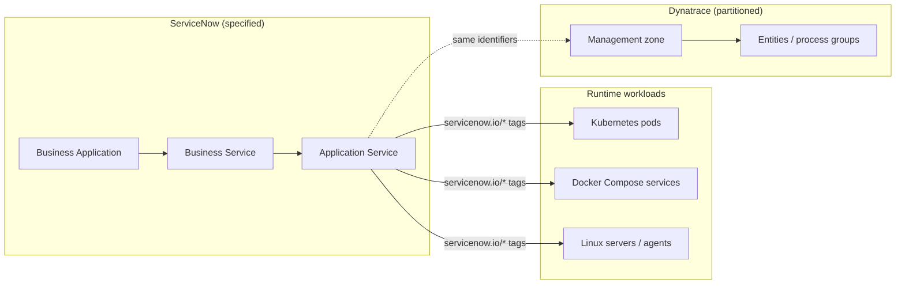

# Dynatrace and ServiceNow Specification Guide

## Purpose

This guide is the **primary reference for application modelers** — senior developers, application architects, and enterprise architects — who define how workloads appear in **ServiceNow CSDM** and **Dynatrace**. It explains what to declare in version-controlled specification files, what runtime labels to apply on workloads, and how the two platforms correlate at deploy and compare time.

Operational install steps (users, MID Server, ACLs, playbooks) remain in [install.md](install.md). Normative YAML schema details remain in [CSDM_Specifications.md](CSDM_Specifications.md). Drift detection workflow is in [DT_SN_Comparison_Process.md](DT_SN_Comparison_Process.md).

---

## Audience and outcomes

After reading this guide you should be able to:

1. Declare a **Business Application → Business Service → Application Service** hierarchy in `*.csdm.yaml`.
2. Choose the correct **platform** (`kubernetes`, `docker`, `host`, `saas`) and **Service Mapping** method (`tags`, `vertical`, `manual`).
3. Author **runtime labels** that bind discovered CIs to application services.
4. Align **Dynatrace** management zones and entity boundaries with the same identifiers.
5. Hand off to operators: `csdm/deploy.yml`, discovery playbooks, and `compare.yml`.

---

## Modeling order: ServiceNow first

Model **ServiceNow CSDM intent first**, then mirror boundaries in Dynatrace. ServiceNow holds the authoritative business hierarchy; Dynatrace partitions observability data to match that hierarchy for problems, metrics, and topology import.



---

## CSDM hierarchy

| Level | CMDB class | Purpose | Example |
|-------|------------|---------|---------|
| **Business Application** | `cmdb_ci_business_app` | Portfolio / product boundary | Observability Platform |
| **Business Service** | `cmdb_ci_service` | Logical capability | Elasticsearch, Apache Spark |
| **Application Service** | `cmdb_ci_service_discovered` | Deployable unit for Service Mapping | `grafana`, `spark-master`, `elastic-agent-lab1` |

Each object has a stable **`identifier`** (slug: `[a-z0-9-]+`, max 63 characters). Tag-based Service Mapping matches **`servicenow.io/application-service-identifier`** on workload CIs to this value.

### Region layout

Specifications live under `servicenow/regions/<region_id>/`:

| File | Role |
|------|------|
| `region.yaml` | Region id, CMDB location, Dynatrace management zone, list of `csdm_specs` |
| `*.csdm.yaml` | One stack or domain per file |
| `dynatrace-correlation.yaml` | Compare-time join keys (optional) |

Brooks Lab registers four specs in `region.yaml`: `observability-platform`, `spark`, `elastic-agent`, `dynatrace-monitoring`.

---

## Specification file examples

### Business Application and Business Service

```yaml
business_applications:
  - name: Observability Platform
    identifier: observability-platform
    short_description: Monitoring, logging, metrics, and tracing
    operational_status: "1"
    active: "true"

business_services:
  - name: Grafana
    identifier: grafana
    short_description: Dashboards and visualization
    operational_status: "1"
    parent_business_application: Observability Platform
```

### Docker application service (tag-based)

```yaml
application_services:
  - name: Grafana
    identifier: grafana
    short_description: Grafana UI
    operational_status: "1"
    parent_business_service: Grafana
    platform: docker
    service_mapping: tags
    discover: false
    service_tier: web
    depends_on:
      - name: lab3
        type: linux_server
    tags:
      docker:
        com.docker.compose.project: observability
        com.docker.compose.service: grafana
```

The **`identifier`** (`grafana`) must equal **`servicenow.io/application-service-identifier`** on the container. Compose project/service keys help discovery and diagnostics; canonical Service Mapping uses `servicenow.io/*`.

### Kubernetes application service (tag-based)

```yaml
application_services:
  - name: Spark Master
    identifier: spark-master
    short_description: Spark master — Kubernetes StatefulSet
    operational_status: "1"
    parent_business_service: Apache Spark
    platform: kubernetes
    service_mapping: tags
    discover: false
    service_tier: app
    namespace: spark
    tags:
      kubernetes:
        app.kubernetes.io/name: spark-master
        app.kubernetes.io/instance: brooks-lab
        app.kubernetes.io/component: master
        app.kubernetes.io/part-of: apache-spark
```

KVA writes **`app.kubernetes.io/*`** to `cmdb_key_value`. **Also** apply full **`servicenow.io/*`** on pod templates (see below); automation syncs those to pod CIs for canonical tag-based mapping.

### Host agent application service (expanded per node)

```yaml
application_services:
  - name: "Elastic Agent ({host})"
    identifier: "elastic-agent-{host_lower}"
    short_description: "Elastic Agent on {host} — ships logs and metrics"
    operational_status: "1"
    parent_business_service: Elastic Agent
    platform: host
    service_mapping: tags
    discover: false
    service_tier: ingest
    expand:
      inventory_group: k8s_nodes
    tags:
      host: {}
```

Host agents run as **systemd** or **DaemonSets**, not Docker Compose. Tags are written to the **`cmdb_ci_linux_server`** CI for each node (`lab1`, `lab2`, `lab3`) via `discovery/host/sync_tags.yml`.

### SaaS / manual mapping

```yaml
application_services:
  - name: Dynatrace Tenant
    identifier: dynatrace-tenant
    platform: saas
    service_mapping: manual
    discover: false
```

No runtime tags; map manually or via SGC import.

### Shared defaults

```yaml
tag_defaults:
  environment: on-prem
  location: "{{ SN_LAB_LOCATION_NAME }}"
  cluster: brooks-lab

csdm_defaults:
  owned_by: gbrooks
  busines_criticality: "4 - not critical"
```

Deploy automation merges `tag_defaults` with per-service overrides into runtime label maps.

---

## Runtime label reference

### Required ServiceNow labels (tag-based services)

| Label key | Source | Example value |
|-----------|--------|---------------|
| `servicenow.io/application-identifier` | Parent BA `identifier` | `observability-platform` |
| `servicenow.io/business-service-identifier` | Parent BS `identifier` | `grafana` |
| `servicenow.io/application-service-identifier` | Application service `identifier` | `grafana` |
| `servicenow.io/environment` | `tag_defaults.environment` | `on-prem` |
| `servicenow.io/location` | `tag_defaults.location` | `brooks-lab` |

Optional: `servicenow.io/service-tier`, `servicenow.io/cluster`, `servicenow.io/namespace`.

### Docker Compose snippet

```yaml
services:
  grafana:
    image: grafana/grafana
    labels:
      com.docker.compose.project: observability
      com.docker.compose.service: grafana
      servicenow.io/application-identifier: observability-platform
      servicenow.io/business-service-identifier: grafana
      servicenow.io/application-service-identifier: grafana
      servicenow.io/environment: on-prem
      servicenow.io/location: brooks-lab
      servicenow.io/service-tier: web
```

After changing labels, recreate containers and run `discovery/docker/discover.yml` to upsert `cmdb_key_value` rows.

### Kubernetes pod template snippet

```yaml
metadata:
  labels:
    app.kubernetes.io/name: spark-master
    app.kubernetes.io/instance: brooks-lab
    app.kubernetes.io/component: master
    app.kubernetes.io/part-of: apache-spark
    servicenow.io/application-identifier: data-and-analytic-services
    servicenow.io/business-service-identifier: apache-spark
    servicenow.io/application-service-identifier: spark-master
    servicenow.io/environment: on-prem
    servicenow.io/location: brooks-lab
    servicenow.io/service-tier: app
    servicenow.io/cluster: brooks-lab
    servicenow.io/namespace: spark
```

After deploy, run `discovery/k8s/discover.yml` (KVA restart + pod label sync) so **`servicenow.io/*`** appears on `cmdb_ci_kubernetes_pod` rows.

### Host agents

Host agents do not use Compose labels on the agent process itself. **Systemd agents** (for example Elastic Agent) use `platform: host`; automation writes merged **`servicenow.io/*`** to each **`cmdb_ci_linux_server`**.

**Kubernetes DaemonSet agents** (for example Dynatrace OneAgent via DynaKube) use `platform: kubernetes` with `namespace` and `pod_name_prefix` so tags land on **`cmdb_ci_kubernetes_pod`** — not the linux server (only one canonical `application-service-identifier` per host CI).

```bash
ansible-playbook -i inventory.yml playbooks/servicenow/discovery/host/sync_tags.yml -e @../vars/secrets.yaml
```

---

## How tags reach the CMDB

| Platform | Workload | Label source | CMDB CI | Sync playbook |
|----------|----------|--------------|---------|---------------|
| Docker | Compose service | `labels:` in compose file | `cmdb_ci_docker_container` | `discovery/docker/discover.yml` |
| Kubernetes | Pod | Pod template labels | `cmdb_ci_kubernetes_pod` | `discovery/k8s/sync_pod_labels.yml` |
| Kubernetes | Pod | KVA informer | `cmdb_ci_kubernetes_pod` | KVA (writes `app.kubernetes.io/*` only) |
| Host | Elastic Agent | `elastic-agent.csdm.yaml` | host | `discovery/host/sync_tags.yml` |
| K8s pod | Dynatrace OneAgent | `dynatrace-monitoring.csdm.yaml` | kubernetes (`dynatrace` ns) | `discovery/k8s/sync_csdm_tags.yml` |

**Canonical** tag-based Service Mapping uses **`servicenow.io/application-service-identifier`**. Alternate keys (`app.kubernetes.io/name`) may exist but compare reports `alternate_tag_only` until canonical tags are present.

Table ACLs for `cmdb_key_value` must allow the automation user to create rows — see [install.md §6.3](install.md#63-enable-automation-to-update-key-value-pairs).

---

## Dynatrace alignment

Define boundaries in ServiceNow first, then configure Dynatrace to match:

| ServiceNow concept | Dynatrace equivalent |
|--------------------|----------------------|
| Scope unit / region | **Management zone** (e.g. `spark-observability`) |
| Application service `identifier` | Tags, process-group naming, or K8s workload rules |
| `cmdb_location` | Host tags + MZ membership rules |
| Business Application | Optional: custom tags on entities |

Brooks Lab `region.yaml` maps:

- CMDB location: `brooks-lab`
- Dynatrace management zone: `spark-observability`
- Kubernetes cluster names: ServiceNow `brooks-lab` ↔ Dynatrace `spark-observability-k8s`

Run **`compare.yml`** to verify identifiers, tag bindings, and MZ placement — see [DT_SN_Comparison_Process.md](DT_SN_Comparison_Process.md).

---

## Modeler workflow

1. **Author** or update `servicenow/regions/<region_id>/*.csdm.yaml` (hierarchy, identifiers, `depends_on`, platform, tags).
2. **Register** new spec files in `region.yaml` → `csdm_specs`.
3. **Apply runtime labels** on Docker Compose, K8s manifests, or rely on host sync for agents.
4. **Deploy CSDM** — `csdm/deploy.yml` creates/updates CMDB application services.
5. **Sync discovery** — Docker discover, K8s discover (+ pod labels), host tag sync as applicable.
6. **Configure Service Mapping** on the instance — tag filters per [Tag_Based_Service_Mapping.md](Tag_Based_Service_Mapping.md).
7. **Compare** — `compare.yml` and review `tmp/compare/<timestamp>/compare_report.json`.

---

## Brooks Lab quick reference

| Stack | Spec file | Platform | Tag sync |
|-------|-----------|----------|----------|
| Observability (ES, Grafana, …) | `observability-platform.csdm.yaml` | docker | `discovery/docker/discover.yml` |
| Spark | `spark.csdm.yaml` | kubernetes | Pod labels + `discovery/k8s/sync_pod_labels.yml` |
| Elastic Agent | `elastic-agent.csdm.yaml` | host | `discovery/host/sync_tags.yml` |
| Dynatrace OneAgent | `dynatrace-monitoring.csdm.yaml` | host | `discovery/host/sync_tags.yml` |
| Dynatrace Tenant | `dynatrace-monitoring.csdm.yaml` | saas | Manual / SGC |

---

## Related documents

| Document | Role |
|----------|------|
| [CSDM_Specifications.md](CSDM_Specifications.md) | Normative YAML schema and deploy processor rules |
| [Tag_Based_Service_Mapping.md](Tag_Based_Service_Mapping.md) | ServiceNow UI: tag categories and application service filters |
| [install.md](install.md) | Instance prerequisites, ACLs, phased install |
| [DT_SN_Comparison_Process.md](DT_SN_Comparison_Process.md) | Compare workflow and finding categories |
