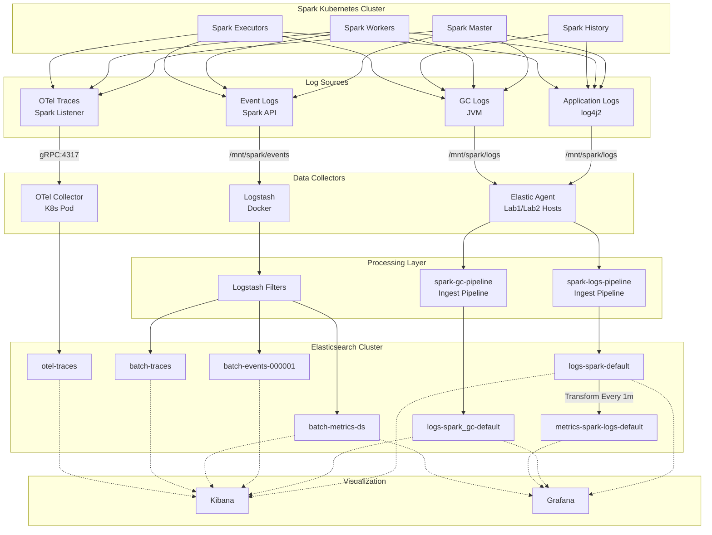

# Elasticsearch Spark-Related Indices and Data Streams

**Generated**: October 20, 2025  
**System**: Elastic-on-Spark Observability Platform

---

## Spark and Batch Processing Indices/Data Streams

| Index Pattern / Name | Type | Configuration File | Data View Name | Description |
|---------------------|------|-------------------|----------------|-------------|
| `logs-spark-default` | Data Stream | `spark-logs/logs-spark-default.template.json` | Spark Application Logs | Spark application logs from all cluster components (master, worker, history, executors) with parsed log levels and stack traces |
| `metrics-spark-logs-default` | Index (¹) | `spark-logs/metrics-spark-logs.template.json` | Spark Log Metrics | Aggregated Spark log metrics by log level, pod, and time (1-minute buckets) - Transform output from logs-spark-default |
| `logs-spark_gc-default` | Data Stream | `spark-gc/spark-gc.template.json` | Spark GC Logs | Spark JVM garbage collection logs with GC event details, pause times, and memory statistics |
| `batch-events-000001` | Rollover Index | `batch-events/batch-events.template.json` | Batch Events | Spark batch job events from Spark event logs (application start/end, job start/end, stage info) |
| `batch-metrics-ds` | Data Stream | `batch-metrics/batch-metrics.template.json` | Batch Metrics | Spark batch job metrics (execution times, task counts, shuffle metrics) |
| `batch-traces` | Data Stream | `batch-traces/batch-traces.template.json` | Batch Traces | Spark SQL query execution traces and DAG information |
| `logs-spark-spark` | Data Stream | *(legacy - same template as logs-spark-default)* | *(legacy)* | **DEPRECATED** - Old Spark logs data stream, replaced by logs-spark-default |
| `otel-traces` | Data Stream | `otel-traces/otel-traces.template.json` | OpenTelemetry Traces | OpenTelemetry distributed tracing data from Spark OTel Listener |

---

## Data Flow Overview

---

## Ingest Pipelines

| Pipeline Name | Associated Index | Configuration File | Purpose |
|---------------|------------------|-------------------|---------|
| `spark-logs-pipeline` | logs-spark-default | `spark-logs/spark-logs-ingest-pipeline.json` | Parse log level, Java class, extract stack traces from multi-line exceptions |
| `spark-gc-pipeline` | logs-spark_gc-default | `spark-gc/spark-gc-ingest-pipeline.json` | Parse GC events, extract pause times and heap statistics |
| (none) | batch-events-* | N/A | Logstash handles parsing |
| (none) | batch-metrics-ds | N/A | Structured data from Logstash |
| (none) | batch-traces | N/A | Structured data from Logstash |

---

## Transforms

| Transform Name | Source | Destination | Configuration File | Purpose |
|----------------|--------|-------------|-------------------|---------|
| `spark-log-metrics` | logs-spark-default | metrics-spark-logs-default | `spark-logs/spark-log-metrics-transform.json` | Aggregate log counts by level, pod, and time (1m buckets) |

---

## ILM Policies

| Policy Name | Applied To | Configuration File | Retention |
|-------------|------------|-------------------|-----------|
| `spark-logs` | logs-spark-default | `spark-logs/spark-logs.ilm.json` | 90 days |
| `spark-metrics` | metrics-spark-logs-default | `spark-logs/metrics-spark-logs.ilm.json` | 90 days |
| `spark-gc` | logs-spark_gc-default | `spark-gc/spark-gc.ilm.json` | 30 days |
| `batch-events` | batch-events-* | `batch-events/batch-events.ilm-policy.json` | 90 days |
| `batch-traces` | batch-traces | `batch-traces/batch-traces.ilm-policy.json` | 30 days |
| `otel-traces` | otel-traces | `otel-traces/otel-traces.ilm-policy.json` | 7 days |

---

## Notes

- **Legacy Index**: `logs-spark-spark` should be deleted (replaced by `logs-spark-default`)
- **Transform Output**: `metrics-spark-logs-default` is created automatically by the transform
- **Rollover Indices**: `batch-events-000001` is managed by ILM and will rollover to `batch-events-000002` when size/age limits are reached
- **Data Streams**: Most indices use data stream architecture for automatic lifecycle management
- **Configuration Base**: All configuration file paths are relative to `observability/elasticsearch/` directory

---

## Footnotes

**(¹) metrics-spark-logs-default: Why Not a Data Stream?**

This data is inherently time-series and SHOULD be a data stream for TSDS compression benefits, BUT:

**Elasticsearch Transform Limitation (v8.15):**
- Transforms CANNOT write to data streams (even when pre-created)
- Transform tries to CREATE destination as INDEX, not use existing data stream
- Error: "cannot create index... because it matches with template that creates data streams only"
- This is a **known limitation** in current Elasticsearch versions

**Verified Attempts:**
1. ✅ Pre-create data stream → Transform still fails to start
2. ✅ Remove `composed_of` templates → Transform still fails
3. ✅ Template with `data_stream: {}` → Transform cannot write

**Workaround (Current Solution):**
- Use regular index (template has NO `data_stream` definition)
- Transform creates and manages index automatically
- Works reliably with full functionality
- Loses TSDS compression benefits (future enhancement when Elasticsearch supports it)

**Future:** Elasticsearch may add native transform → data stream support in version 9.x or later.

