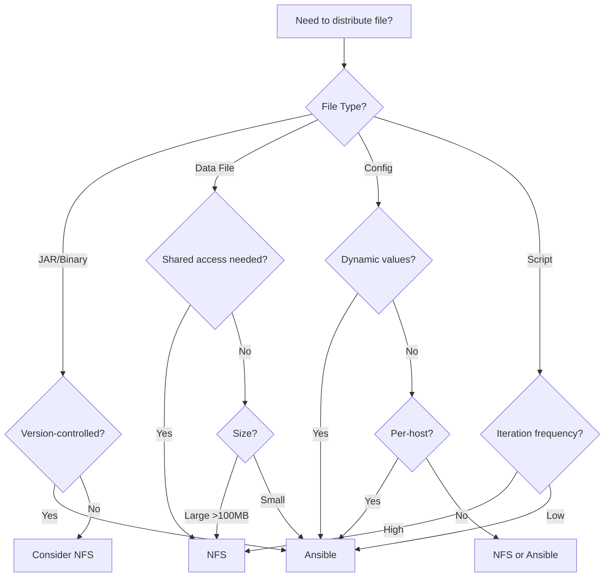

# File Distribution Strategy

## Overview

This document defines the strategy and best practices for distributing files to managed nodes in the Elastic-on-Spark infrastructure. There are two primary distribution mechanisms available:

1. **Ansible** - Push-based distribution via playbooks
2. **NFS** - Shared filesystem mounted on all nodes

## Distribution Matrix

| File Type | Distribution Method | Location | Rationale |
|-----------|-------------------|----------|-----------|
| **JARs** (Application, Libraries) | Ansible | `~/ansible/{component}/` | Version control, atomic updates, rollback capability |
| **Configuration Files** | Ansible (templated) | Component-specific | Dynamic values, per-host customization, secrets |
| **Docker Images** | Docker Registry | Local registry (Lab2:5000) | Standard practice, layer caching, efficient |
| **Data Files** (Input/Output) | NFS | `/mnt/spark/data/` | Shared access, large files, concurrent access |
| **Event Logs** | NFS | `/mnt/spark/events/` | Real-time writes from multiple pods, aggregation |
| **Python Scripts** (Apps) | Ansible or NFS | `/mnt/spark/apps/` (NFS recommended) | Rapid iteration, no deployment needed |
| **Static Assets** (Certs, Keys) | Ansible | `/etc/{service}/` | Security, access control, versioning |

## Detailed Guidelines

### When to Use Ansible Distribution

**Characteristics**:
- Versioned artifacts (JARs, binaries)
- Requires deployment/restart
- Small to medium files (< 100MB)
- Host-specific configuration
- Security-sensitive files

**Advantages**:
- Atomic updates across cluster
- Rollback capability via playbooks
- Version control integration
- Host-specific customization
- Access control via file permissions
- Audit trail (Ansible logs)

**Examples**:
```yaml
# Ansible playbook task
- name: Deploy OpenTelemetry Listener JAR
  copy:
    src: "{{ project_root }}/spark/otel/artifacts/spark-otel-listener-1.0.0.jar"
    dest: "/home/{{ ansible_user }}/ansible/otel/spark-otel-listener-1.0.0.jar"
    mode: '0644'
```

**File Locations**:
- JARs: `~/ansible/otel/`, `~/ansible/spark/jars/`
- Configs: `~/ansible/config/`, `/etc/{service}/`
- Binaries: `~/ansible/bin/`
- Certificates: `/etc/ssl/certs/`, `/etc/elastic-agent/certs/`

### When to Use NFS Distribution

**Characteristics**:
- Shared data access required
- Large files (> 100MB)
- High-frequency updates
- Runtime-generated files
- Concurrent read/write access

**Advantages**:
- No deployment needed
- Immediate availability across cluster
- Single source of truth
- Simplified data pipeline
- Efficient for large files

**Examples**:
```yaml
# NFS mount configuration
/srv/nfs/spark/events  *(rw,sync,no_subtree_check,no_root_squash)

# Usage in Spark
spark.eventLog.dir=/mnt/spark/events
```

**File Locations**:
- Data: `/mnt/spark/data/`
- Events: `/mnt/spark/events/`
- Shared Apps: `/mnt/spark/apps/` (optional)
- Shared Libraries: `/mnt/spark/jars/` (legacy, prefer Ansible)

### Hybrid Approach: Build Artifacts

For build artifacts (e.g., custom JARs):

1. **Build**: Local or CI/CD
2. **Stage**: Repository (`spark/otel/artifacts/`)
3. **Distribute**: Ansible playbook
4. **Deploy**: Configuration update + restart

```bash
# Workflow
make build              # Build JAR locally
git add artifacts/      # Stage in repo
git commit && push      # Version control
ansible-playbook deploy # Distribute to nodes
ansible-playbook start  # Apply changes
```

## Decision Tree



## Implementation: OpenTelemetry Listener JAR

**Decision**: Ansible distribution to `~/ansible/otel/`

**Rationale**:
1. **Versioned Artifact**: JAR is built from source, version-controlled
2. **Deployment Required**: Spark must be restarted to load new listener
3. **Small File**: ~5MB (easily distributed via Ansible)
4. **No Shared Access**: Each node needs its own copy
5. **Rollback**: Easy to revert to previous JAR version
6. **Audit**: Ansible logs track when/where deployed

**Workflow**:
```bash
# 1. Build
cd ansible
ansible-playbook -i inventory.yml playbooks/spark/build.yml

# 2. Deploy (includes JAR distribution)
ansible-playbook -i inventory.yml playbooks/spark/deploy.yml

# 3. Restart (applies changes)
ansible-playbook -i inventory.yml playbooks/spark/stop.yml
ansible-playbook -i inventory.yml playbooks/spark/start.yml
```

**File Paths**:
- **Source**: `spark/otel/listener/src/main/scala/...`
- **Build Artifact**: `spark/otel/listener/target/spark-otel-listener-1.0.0.jar`
- **Staged Artifact**: `spark/otel/artifacts/spark-otel-listener-1.0.0.jar` (in repo)
- **Deployed Location**: `~/ansible/otel/spark-otel-listener-1.0.0.jar` (on managed nodes)

**Spark Configuration**:
```properties
# spark-defaults.conf.j2
spark.jars=file:///home/ansible/ansible/otel/spark-otel-listener-1.0.0.jar
```

## Security Considerations

### Ansible-Distributed Files
- **Permissions**: Explicitly set via playbook (e.g., `mode: '0644'`)
- **Ownership**: Set to ansible user (or specific service user)
- **Secrets**: Use Ansible Vault for sensitive files
- **Audit**: Ansible logs capture distribution events

### NFS-Distributed Files
- **Permissions**: Set via NFS export options and filesystem ACLs
- **Access Control**: NFS mount options (`ro`, `rw`, `no_root_squash`)
- **Network Security**: NFS should be on private network only
- **Audit**: Less granular - use filesystem audit tools

## Performance Considerations

### Ansible
- **Speed**: Fast for small files (< 100MB)
- **Parallelism**: Ansible forks (default: 5)
- **Network**: Direct SSH connection to each node
- **Overhead**: Minimal once deployed

### NFS
- **Speed**: Excellent for large files and reads
- **Latency**: Slightly higher for small files (network round-trip)
- **Concurrency**: Handles multiple concurrent reads/writes
- **Overhead**: NFS daemon on server, client mounts

## Migration Path

If you need to migrate from one distribution method to another:

### NFS → Ansible
1. Create Ansible playbook to copy files
2. Test on one node
3. Update playbook to remove NFS dependency
4. Deploy to all nodes
5. Unmount NFS share

### Ansible → NFS
1. Create NFS export
2. Mount on all nodes
3. Copy files to NFS
4. Update configuration to use NFS paths
5. Remove Ansible file distribution tasks

## Best Practices

1. **Version Everything**: Use Git for source, Docker for images, Ansible for deployment
2. **Automate Fully**: No manual file copies
3. **Test Rollback**: Ensure you can revert to previous versions
4. **Document Paths**: Maintain a table of file locations (this doc!)
5. **Monitor Access**: Track file access patterns to optimize distribution
6. **Consolidate**: Prefer one method per file type for consistency
7. **Security First**: Least privilege for file access
8. **Audit Regularly**: Review distribution logs and file permissions

## Future Considerations

### Container Image Layers
For Spark pods, consider embedding JARs directly in Docker images:
- **Pros**: No runtime distribution needed, version-pinned
- **Cons**: Requires image rebuild for JAR updates, larger images

### Artifact Repository
For larger scale, consider a dedicated artifact repository (Artifactory, Nexus):
- **Pros**: Centralized, caching, access control, versioning
- **Cons**: Additional infrastructure, complexity

### S3/Object Storage
For cloud deployments, S3 or equivalent:
- **Pros**: Scalable, durable, versioned, no NFS needed
- **Cons**: Network latency, costs, cloud-specific

## Summary

**Default Strategy**:
- **JARs and Binaries**: Ansible to `~/ansible/{component}/`
- **Data and Logs**: NFS to `/mnt/spark/{data,events}/`
- **Configs**: Ansible (templated) to component-specific locations
- **Images**: Docker Registry

**Key Principle**: Use Ansible for deployment-time artifacts (versioned, requires restart), use NFS for runtime artifacts (shared, high-frequency access).

---

**Document Version**: 1.0  
**Last Updated**: 2025-10-17  
**Author**: Elastic-on-Spark Team

