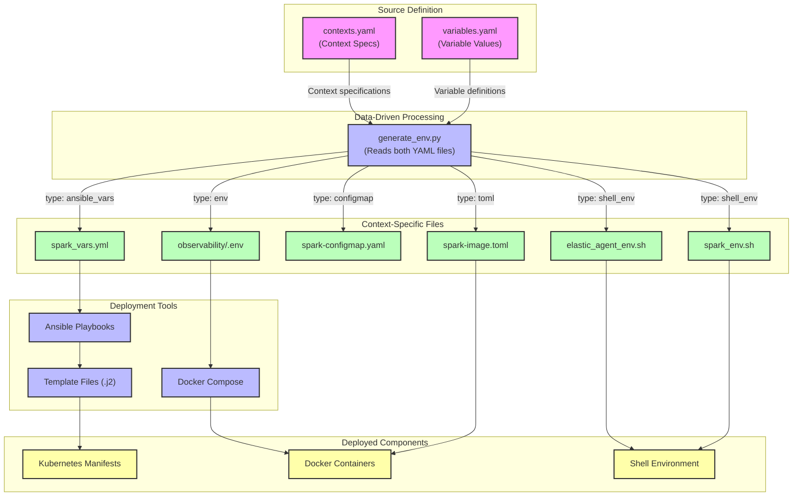

# Variable Flow in Elastic-on-Spark

This document outlines how variables flow through the system from the central definition to their use in deployed components.

## Overview

The variable flow follows a data-driven pipeline structure:

```
variables.yaml + contexts.yaml → generate_env.py → context-specific files → Ansible/deployment tools → deployed components
```

**Key Design Principle**: The system uses a data-driven architecture where context specifications are externalized into `contexts.yaml`, eliminating hardcoded mappings and making the system easily extensible.

## Visual Representation



The diagram illustrates the **data-driven architecture**:
1. **Two source files**: `variables.yaml` defines values, `contexts.yaml` defines transformation rules
2. **Single processor**: `generate_env.py` reads both files and generates outputs based on specifications
3. **Type-driven generation**: Each context's output type determines which writer function is used
4. **Easy extensibility**: New contexts can be added by editing `contexts.yaml` without code changes

## Detailed Flow for Spark Version

### 1. Source Definition

**File**: `/home/gxbrooks/repos/elastic-on-spark/variables.yaml`

This is the single source of truth for all variables. Variables are defined with their value and applicable contexts:

```yaml
SPARK_VERSION:
  value: 3.5.1
  contexts: [spark-image, ansible]
```

### 2. Context Specification

**File**: `/home/gxbrooks/repos/elastic-on-spark/contexts.yaml`

This file defines all output contexts, eliminating hardcoded mappings:

```yaml
contexts:
  - name: observability
    type: env
    output: observability/.env
    description: Environment variables for Docker Compose observability stack

  - name: spark-image
    type: toml
    output: spark/spark-image.toml
    description: Build-time configuration for Spark Docker images

  - name: spark-runtime
    type: configmap
    output: ansible/roles/spark/files/k8s/spark-configmap.yaml
    description: Kubernetes ConfigMap for Spark runtime environment

  # ... additional contexts
```

### 3. Variable Processing

**Agent**: `/home/gxbrooks/repos/elastic-on-spark/linux/generate_env.py`

This script implements a **data-driven architecture**:

```python
# Load context specifications from contexts.yaml (not hardcoded)
def load_contexts():
    with open('contexts.yaml') as f:
        spec = yaml.safe_load(f)
        return spec.get('contexts', [])

# Type to writer function mapping
WRITER_FUNCTIONS = {
    'env': 'write_env',
    'shell_env': 'write_shell_env',
    'toml': 'write_toml',
    'configmap': 'write_configmap',
    'ansible_vars': 'write_ansible_vars',
}

# Function that extracts variables for specific contexts
def get_vars(variables, context_name):
    return {k: v['value'] for k, v in variables.items() 
            if context_name in v.get('contexts', [])}

# Main loop iterates over contexts from spec file
for context in contexts_to_generate:
    context_name = context['name']
    output_type = context['type']
    output_file = context['output']
    
    # Get appropriate writer function based on type
    writer_func = globals()[WRITER_FUNCTIONS[output_type]]
    
    # Extract variables and generate file
    vars_dict = get_vars(variables, context_name)
    writer_func(vars_dict, output_file)
```

**Key Advantages**:
- ✅ No hardcoded context mappings
- ✅ Easy to add new contexts (edit YAML, no code changes)
- ✅ Self-documenting (context descriptions in spec file)
- ✅ Type-safe (validates output types against available writers)
- ✅ Extensible (new output types = new writer function)

### 4. Context-Specific Files

For Spark version, the relevant context-specific files are generated based on the context specifications:

#### New Contexts (Added in vObservabilityFramework+2)

**spark-client**: Developer environment variables
- **File**: `spark/spark_env.sh`
- **Purpose**: Environment variables for developers running Spark applications
- **Variables**: `SPARK_MASTER_EXTERNAL_HOST`, `SPARK_MASTER_EXTERNAL_PORT`, `SPARK_EVENTS_DIR`, `HDFS_DEFAULT_FS`
- **Usage**: Automatically sourced by `linux/.bashrc` for developers

**elastic-agent**: Host-level Elastic Agent configuration
- **File**: `elastic-agent/elastic_agent_env.sh`
- **Purpose**: Environment variables for Elastic Agent running on hosts
- **Variables**: `ELASTIC_HOST_EXTERNAL`, `ELASTIC_URL_EXTERNAL`, `LS_HOST_EXTERNAL`, `CA_CERT_LINUX_PATH`
- **Usage**: Used to generate `elastic-agent/env.conf` for systemd service

**ispark**: Interactive Spark development
- **File**: `spark/ispark/ispark_env.sh`
- **Purpose**: Environment variables for interactive Spark sessions
- **Usage**: Sourced by iPython Spark launcher scripts

**nfs**: NFS server configuration
- **File**: `ansible/vars/nfs_vars.yml`
- **Purpose**: NFS server variables for Ansible playbooks
- **Usage**: Used by NFS installation and configuration playbooks

#### Original Contexts

#### a. Ansible Variables

**File**: `/home/gxbrooks/repos/elastic-on-spark/ansible/vars/spark_vars.yml`  
**Generated by**: `write_ansible_vars()` function in `generate_env.py`

```yaml
# Spark version
spark_version: "3.5.1"

# Registry and image configuration
registry_host: "localhost:5000"
spark_image: "{{ registry_host }}/spark"
spark_tag: "{{ spark_version }}"
```

Key transformations:
- `SPARK_VERSION` → `spark_version` (naming convention change)
- Additional derived variables: `spark_image`, `spark_tag`

#### b. Spark Image Configuration

**File**: `/home/gxbrooks/repos/elastic-on-spark/spark/spark-image.toml`  
**Generated by**: `write_toml()` function in `generate_env.py`

```toml
[env]
SPARK_VERSION = "3.5.1"
```

### 5. Ansible Playbook Processing

**Agent**: Ansible playbooks in `/home/gxbrooks/repos/elastic-on-spark/ansible/playbooks/spark/`

Playbooks include the generated variables file:

```yaml
vars_files:
  - "{{ playbook_dir | dirname | dirname }}/vars/spark_vars.yml"
```

### 6. Template Rendering

**Agent**: Ansible template module

**Input Files**: Template files in `/home/gxbrooks/repos/elastic-on-spark/ansible/roles/spark/templates/`  
**Example**: `spark-master.yml.j2`

```yaml
containers:
  - name: spark-master
    image: "{{ spark_image }}:{{ spark_tag }}"
```

**Output Files**: Rendered Kubernetes manifests in the target environment's directory  
**Example**: `~/spark/k8s/spark-master.yaml`

> **Note on File Extensions**: The system maintains consistency by converting `.yml.j2` template files to `.yaml` output files during the rendering process. This ensures compatibility with both Ansible (which often uses `.yml`) and Kubernetes (which prefers `.yaml`). The conversion is handled by the regex_replace filter in the template task.

Key transformations:
- Ansible variables are rendered into their values
- `{{ spark_image }}:{{ spark_tag }}` → `localhost:5000/spark:3.5.1`

### 7. Deployment

**Agent**: Kubernetes (via kubectl, applied by Ansible)

The rendered manifest files are applied to the Kubernetes cluster, creating or updating the necessary resources with the correct Spark version.

### Variable Transformation Example: Elasticsearch Settings

Variables related to Elasticsearch follow this flow:

1. **Source Definition**:
```yaml
# In variables.yaml
ELASTIC_HOST:
  value: es01
  contexts: [observability, spark-runtime]
ELASTIC_PORT:
  value: 9200
  contexts: [observability, spark-runtime]
```

2. **Processing by generate_env.py**:
   - For `spark-runtime` context: Added to `ansible/roles/spark/files/k8s/spark-configmap.yaml` as environment variables
   - For `ansible` context: Converted to snake_case and added to `spark_vars.yml`

3. **Available in Templates**:
```yaml
# Available in templates as:
{{ elastic_host }} # From spark_vars.yml
```

4. **Kubernetes ConfigMap**:
```yaml
# Also available via ConfigMap reference in deployment templates:
envFrom:
  - configMapRef:
      name: spark-configmap
# Which provides ELASTIC_HOST and ELASTIC_PORT environment variables
```

## Complete Flow Summary

1. **Source of Truth**: `variables.yaml` defines `SPARK_VERSION: 3.5.1` with contexts `[spark-image, ansible]`
2. **Context Specification**: `contexts.yaml` defines output file format and location for each context
3. **Data-Driven Processing**: `generate_env.py` reads both files:
   - Loads context specifications from `contexts.yaml`
   - Filters variables by context name
   - Routes to appropriate writer function based on output type
4. **Context Generation**: 
   - For Ansible: Creates `spark_vars.yml` with `spark_version: "3.5.1"` (type: ansible_vars)
   - For Spark image: Creates `spark-image.toml` with `SPARK_VERSION = "3.5.1"` (type: toml)
   - For Spark runtime: Creates `spark-configmap.yaml` with `SPARK_VERSION: "3.5.1"` (type: configmap)
5. **Ansible Processing**: Playbooks load variables from `spark_vars.yml`
6. **Template Rendering**: Templates use `{{ spark_image }}:{{ spark_tag }}` → `docker.io/apache/spark:3.5.1`
7. **Deployment**: Rendered manifest files are applied to Kubernetes

## Best Practices

### Variable Management

1. **Always modify variables in `variables.yaml`** - This is the single source of truth
2. **Add new contexts in `contexts.yaml`** - No code changes needed in `generate_env.py`
3. **Run `generate_env.py` after changes**:
   ```bash
   ./linux/generate_env.py -v           # Regenerate all contexts with verbose output
   ./linux/generate_env.py spark-client # Regenerate specific context
   ./linux/generate_env.py -f           # Force regeneration even if up to date
   ```
4. **Never manually edit generated files** - They will be overwritten

### Adding a New Context

To add a new output context:

1. **Define the context in `contexts.yaml`**:
   ```yaml
   - name: my-new-context
     type: shell_env                    # Choose: env, shell_env, toml, configmap, ansible_vars
     output: path/to/my-context.sh
     description: Description of what this context provides
   ```

2. **Tag variables for this context in `variables.yaml`**:
   ```yaml
   MY_VARIABLE:
     value: some-value
     contexts: [my-new-context, other-context]
   ```

3. **Run the generator**:
   ```bash
   ./linux/generate_env.py my-new-context -v
   ```

That's it! No code changes required.

### Variable Naming Conventions

4. Use the correct variable naming conventions in templates:
   - **Ansible variables**: snake_case → `{{ spark_version }}`
   - **Shell/environment variables**: UPPER_CASE → `${SPARK_VERSION}`
   - **ConfigMap references**: UPPER_CASE → `${SPARK_VERSION}`

## Maintaining Consistency

The data-driven architecture ensures consistency by:

1. **Single source of truth**: `variables.yaml` for all variable values
2. **Declarative specifications**: `contexts.yaml` for all output configurations
3. **Automatic generation**: Context-specific files regenerated from specs
4. **Type safety**: Output types validated against available writer functions
5. **Timestamp tracking**: Files only regenerated when source changes
6. **Proper inclusion**: Variable files referenced in playbooks
7. **Consistent conventions**: Naming patterns enforced per output type

### Verification Commands

```bash
# Check if any files need regeneration
./linux/generate_env.py

# Force regenerate all and verify
./linux/generate_env.py -f -v

# Test specific context
./linux/generate_env.py spark-client -v

# List all defined contexts
grep "^  - name:" contexts.yaml | awk '{print $3}'
```

### Troubleshooting

**Problem**: Generated file has wrong values  
**Solution**: Check `variables.yaml` for correct value and applicable contexts

**Problem**: Context not generating  
**Solution**: Verify context name exists in `contexts.yaml` and output type is valid

**Problem**: Variable not appearing in generated file  
**Solution**: Ensure variable's `contexts` list in `variables.yaml` includes the context name

To verify that variables are properly flowing through the system, refer to the [Variable Consistency Checklist](VARIABLE_CONSISTENCY_CHECKLIST.md).
