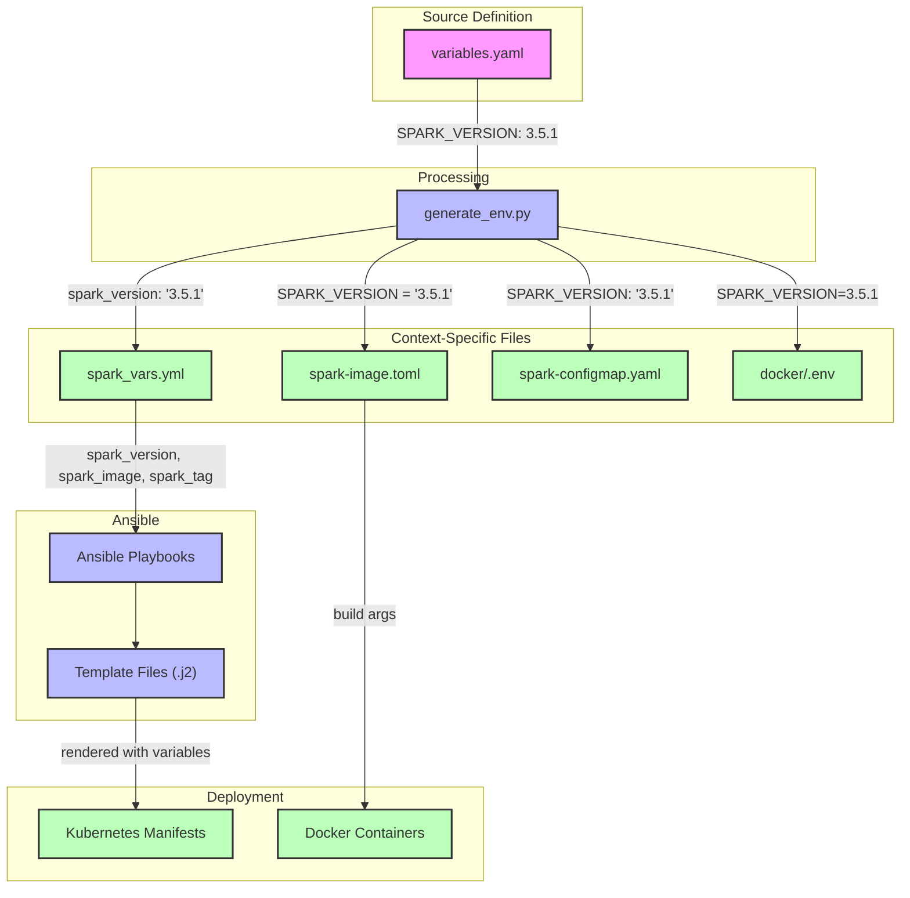

# Variable Flow in Elastic-on-Spark

This document outlines how variables flow through the system from the central definition to their use in deployed components.

## Overview

The variable flow follows a pipeline structure:

```
variables.yaml → generate_env.py → context-specific files → Ansible/deployment tools → deployed components
```

## Visual Representation



The diagram illustrates how variables are defined in the source file, processed by `generate_env.py`, distributed to context-specific files, and finally used in deployment.

## Detailed Flow for Spark Version

### 1. Source Definition

**File**: `/home/gxbrooks/repos/elastic-on-spark/variables.yaml`

This is the single source of truth for all variables. Variables are defined with their value and applicable contexts:

```yaml
SPARK_VERSION:
  value: 3.5.1
  contexts: [spark-image, ansible]
```

### 2. Variable Processing

**Agent**: `/home/gxbrooks/repos/elastic-on-spark/linux/generate_env.py`

This script reads the source definitions and generates context-specific configuration files:

```python
# Contexts and output files mapping
CONTEXTS = {
    'observability': 'docker/.env',
    'spark-image': 'spark/spark-image.toml',
    'spark-runtime': 'spark/k8s/spark-configmap.yaml',
    'ansible': 'ansible/vars/spark_vars.yml',
}

# Function that extracts variables for specific contexts
def get_vars(config, context):
    return {k: v['value'] for k, v in config.items() if context in v['contexts']}
```

### 3. Context-Specific Files

For Spark version, the relevant context-specific files are:

#### a. Ansible Variables

**File**: `/home/gxbrooks/repos/elastic-on-spark/ansible/vars/spark_vars.yml`  
**Generated by**: `write_ansible_vars()` function in `generate_env.py`

```yaml
# Spark version
spark_version: "3.5.1"

# Registry and image configuration
registry_host: "localhost:5000"
spark_image: "{{ registry_host }}/spark"
spark_tag: "{{ spark_version }}"
```

Key transformations:
- `SPARK_VERSION` → `spark_version` (naming convention change)
- Additional derived variables: `spark_image`, `spark_tag`

#### b. Spark Image Configuration

**File**: `/home/gxbrooks/repos/elastic-on-spark/spark/spark-image.toml`  
**Generated by**: `write_toml()` function in `generate_env.py`

```toml
[env]
SPARK_VERSION = "3.5.1"
```

### 4. Ansible Playbook Processing

**Agent**: Ansible playbooks in `/home/gxbrooks/repos/elastic-on-spark/ansible/playbooks/spark/`

Playbooks include the generated variables file:

```yaml
vars_files:
  - "{{ playbook_dir | dirname | dirname }}/vars/spark_vars.yml"
```

### 5. Template Rendering

**Agent**: Ansible template module

**Input Files**: Template files in `/home/gxbrooks/repos/elastic-on-spark/ansible/roles/spark/templates/`  
**Example**: `spark-master-deployment.yml.j2`

```yaml
containers:
  - name: spark-master
    image: "{{ spark_image }}:{{ spark_tag }}"
```

**Output Files**: Rendered Kubernetes manifests in the target environment's directory  
**Example**: `~/spark/k8s/spark-master-deployment.yaml`

> **Note on File Extensions**: The system maintains consistency by converting `.yml.j2` template files to `.yaml` output files during the rendering process. This ensures compatibility with both Ansible (which often uses `.yml`) and Kubernetes (which prefers `.yaml`). The conversion is handled by the regex_replace filter in the template task.

Key transformations:
- Ansible variables are rendered into their values
- `{{ spark_image }}:{{ spark_tag }}` → `localhost:5000/spark:3.5.1`

### 6. Deployment

**Agent**: Kubernetes (via kubectl, applied by Ansible)

The rendered manifest files are applied to the Kubernetes cluster, creating or updating the necessary resources with the correct Spark version.

### Variable Transformation Example: Elasticsearch Settings

Variables related to Elasticsearch follow this flow:

1. **Source Definition**:
```yaml
# In variables.yaml
ELASTIC_HOST:
  value: es01
  contexts: [observability, spark-runtime]
ELASTIC_PORT:
  value: 9200
  contexts: [observability, spark-runtime]
```

2. **Processing by generate_env.py**:
   - For `spark-runtime` context: Added to `spark-configmap.yaml` as environment variables
   - For `ansible` context: Converted to snake_case and added to `spark_vars.yml`

3. **Available in Templates**:
```yaml
# Available in templates as:
{{ elastic_host }} # From spark_vars.yml
```

4. **Kubernetes ConfigMap**:
```yaml
# Also available via ConfigMap reference in deployment templates:
envFrom:
  - configMapRef:
      name: spark-configmap
# Which provides ELASTIC_HOST and ELASTIC_PORT environment variables
```

## Complete Flow Summary

1. **Source of Truth**: `variables.yaml` defines `SPARK_VERSION: 3.5.1`
2. **Processing**: `generate_env.py` processes this definition
3. **Context Generation**: 
   - For Ansible: Creates `spark_vars.yml` with `spark_version: "3.5.1"`
   - For Spark image: Creates `spark-image.toml` with `SPARK_VERSION = "3.5.1"`
4. **Ansible Processing**: Playbooks load variables from `spark_vars.yml`
5. **Template Rendering**: Templates use `{{ spark_image }}:{{ spark_tag }}` which gets rendered to `localhost:5000/spark:3.5.1`
6. **Deployment**: Rendered manifest files are applied to Kubernetes

## Best Practices

1. Always modify variables in the source file (`variables.yaml`)
2. Run `generate_env.py` after any changes to update all context-specific files
3. Ensure playbooks include the appropriate vars file
4. Use the correct variable naming conventions in templates:
   - Ansible variables use snake_case: `{{ spark_version }}`
   - Shell/environment variables use UPPER_CASE: `${SPARK_VERSION}`

## Maintaining Consistency

The system ensures consistency by:
1. Using a single source of truth (`variables.yaml`)
2. Automatic generation of context-specific files
3. Proper inclusion of variable files in playbooks
4. Consistent variable naming and referencing in templates

To verify that variables are properly flowing through the system, refer to the [Variable Consistency Checklist](VARIABLE_CONSISTENCY_CHECKLIST.md).
