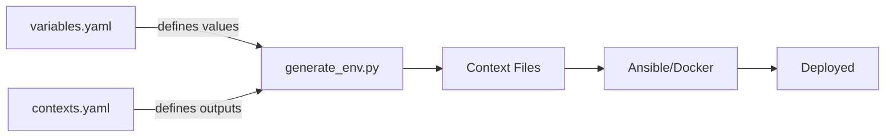

# Variable Flow in Elastic-on-Spark

## **Core Principles**

### **1. Single Source of Truth**

All variables are defined in `variables.yaml`. Never hardcode versions or configuration values in playbooks, scripts, or templates.

### **2. Required vs Optional Values**

**CRITICAL GUIDELINE**: Only specify component versions that have explicit requirements (e.g., "PySpark 4.0.1 is required"). 

- ✅ **Specify versions**: When compatibility matters (e.g., `SPARK_VERSION: 4.0.1`)
- ❌ **Don't default**: Scripts MUST error if required variables are missing
- ✅ **Detect drift**: Missing variables indicate configuration problems

**Rationale**: The single source of truth model only works if missing values are detected, not silently defaulted.

**Example** (from `linux/assert_devops_client.sh`):
```bash
# Load from environment file
source devops_env.sh

# Error if critical variable is missing
if [[ -z "$SPARK_VERSION" ]]; then
  echo "Error: SPARK_VERSION not defined in devops_env.sh" >&2
  exit 1
fi

# Use the variable
pip install pyspark==$SPARK_VERSION
```

### **3. Version Consistency**

All clients and managed nodes MUST run the same versions. This prevents:
- RPC serialization errors (Spark)
- API incompatibilities (Elasticsearch/Kibana)
- Unexpected behavior from version drift

---

## **Architecture Overview**



**Flow**: 
1. `variables.yaml` + `contexts.yaml` define what and where
2. `generate_env.py` generates context-specific files
3. Deployment tools consume generated files
4. Components run with consistent configuration

---

## **Key Files**

| File | Purpose | Format |
|------|---------|--------|
| `variables.yaml` | Variable values + contexts | YAML |
| `contexts.yaml` | Output specifications | YAML |
| `linux/generate_env.py` | Code generator | Python |

**Generated Files** (examples):
- `spark/spark-image.toml` → Docker build args
- `ansible/vars/spark_vars.yml` → Ansible variables
- `ansible/roles/spark/files/k8s/spark-configmap.yaml` → K8s environment
- `observability/.env` → Docker Compose

See `contexts.yaml` for complete list of outputs.

---

## **Usage**

### **Update a Variable**

```bash
# 1. Edit variables.yaml
vim variables.yaml

# 2. Regenerate all contexts
./linux/generate_env.py -f

# 3. Deploy changes
cd ansible && ansible-playbook -i inventory.yml playbooks/spark/deploy.yml
```

### **Add a New Context**

```bash
# 1. Edit contexts.yaml - add new context spec
# 2. Tag variables in variables.yaml with new context name
# 3. Run generator
./linux/generate_env.py <context-name> -v
```

### **Check Status**

```bash
# See what would be regenerated
./linux/generate_env.py

# Force regenerate all with verbose output
./linux/generate_env.py -f -v
```

---

## **Naming Conventions**

| Context Type | Variable Format | Example |
|--------------|-----------------|---------|
| `env`, `shell_env` | `UPPER_CASE` | `SPARK_VERSION="4.0.1"` |
| `ansible_vars` | `snake_case` | `spark_version: "4.0.1"` |
| `toml` | `UPPER_CASE` | `SPARK_VERSION = "4.0.1"` |
| `configmap` | `UPPER_CASE` | `SPARK_VERSION: "4.0.1"` |

---

## **Troubleshooting**

**Problem**: Generated file has wrong values  
**Solution**: Check `variables.yaml` - ensure variable has value and correct contexts list

**Problem**: Variable missing in generated file  
**Solution**: Add context name to variable's `contexts` list in `variables.yaml`

**Problem**: Script fails with "variable not defined"  
**Solution**: ✅ **This is correct behavior!** Add the missing variable to `variables.yaml` with appropriate contexts

**Problem**: Context not generating  
**Solution**: Verify context exists in `contexts.yaml` and output type is valid

---

## **Implementation Details**

For detailed code examples and technical implementation, see:
- `contexts.yaml` - Context specifications
- `linux/generate_env.py` - Generator implementation  
- Individual context files for output formats

---

**Key Takeaway**: This data-driven architecture ensures **version consistency** across all infrastructure by detecting missing values rather than hiding them with defaults.
