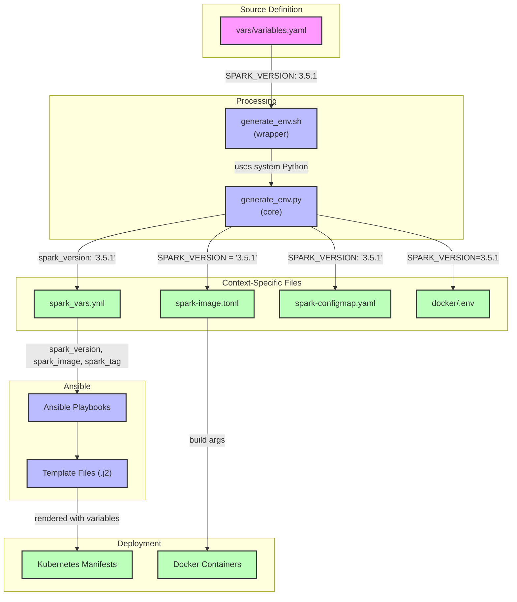

```mermaid
flowchart TD
    subgraph "Source Definition"
        variables["vars/variables.yaml"]
    end

    subgraph "Processing"
        generate_env["generate_env.sh\n(wrapper)"]
        generate_env_py["generate_env.py\n(core)"]
    end

    subgraph "Context-Specific Files"
        spark_image["spark-image.toml"]
        spark_vars["spark_vars.yml"]
        spark_configmap["spark-configmap.yaml"]
        docker_env["docker/.env"]
    end

    subgraph "Ansible"
        playbooks["Ansible Playbooks"]
        templates["Template Files (.j2)"]
    end

    subgraph "Deployment"
        k8s_manifest["Kubernetes Manifests"]
        docker_container["Docker Containers"]
    end

    variables -->|"SPARK_VERSION: 3.5.1"| generate_env
    generate_env -->|"uses system Python"| generate_env_py
    
    generate_env_py -->|"SPARK_VERSION = '3.5.1'"| spark_image
    generate_env_py -->|"spark_version: '3.5.1'"| spark_vars
    generate_env_py -->|"SPARK_VERSION: '3.5.1'"| spark_configmap
    generate_env_py -->|"SPARK_VERSION=3.5.1"| docker_env
    
    spark_vars -->|"spark_version, spark_image, spark_tag"| playbooks
    
    playbooks --> templates
    templates -->|"rendered with variables"| k8s_manifest
    
    spark_image -->|"build args"| docker_container
    
    classDef source fill:#f9f,stroke:#333,stroke-width:2px;
    classDef processor fill:#bbf,stroke:#333,stroke-width:2px;
    classDef output fill:#bfb,stroke:#333,stroke-width:2px;
    
    class variables source;
    class generate_env,generate_env_py,playbooks,templates processor;
    class spark_image,spark_vars,spark_configmap,docker_env,k8s_manifest,docker_container output;
```
