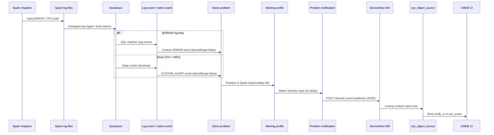

# Dynatrace problems → ServiceNow events (brooks-lab)

**Updated:** 2026-06-11  
**Automation:** `ansible/playbooks/servicenow/sgc/sources/dynatrace/events/deploy.yml`

This document describes how Dynatrace detects Spark lab conditions (host CPU and ERROR log lines), opens **problems**, and forwards them to ServiceNow **Event Management** as `em_event` rows via the brooks-lab webhook (`source=SGO-Dynatrace`).

---

## End-to-end flow



### Stages

| Stage | Component | What happens |
| ----- | --------- | ------------ |
| 1. Signal | Spark chapters, OneAgent | Chapters raise host CPU and occasionally emit log4j **ERROR** lines to `/mnt/spark/logs/*` or `/opt/spark/logs/*`. |
| 2. Detection | Log event / metric event | Dynatrace Settings 2.0 objects evaluate DQL (logs) or `builtin:host.cpu.usage` (metrics). |
| 3. Problem | Davis | Each matching signal creates a **problem** (`davisMerge=false` so log/CPU alerts are not silently merged away). |
| 4. Filter | Alerting profile | **`Spark Observability - ServiceNow brooks-lab`** scopes problems to management zone **Spark Observability** and forwards **ERRORS**, **CUSTOM_ALERT**, and other configured severities immediately. |
| 5. Notify | Problem notification | **`ServiceNow brooks-lab - Spark Observability`** POSTs the SGC problem JSON template to ServiceNow. |
| 6. Ingest | EM push connector | Listener `source=SGO-Dynatrace` parses JSON, maps fields, optionally binds CI via `sys_object_source`. |
| 7. Operate | Event rules / alerts | Downstream EM rules may create `em_alert` or ITSM incidents (not covered here). |

---

## Dynatrace objects (Ansible-managed)

| Object | Settings schema | Summary / name | Purpose |
| ------ | --------------- | -------------- | ------- |
| Management zone | `builtin:management-zones` | `Spark Observability` | Partition brooks-lab hosts/K8s (prerequisite from `observability/dynatrace/deploy.yml`). |
| **Log event** | `builtin:logmonitoring.log-events` | **`Spark Lab - ERROR log lines`** | Fires on ERROR logs under Spark log paths. |
| Metric event | `builtin:anomaly-detection.metric-events` | `Spark Lab - Host CPU above 80%` | Fires when `builtin:host.cpu.usage` AVG > 80% (3-sample window). |
| Alerting profile | `builtin:alerting.profile` | `Spark Observability - ServiceNow brooks-lab` | Forwards problems in the Spark Observability MZ. |
| Problem notification | `builtin:problem.notifications` | `ServiceNow brooks-lab - Spark Observability` | Webhook to ServiceNow inbound events API. |

Deploy or refresh:

```bash
cd ansible
ansible-playbook -i inventory.yml \
  playbooks/servicenow/sgc/sources/dynatrace/events/deploy.yml \
  -e @../vars/secrets.yaml
```

Diagnose / test:

```bash
ansible-playbook -i inventory.yml \
  playbooks/servicenow/sgc/sources/dynatrace/events/diagnose.yml \
  -e @../vars/secrets.yaml

ansible-playbook -i inventory.yml \
  playbooks/servicenow/sgc/sources/dynatrace/events/test.yml \
  -e @../vars/secrets.yaml
```

---

## Spark ERROR log monitor

### Configuration

Template: `ansible/playbooks/servicenow/sgc/sources/dynatrace/files/spark-error-log-event.json.j2`

| Field | Value |
| ----- | ----- |
| **Summary** | `Spark Lab - ERROR log lines` |
| **Enabled** | `true` |
| **DQL matcher** | `loglevel == "ERROR" AND (matchesValue(log.source.path, "/mnt/spark/logs/*") OR matchesValue(log.source.path, "/opt/spark/logs/*") OR matchesValue(content, "*TaskSetManager*") OR matchesValue(content, "*org.apache.spark*"))` |
| **Event title** | `Spark ERROR log detected ({log.source})` |
| **Event description** | Spark application log line at ERROR level in brooks-lab (`{log.source.path}`). |
| **Event type** | `ERROR` |
| **Davis merge** | `false` — each ERROR match opens/forwards a distinct problem. |

### Why these paths

| Path | Typical writer |
| ---- | -------------- |
| `/mnt/spark/logs/*` | Spark driver/executor logs on Lab hosts (chapter client mode, NFS mount). |
| `/opt/spark/logs/*` | Spark 4.x UI / DiskLog on workers when present. |

The matcher uses Dynatrace **DQL** `matchesValue()` wildcards (not the deprecated `queryDefinition` / `triggeringThreshold` shape). Any single ERROR line in those paths triggers the log event.

### Expected chapter signal

During `./run-chapters.sh`, chapters **06** and **08** occasionally emit log4j ERROR lines (for example `TaskSetManager` task abort). With the log event deployed, Dynatrace should open an **ERRORS**-severity problem and forward it to ServiceNow.

---

## Host CPU metric monitor (companion path)

Template: `ansible/playbooks/servicenow/sgc/sources/dynatrace/files/spark-cpu-metric-event.json.j2`

| Field | Value |
| ----- | ----- |
| **Metric** | `builtin:host.cpu.usage` (AVG) |
| **Threshold** | Static **> 80%** |
| **Samples** | `violatingSamples: 1`, `samples: 3`, `dealertingSamples: 3` |
| **Event type** | `CUSTOM_ALERT` |
| **Title** | `Spark Lab host CPU above 80% ({dims:dt.entity.host})` |

Chapter runs sustain CPU on Lab1/Lab2/Lab3 hosts in the Spark Observability management zone, producing **CUSTOM_ALERT** problems forwarded on the same webhook path.

---

## Problem notification webhook

**URL (brooks-lab, SGC installed):**

```
https://optimizincdemo1.service-now.com/api/sn_em_connector/em/inbound_event?source=SGO-Dynatrace
```

**Authentication:** HTTP `Authorization: Basic …` using brooks-lab credentials (`SN_DT_WEBHOOK_USER` / `SN_DT_WEBHOOK_PASSWORD` in `vars/secrets.yaml`). Automation provisions these for the brooks-lab notification only; it does **not** modify the pre-existing **ServiceNow Demo 1 - Optimiz** notification.

**Payload template** (SGC format — `ConnectionId` + **`ProblemDetailsJSON`** v1, not v2):

The SGC inbound listener (`Dynatrace Observability`) reads `ProblemDetailsJSON.id` and
`ProblemDetailsJSON.rankedEvents[]` (with `entityId`, `eventType`, `severityLevel`).
The Demo 1 / legacy template uses `ProblemDetailsJSONv2`, which causes HTTP 500 on the
SGO path. Ansible deploys the SGC template from
`files/sgc-problem-notification-payload.json.j2` when `sn_dynatrace_integ` is installed.

```json
{
  "ConnectionId": "<sys_alias sys_id for Dynatrace Connection>",
  "ImpactedEntities": {ImpactedEntities},
  "ImpactedEntity": "{ImpactedEntity}",
  "PID": "{PID}",
  "ProblemDetailsJSON": {ProblemDetailsJSON},
  "ProblemDetailsText": "{ProblemDetailsText}",
  "ProblemID": "{ProblemID}",
  "ProblemImpact": "{ProblemImpact}",
  "ProblemSeverity": "{ProblemSeverity}",
  "ProblemTitle": "{ProblemTitle}",
  "ProblemURL": "{ProblemURL}",
  "State": "{State}",
  "Tags": "{Tags}"
}
```

**Closed problems:** `notifyClosedProblems: true` — resolution updates are POSTed when problems close.

---

## Dynatrace webhook fields (source)

These keys arrive in the POST body after Dynatrace substitutes problem placeholders.

| Webhook field | Dynatrace meaning | Example (ERROR log problem) |
| ------------- | ----------------- | --------------------------- |
| **`ProblemID`** | Unique problem identifier (stable for open/close pair) | `-1234567890123456789` |
| **`ProblemTitle`** | Short title from event template / Davis | `Spark ERROR log detected (Lab2)` |
| **`ProblemSeverity`** | Davis severity label | `ERROR` (log event) or `CUSTOM_ALERT` (CPU) |
| **`ProblemImpact`** | User/business impact level | `INFRASTRUCTURE`, `APPLICATION`, etc. |
| **`ProblemURL`** | Deep link to problem in Dynatrace UI | `https://…/ui/problems/…` |
| **`ImpactedEntity`** | Primary impacted entity display name | Host or log source name |
| **`ImpactedEntities`** | JSON array of impacted entities | Hosts, processes, services with `entityId`, name, type |
| **`ProblemDetailsJSONv2`** | Structured problem detail (events, entityIds, root cause) | Parsed by SGC for CI binding |
| **`ProblemDetailsText`** | Plain-text problem narrative | Multi-line Davis analysis |
| **`ProblemDetailsMarkdown`** | Markdown problem narrative | Same content, markdown |
| **`ProblemDetailsHTML`** | HTML problem narrative | Same content, HTML |
| **`State`** | `OPEN` or `RESOLVED` (closed notification) | `OPEN` on create |
| **`Tags`** | Problem tags (includes management zone / auto-tags when present) | `Project:spark-observability`, … |
| **`PID`** | Davis correlation / problem id alias | Used for cross-event correlation |

Entity identifiers for CI binding are taken from **`ImpactedEntities`** / **`ProblemDetailsJSONv2`** (fields such as `entityId`, `dt.entity.host`, `dt.entity.process_group_instance`).

---

## ServiceNow `em_event` fields

When the SGC push connector listener (`source=SGO-Dynatrace`) accepts the webhook, ServiceNow creates or updates a row in **`em_event`**. Exact transforms are defined in scoped app field mappings (`sa_event_field_mapping` / `$sa_event_map`); the table below is the operational contract for brooks-lab.

| `em_event` field | Purpose | Populated from (Dynatrace → SN) |
| ---------------- | ------- | -------------------------------- |
| **`source`** | Identifies integration; selects listener and mapping rules | URL query parameter **`SGO-Dynatrace`** (not from JSON body) |
| **`message_key`** | Deduplication / update key for the same problem | **`ProblemID`** — same key on OPEN and RESOLVED posts |
| **`description`** | Primary human-readable text in Event Management UI | **`ProblemTitle`**, often concatenated with **`ProblemDetailsText`** or markdown excerpt |
| **`message`** | Short message (legacy/alternate display) | Usually mirrors **`ProblemTitle`** or first line of details |
| **`severity`** | Numeric severity (**1**=Critical … **5**=OK); required for Ready state | Mapped from **`ProblemSeverity`** / **`ProblemImpact`** (e.g. ERROR → 2–3, CUSTOM_ALERT → 3–4) |
| **`type`** | Event classification for rules and dashboards | Derived from problem category / event type in **`ProblemDetailsJSONv2`** (e.g. `ERROR`, `CUSTOM_ALERT`) |
| **`node`** | Primary affected entity key for binding and dedup | **`ImpactedEntity`** display name or parsed host from **`ImpactedEntities`** |
| **`resource`** | Sub-component (process, service, log source) | Log source path or process name from impacted entities when present |
| **`metric_name`** | Metric that triggered the problem (CPU path) | From metric event details inside **`ProblemDetailsJSONv2`** (e.g. `builtin:host.cpu.usage`) |
| **`additional_info`** | JSON/text blob for advanced rules | Full or partial webhook JSON: **`ProblemDetailsJSONv2`**, **`ProblemURL`**, **`Tags`**, **`ImpactedEntities`**, **`PID`** |
| **`time_of_event`** | When the condition occurred | Problem start time from payload / parsed JSON (not necessarily POST time) |
| **`timestamp`** | Ingest / record timestamp | ServiceNow insert time |
| **`correlation_id`** | Cross-event correlation | **`PID`** when mapped |
| **`cmdb_ci`** | Link to affected CI (Service Map, incidents) | **`sys_object_source`** lookup: native key = Dynatrace **`entityId`** from **`ImpactedEntities`** / **`ProblemDetailsJSONv2`** |
| **`cmdb_ci_type`** | CMDB table of bound CI | From matched **`sys_object_source.target_table`** (e.g. `cmdb_ci_linux_server`) |
| **`state`** | Processing state (`Ready`, `Error`, …) | **Ready** when severity and required fields validate; **Error** on mapping failures (e.g. missing severity in test payloads) |
| **`event_class`** | Optional classifier for downstream rules | Connector default or parsed problem category |
| **`resolution_code`** | Cleared / closed semantics | Set when **`State`** = `RESOLVED` on close notification |

### CI binding (SGC path)

1. Listener receives POST at `inbound_event?source=SGO-Dynatrace`.
2. Parser extracts **`entityId`** from **`ImpactedEntities`** or **`ProblemDetailsJSONv2`**.
3. Builds **source native key** → queries **`sys_object_source`** where `name = SGO-Dynatrace`.
4. Writes **`cmdb_ci`** and **`cmdb_ci_type`** on the new or updated `em_event`.

If step 3 fails (import lag, hostname mismatch such as `lab1` vs `Lab1`), the event is still created but **`cmdb_ci` may be empty** until SGC scheduled imports and IRE merge align entities.

### Severity mapping (typical)

| Dynatrace `ProblemSeverity` | Typical `em_event.severity` | brooks-lab source |
| --------------------------- | --------------------------- | ----------------- |
| `AVAILABILITY` | 1 (Critical) | Rare on chapter path |
| `ERROR` | 2 (Major) | **Spark ERROR log event** |
| `PERFORMANCE` | 3 (Minor) | — |
| `RESOURCE_CONTENTION` | 3 (Minor) | — |
| `CUSTOM_ALERT` | 3–4 (Minor / Warning) | **Host CPU > 80%** |

Exact numbers depend on SGC field mapping version; use Event Management → All Events to confirm on the tenant.

---

## Generating test traffic

Run chapters (CPU load + occasional ERROR logs):

```bash
cd spark/apps/data-analysis-book

# All chapters except 08/09 sequentially, with 08 then 09 in parallel:
./run-chapters.sh 08 09 > /tmp/chapters-08-09.log 2>&1 &
./run-chapters.sh 03 04 05 06 07 10
wait
```

Or all chapters sequentially:

```bash
./run-chapters.sh -a
```

---

## Dynatrace UI navigation (tenant pdt20158)

The brooks-lab SGC webhook is a **Settings Classic** object (`builtin:problem.notifications`).
It is **not** listed under **Settings → Connections → ServiceNow** — that surface only
shows integrations registered through the Connections wizard. Searching **ServiceNow**
inside **Settings** returns the Connections list, not the webhook.

**Object name:** `ServiceNow brooks-lab - Spark Observability`

### SGC webhook — how to open it

On current Dynatrace SaaS builds, top-level **Settings** has **Connections** but no
**Integration** menu. Problem notifications live under **Settings Classic**. Use one of
these paths (first is usually fastest):

**Option 1 — Direct list URL (recommended)**

Open the Problem notifications list:

[Problem notifications (tenant pdt20158)](https://pdt20158.live.dynatrace.com/ui/settings/builtin:problem.notifications)

Scroll to **`ServiceNow brooks-lab - Spark Observability`**, expand the row (**Details**
arrow), then **Send test notification** or edit as needed.

**Option 2 — Global search → Settings Classic**

Use the **global** search bar at the top of Dynatrace (main app chrome), **not** the
filter inside **Settings**:

1. Search **`Settings Classic`** and open it  
   (or search **`Problem notifications`** and pick the Settings Classic result)
2. **Integration** → **Problem notifications**
3. Open **`ServiceNow brooks-lab - Spark Observability`**

**Option 3 — Left navigation**

If **Settings Classic** appears in the left nav (may need pinning under **Customize
navigation**):

1. **Settings Classic** → **Integration** → **Problem notifications**
2. Open **`ServiceNow brooks-lab - Spark Observability`**

Dynatrace documents this location as **Settings Classic → Integration → Problem
notifications** ([webhook integration docs](https://docs.dynatrace.com/docs/analyze-explore-automate/notifications-and-alerting/problem-notifications/webhook-integration)).

### Verify the correct webhook

On the notification detail page, confirm:

| Field | Expected value |
| ----- | -------------- |
| Display name | `ServiceNow brooks-lab - Spark Observability` |
| Type | Custom integration / **Webhook** |
| Webhook URL | `https://optimizincdemo1.service-now.com/api/sn_em_connector/em/inbound_event?source=SGO-Dynatrace` |
| Alerting profile | `Spark Observability - ServiceNow brooks-lab` |
| Payload | includes `ConnectionId` (SGC template) |

Auth uses brooks-lab Basic credentials (`SN_DT_WEBHOOK_*` in `vars/secrets.yaml`).

### Deep links

The **list** URL above is reliable. Per-object **edit** URLs often spin or return to
home — open the row from the list instead. Use `*.live.dynatrace.com` (not
`*.apps.dynatrace.com`).

Related list URLs:

- [Problem alerting profiles](https://pdt20158.live.dynatrace.com/ui/settings/builtin:alerting.profile)
- [Log events](https://pdt20158.live.dynatrace.com/ui/settings/builtin:logmonitoring.log-events)
- [Metric events](https://pdt20158.live.dynatrace.com/ui/settings/builtin:anomaly-detection.metric-events)

### Alerting profile (which problems trigger the webhook)

**Object:** `Spark Observability - ServiceNow brooks-lab`

1. Open [Problem alerting profiles](https://pdt20158.live.dynatrace.com/ui/settings/builtin:alerting.profile), **or**
   **Settings Classic** → **Alerting** → **Problem alerting profiles**
2. Open **`Spark Observability - ServiceNow brooks-lab`**
3. Confirm **Management zone** = **Spark Observability** and severity rules include
   **ERROR** and **CUSTOM_ALERT**

### Problem detectors (what opens problems)

| Object | Navigation |
| ------ | ---------- |
| **`Spark Lab - ERROR log lines`** | [Log events list](https://pdt20158.live.dynatrace.com/ui/settings/builtin:logmonitoring.log-events) or **Settings Classic** → **Log monitoring** → **Log events** |
| **`Spark Lab - Host CPU above 80%`** | [Metric events list](https://pdt20158.live.dynatrace.com/ui/settings/builtin:anomaly-detection.metric-events) or **Settings Classic** → **Anomaly detection** → **Metric events** |

### Problems (runtime view)

1. Left nav → **Problems**
2. Filter **Management zone** = **Spark Observability**

### ServiceNow — SGO-Dynatrace events

| Purpose | URL |
| ------- | --- |
| `em_event` list (newest first) | [em_event_list.do](https://optimizincdemo1.service-now.com/em_event_list.do?sysparm_query=source%3DSGO-Dynatrace%5EORDERBYDESCsys_created_on) |

**UI path:** **Event Management → All Events** → filter **Source** = `SGO-Dynatrace`.

---

## Validation

**Dynatrace UI**

- Settings → Log monitoring → Log events → **`Spark Lab - ERROR log lines`**
- Settings → Anomaly detection → Metric events → **`Spark Lab - Host CPU above 80%`**
- Problems → filter management zone **Spark Observability**

**ServiceNow UI**

- Event Management → All Events → filter **`source`** contains `SGO-Dynatrace`
- Expect **`description`** matching Spark ERROR or CPU titles after chapter runs

**Ansible**

```bash
cd ansible
ansible-playbook -i inventory.yml \
  playbooks/servicenow/sgc/sources/dynatrace/events/test.yml \
  -e @../vars/secrets.yaml
```

---

## Isolation from Demo 1

| Object | Brooks-lab automation | Pre-existing Demo 1 |
| ------ | --------------------- | ------------------- |
| Problem notification | `ServiceNow brooks-lab - Spark Observability` | `ServiceNow Demo 1 - Optimiz` |
| Inbound URL | `source=SGO-Dynatrace` | `source=dynatrace&sys_id=712a39811…` |
| Alerting profile | Spark Observability MZ only | (Demo 1 profile separate) |

Brooks-lab playbooks **add** parallel Dynatrace objects; they do **not** modify Demo 1 connector configuration.

---

## Related documentation

- `ansible/playbooks/servicenow/sgc/sources/dynatrace/events/` — deploy, diagnose, test playbooks
- `ansible/playbooks/servicenow/docs/install.md` — SGC install and Phase 4 events sequence
- `observability/dynatrace/docs/Tenant_Setup.md` — tokens and tenant partitioning
- `tmp/Dynatrace-ServiceNow-events.md` — extended architecture notes and provenance
