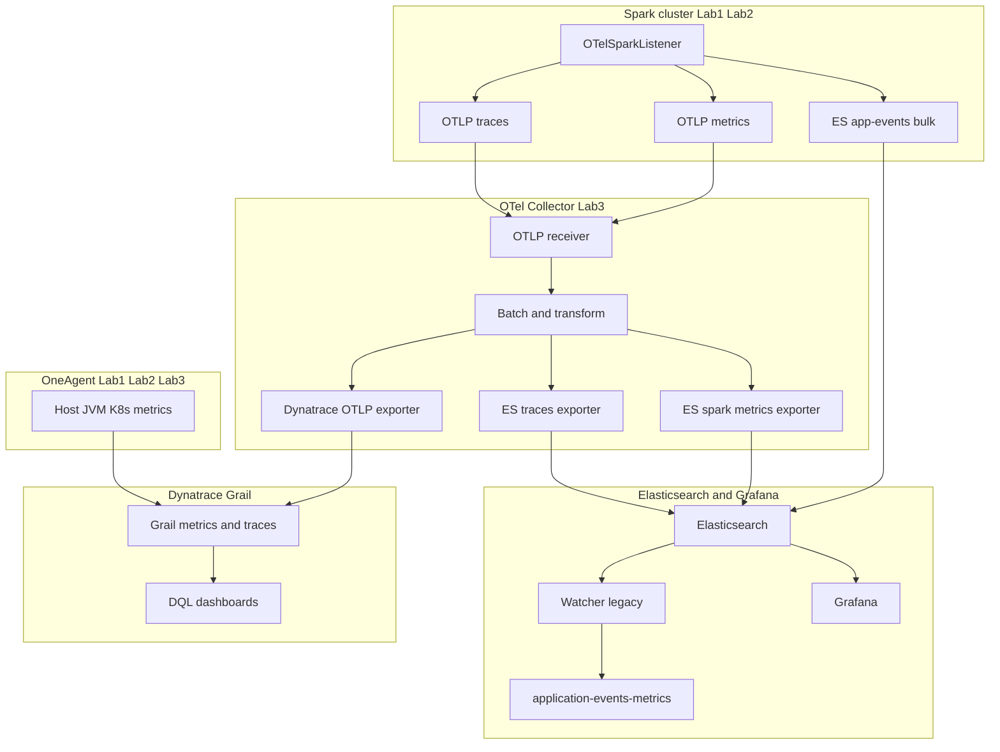

# Dynatrace architecture

## Scope

Dynatrace is a co-equal observability backend alongside the Elastic/Grafana
stack. Both platforms can receive telemetry simultaneously; Ansible lifecycle
playbooks select emphasis via `OBSERVABILITY_PLATFORM` (`elastic` default,
`dynatrace` for Dynatrace-focused operations).

This document describes **where components run**, **how data flows**, and
**what each layer is responsible for**. Operational playbooks, dashboard JSON,
and ingest tokens live elsewhere in the `dynatrace/` module.

## Platform mental model

| Concept | Role in this project |
|--------|----------------------|
| **OneAgent** | Host, process, and Kubernetes instrumentation on Lab1–Lab3 — supplies `dt.host.*`, JVM, and K8s infra signals (CPU, memory, page faults, etc.) |
| **Grail** | Dynatrace analytics store for logs, traces, metrics, and events — OTLP and REST-ingested custom metrics land here |
| **Metric key** | Identifier for a time series in Grail (e.g. `dt.host.cpu.usage` or OTLP-derived custom keys) — DQL `timeseries` requires a metric key, not a string literal |
| **Classic vs Grail metrics** | Older `builtin:tech.jvm.*` keys vs newer `dt.*` / Grail-native keys — custom Spark OTLP metrics use Grail ingest; some JVM tiles remain Classic-only |
| **OTLP ingest** | Tenant endpoint for traces, metrics, and logs — the OTel Collector dual-feeds traces and Spark metrics here |
| **Management zone / tags** | In-tenant partitioning (`Spark Observability`) — filters DQL tiles to lab hosts and cluster |
| **DQL `timeseries`** | Primary chart primitive for New Dashboards — `timeseries avg(metric.key), by:{dimension}` |
| **Distributed traces** | Spark jobs appear as trace hierarchies in Grail — used for drilldown, **not** for active execution counts |

Grafana composes many backends (Elasticsearch Lucene, PromQL, mixed sources).
Dynatrace dashboards excel when each tile is a **Grail metric**. Spark
application panels therefore follow **OTLP counters/gauges → Grail → DQL**,
while Grafana queries the **same instruments** from Elasticsearch (metrics
index) or, where bridged, Prometheus.

## Component placement

| Component | Where it runs | Responsibility |
|-----------|---------------|----------------|
| **OneAgent** | Lab1, Lab2, Lab3 | Host and process metrics, K8s node visibility, JVM auto-instrumentation |
| **Dynatrace Operator** | Kubernetes control plane (Lab3) | Installs and manages Dynakube |
| **Dynakube** (`cloudNativeFullStack`) | Kubernetes cluster | Full-stack K8s + workload monitoring; cluster display name must match inventory |
| **OTel Collector** | Lab3 (observability host) | Receives OTLP from Spark; fans out traces and Spark metrics to Elasticsearch and Dynatrace |
| **GPU sampler** | Lab1, Lab2 (K8s workers) | Reads AMD GPU sysfs; POSTs `system.gpu.*` to Dynatrace REST metrics ingest |
| **Docker observability stack** | Lab3 (`observability` group) | Elasticsearch, Grafana, Kibana, Prometheus, Tempo — unchanged when Dynatrace is enabled |

## End-to-end data flow

Spark telemetry originates in the driver/worker **OTelSparkListener**, which
emits three parallel channels:

1. **OTLP traces** — job/stage/task hierarchy for drilldown
2. **OTLP metrics** — low-cardinality Spark application signals (active executions, shuffle, failures, spills)
3. **HTTP bulk documents** — application lifecycle events in Elasticsearch (`app-events-*`) — legacy path retained until OTel metrics are fully validated

**OneAgent path (parallel):** Host CPU, memory, network, disk, page faults,
and JVM GC metrics flow directly to Grail without passing through the OTel
Collector. GPU metrics use a dedicated REST ingest sampler (`system.gpu.*`).

## Design principles

1. **Single instrumentation point** — `OTelSparkListener` owns Spark semantics; no second aggregator service.
2. **Same instruments, two stores** — the Collector fans out Spark metrics to Elasticsearch and Dynatrace, mirroring the existing trace dual-feed.
3. **Low cardinality labels only** — `operation.type`, bounded `spark.app.id`, `cluster`, `deployment.environment`; never stage name, task id, or SQL text on metrics (detail belongs in traces/events).
4. **Cumulative counters for bytes and failures** — query with `rate()` / DQL equivalents for throughput; UpDownCounters for instantaneous open counts.
5. **Metrics at the source** — Dynatrace New Dashboards visualize Grail time series; they do not poll Elasticsearch documents on an interval like Watchers. Spark lifecycle signals must be **pushed as metrics from the listener**.

## Spark application metrics

### Why not derive active executions from spans?

Traces already land in Grail via OTLP. Span-based “open count” queries are
unsuitable for dashboard tiles because span export is batch/async, hierarchical
close logic lives in application code, and DQL on spans is heavier and less
stable at 5–10 s refresh. The listener already maintains authoritative
open/close state for Elasticsearch events; metrics use the **same code path**.

### Active execution semantics

An **active execution** is an open START operation at a hierarchy level:

| `operation.type` | Meaning |
|------------------|---------|
| `app` | Spark application running (one per driver) |
| `job` | Job not yet ended |
| `stage` | Stage submitted, not completed |
| `task` | Task running — aggregated count only (no per-task metric series) |
| `sql` | SQL execution in progress |

The legacy Watcher counts documents where `event.type=start` and
`event.state=open`. OTel **UpDownCounters** increment on START and decrement
on END or hierarchical parent close, keeping OTLP semantics aligned with the
event model.

### Instrument catalog (Phase 1)

| Signal | Instrument kind | When updated |
|--------|-----------------|--------------|
| Active executions | UpDownCounter per `operation.type` | START (+1) / END or close (−1) on app, job, stage, task, sql |
| Shuffle read/write | Counter (bytes) | `onStageCompleted` from task metrics |
| Stage failures | Counter | `onStageCompleted` when failure reason present |
| Spill memory/disk | Counter (bytes) | `onStageCompleted` from task metrics |

Resource attributes include `service.name`, `spark.app.id`,
`deployment.environment`, and `k8s.cluster.name`.

### Collector routing (conceptual)

The OTel Collector receives all OTLP metrics from Spark. Metrics whose names
are prefixed with `spark.` are routed to a dedicated pipeline that exports to
**both** the Elasticsearch spark-metrics data stream and the Dynatrace OTLP
endpoint. Non-Spark metrics (e.g. bridged Prometheus remote write) follow the
default metrics pipeline. Cumulative Spark counters may pass through a
cumulative-to-delta transform before Dynatrace export where required by Grail.

## Platform equivalence

| Capability | Grafana (Elastic path) | Dynatrace | Shared instrumentation |
|------------|------------------------|-----------|------------------------|
| Active executions | ES metrics (OTel) + Watcher (legacy) | Grail OTLP metric | UpDownCounter per operation type |
| Shuffle throughput | ES metrics | Grail OTLP metric | Stage byte counters |
| Stage failures | ES metrics | Grail OTLP metric | Stage failure counter |
| Spills | ES metrics | Grail OTLP metric | Spill byte counters |
| Host CPU/memory/… | Elastic Agent / Prometheus | OneAgent `dt.host.*` | Separate agents |
| GPU | Elastic Agent | GPU sampler `system.gpu.*` | Separate samplers |
| Traces / drilldown | Elasticsearch / Tempo | Grail traces | OTLP traces |

## Query and visualization

- **New Dashboards (primary):** DQL `timeseries` against Grail metric keys;
  Spark System Metrics tiles mirror Grafana aggregated panels (active
  executions, shuffle, failures, spills, host golden signals).
- **Classic Dashboard (supplement):** DATA_EXPLORER tiles for Classic-only keys
  such as `builtin:tech.jvm.spark.*` and some GC proxies not yet in Grail.
- **Metric key discovery:** After first ingest, use Notebook
  `metrics | filter contains(metric.key, "spark")` to confirm OTLP → Grail
  normalization before locking dashboard queries.

Envelope panels (NIC rx/tx, disk read/write) use DQL field negation for the
secondary series because New Dashboards lack Grafana’s per-series dashed-line
styling; see `standards/visualizations.md` for cross-platform conventions.

## Related documentation

- [Elastic and Grafana Stack Architecture](../../docs/Elastic_and_Grafana_Stack_Architecture.md) — Elasticsearch-centric data flow and Grafana query paths
- [Dynatrace module README](../README.md) — playbooks, tokens, dashboard tiers, GPU and JVM notes
- [Elasticsearch indices](../../elasticsearch/docs/Elasticsearch_indices.md) — index and data-view layout for metrics and events
