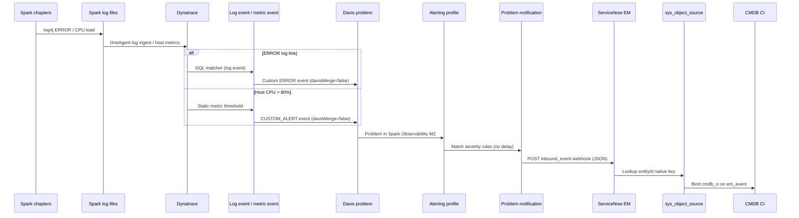
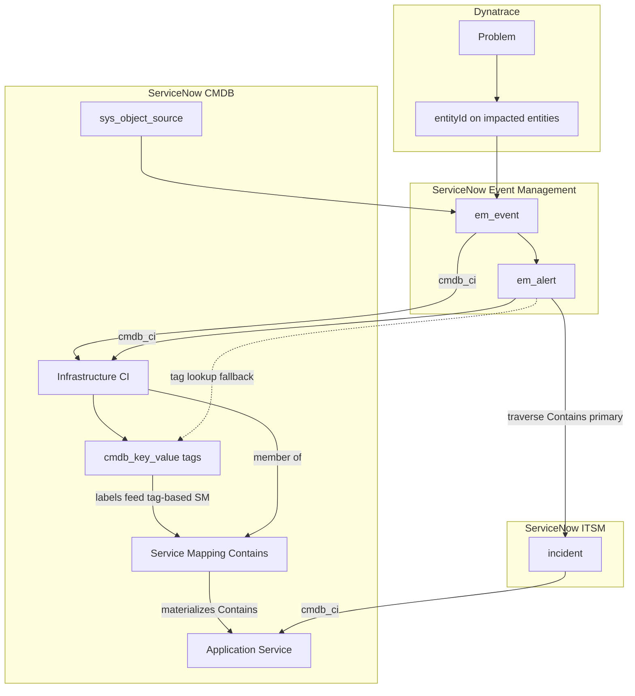
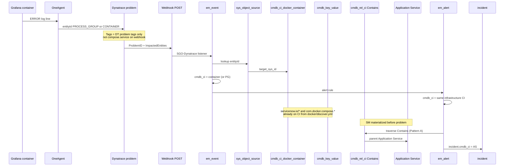

Dynatrace problems → ServiceNow events (brooks-lab)

**Updated:** 2026-06-30  
**Automation:** `ansible/playbooks/servicenow/sgc/sources/dynatrace/events/deploy.yml`

This document describes how Dynatrace detects Spark lab conditions (host CPU and ERROR/WARN log lines), opens **problems**, and forwards them to ServiceNow **Event Management** as `em_event` rows via the brooks-lab webhook (`source=SGO-Dynatrace`).

---

## End-to-end flow



### Stages

| Stage | Component | What happens |
| ----- | --------- | ------------ |
| 1. Signal | Spark chapters, OneAgent | Chapters raise host CPU and occasionally emit log4j **ERROR** lines to `/mnt/spark/logs/*` or `/opt/spark/logs/*`. |
| 2. Detection | Log event / metric event | Dynatrace Settings 2.0 objects evaluate DQL (logs) or `builtin:host.cpu.usage` (metrics). |
| 3. Problem | Davis | Each matching signal creates a **problem** (`davisMerge=false` so log/CPU alerts are not silently merged away). |
| 4. Filter | Alerting profile | **`Spark Observability - ServiceNow brooks-lab`** scopes problems to management zone **Spark Observability** and forwards **ERRORS**, **CUSTOM_ALERT**, and other configured severities immediately. |
| 5. Notify | Problem notification | **`ServiceNow brooks-lab - Spark Observability`** POSTs the SGC problem JSON template to ServiceNow. |
| 6. Ingest | EM push connector | Listener `source=SGO-Dynatrace` parses JSON, maps fields, optionally binds CI via `sys_object_source`. |
| 7. Operate | Event rules / alerts / incidents | EM rules promote `em_event` → `em_alert`; optional ITSM rules create incidents. See [CI binding by layer](#ci-binding-by-layer-dynatrace--event--alert--incident) and [Avoiding incident storms](#avoiding-incident-storms). |

---

## Dynatrace objects (Ansible-managed)

| Object | Settings schema | Summary / name | Purpose |
| ------ | --------------- | -------------- | ------- |
| Management zone | `builtin:management-zones` | `Spark Observability` | Partition brooks-lab hosts/K8s (prerequisite from `observability/dynatrace/deploy.yml`). |
| Custom log source | `builtin:logmonitoring.custom-log-source-settings` | **`Spark Lab - application log files`** | OneAgent tails `/mnt/spark/logs/*/spark-app.log*` for Grail ingest. |
| **OpenPipeline log alerts** | `builtin:openpipeline.logs.pipelines` | **`Spark Lab - log alerts`** | **Primary** Davis event extraction for ERROR/WARN Spark logs (required when logs route through custom OpenPipeline). |
| **Log event (classic)** | `builtin:logmonitoring.log-events` | **`Spark Lab - ERROR and WARN log lines`** | Legacy matcher; kept for idempotency but **does not fire** when logs bypass the classic pipeline (see below). |
| Metric event | `builtin:anomaly-detection.metric-events` | `Spark Lab - Host CPU above 80%` | Fires when `builtin:host.cpu.usage` AVG > 80% (3-sample window). |
| Alerting profile | `builtin:alerting.profile` | `Spark Observability - ServiceNow brooks-lab` | Forwards problems in the Spark Observability MZ. |
| Problem notification | `builtin:problem.notifications` | `ServiceNow brooks-lab - Spark Observability` | Webhook to ServiceNow inbound events API. |

Deploy or refresh:

```bash
cd ansible
ansible-playbook -i inventory.yml \
  playbooks/servicenow/sgc/sources/dynatrace/events/deploy.yml \
  -e @../vars/secrets.yaml
```

Diagnose / test:

```bash
ansible-playbook -i inventory.yml \
  playbooks/servicenow/sgc/sources/dynatrace/events/diagnose.yml \
  -e @../vars/secrets.yaml

ansible-playbook -i inventory.yml \
  playbooks/servicenow/sgc/sources/dynatrace/events/test.yml \
  -e @../vars/secrets.yaml
```

---

## Spark ERROR/WARN log monitor

### Why classic log events did not fire (tenant pdt20158)

On this Grail-enabled tenant, **all logs are routed through a custom OpenPipeline** (`Metric Route`, matcher `true`). When logs use a custom OpenPipeline route, **classic `builtin:logmonitoring.log-events` no longer evaluate** those records ([Dynatrace community](https://community.dynatrace.com/t5/Log-Analytics/Log-events-equivalent-in-OpenPipeline/m-p/291297)).

Symptoms observed during chapter runs:

| Layer | Finding |
| ----- | ------- |
| Elasticsearch | WARN/ERROR lines present (Elastic Agent tails NFS paths). |
| Grail | 1000+ matching WARN lines on `log.source=/mnt/spark/logs/*/spark-app.log`. |
| Classic log event | Enabled, DQL matched in Logs app — **zero** Davis events or problems. |
| ServiceNow | CPU `CUSTOM_ALERT` events arrived; **no** Spark log problems in `em_event`. |

**Fix:** Deploy an OpenPipeline **Davis event processor** on a dedicated pipeline and add a **routing entry** (before the catch-all `Metric Route`) for Spark log paths. Ansible: `apply_spark_openpipeline_log_alerts.yml` + `spark-openpipeline-log-alerts-pipeline.json.j2`.

Additional prerequisites (also deployed by `events/deploy.yml`):

1. **Custom log source** — OneAgent must tail `/mnt/spark/logs/*/spark-app.log*`.
2. **Client log4j2 file appender** — `run-chapters.sh` sets `SPARK_LOG_DIR` and loads `log4j2-client.properties` so chapter drivers write `spark-app.log`.

### OpenPipeline configuration (primary path)

Template: `observability/dynatrace/tenants/pdt20158/integrations/spark-openpipeline-log-alerts-pipeline.json.j2`

| Field | Value |
| ----- | ----- |
| **Pipeline name** | `Spark Lab - log alerts` |
| **Davis matcher** | `(loglevel == "WARN" OR loglevel == "ERROR") AND (matchesValue(log.source, "/mnt/spark/logs/*") OR matchesValue(log.source, "/opt/spark/logs/*"))` |
| **Event type** | `ERROR_EVENT` |
| **Event name** | `Spark log alert` |
| **Routing** | Prepended route: Spark log paths → this pipeline (before `Metric Route`). |
| **Processing** | (1) DQL parse `spark.pod_name` from `log.source`; (2) **fieldsAdd** `lookupEntity(CLOUD_APPLICATION_INSTANCE, spark.pod_name)` → `dt.source_entity` (deployed 2026-07-02). |

OpenPipeline DQL processors cannot use Grail `fetch` / `smartscapeNodes`; pod entity rebind uses the **Add fields** processor with `lookupEntity(...)`. Without step 2, problems keep **HOST** as impacted entity (file tail on NFS node). See `servicenow/docs/Log_to_Incident/Log_to_Incident.adoc` § Implementation status.

### Classic log event (secondary / legacy)

Template: `observability/dynatrace/tenants/pdt20158/integrations/spark-error-log-event.json.j2`

| Field | Value |
| ----- | ----- |
| **Summary** | `Spark Lab - ERROR and WARN log lines` |
| **Enabled** | `true` |
| **DQL matcher** | `(matchesValue(content, "* ERROR *") OR matchesValue(content, "* WARN *") OR loglevel == "ERROR" OR loglevel == "WARN") AND (matchesValue(log.source, "/mnt/spark/logs/*") OR matchesValue(log.source.path, "/mnt/spark/logs/*") OR …)` |
| **Event title** | `Spark log alert on {log.source}` |
| **Event description** | Spark application log line at ERROR or WARN level in brooks-lab (`{log.source}`). |
| **Event type** | `ERROR` |
| **Davis merge** | `false` |

### Why these paths

| Path | Typical writer |
| ---- | -------------- |
| `/mnt/spark/logs/*` | Spark driver/executor logs on Lab hosts (chapter client mode, NFS mount). |
| `/opt/spark/logs/*` | Spark 4.x UI / DiskLog on workers when present. |

The matcher uses Dynatrace **DQL** `matchesValue()` wildcards (not the deprecated `queryDefinition` / `triggeringThreshold` shape). Any single ERROR line in those paths triggers the log event.

### Expected chapter signal

During `./run-chapters.sh`, chapters emit log4j **WARN** and occasional **ERROR** lines (for example `TaskSetManager`, `WindowExec`). With OpenPipeline Davis extraction deployed, Dynatrace opens **ERROR**-severity problems (`Spark log alert`, e.g. P-260728) and forwards them to ServiceNow as `source=SGO-Dynatrace` events.

---

## Host CPU metric monitor (companion path)

Template: `ansible/playbooks/servicenow/sgc/sources/dynatrace/files/spark-cpu-metric-event.json.j2`

| Field | Value |
| ----- | ----- |
| **Metric** | `builtin:host.cpu.usage` (AVG) |
| **Threshold** | Static **> 80%** |
| **Samples** | `violatingSamples: 1`, `samples: 3`, `dealertingSamples: 3` |
| **Event type** | `CUSTOM_ALERT` |
| **Title** | `Host ({dims:dt.entity.host}) CPU above 80%` |

Chapter runs sustain CPU on Lab1/Lab2/Lab3 hosts in the Spark Observability management zone, producing **CUSTOM_ALERT** problems forwarded on the same webhook path.

---

## Problem notification webhook

**URL (brooks-lab, SGC installed):**

```
https://optimizincdemo1.service-now.com/api/sn_em_connector/em/inbound_event?source=SGO-Dynatrace
```

**Authentication:** HTTP `Authorization: Basic …` using brooks-lab credentials (`SN_DT_WEBHOOK_USER` / `SN_DT_WEBHOOK_PASSWORD` in `vars/secrets.yaml`). Automation provisions these for the brooks-lab notification only; it does **not** modify the pre-existing **ServiceNow Demo 1 - Optimiz** notification.

**Payload template** (SGC format — `ConnectionId` + **`ProblemDetailsJSON`** v1, not v2):

The SGC inbound listener (`Dynatrace Observability`) reads `ProblemDetailsJSON.id` and
`ProblemDetailsJSON.rankedEvents[]` (with `entityId`, `eventType`, `severityLevel`).
The Demo 1 / legacy template uses `ProblemDetailsJSONv2`, which causes HTTP 500 on the
SGO path. Ansible deploys the SGC template from
`files/sgc-problem-notification-payload.json.j2` when `sn_dynatrace_integ` is installed.

```json
{
  "ConnectionId": "<sys_alias sys_id for Dynatrace Connection>",
  "ImpactedEntities": {ImpactedEntities},
  "ImpactedEntity": "{ImpactedEntity}",
  "PID": "{PID}",
  "ProblemDetailsJSON": {ProblemDetailsJSON},
  "ProblemDetailsText": "{ProblemDetailsText}",
  "ProblemID": "{ProblemID}",
  "ProblemImpact": "{ProblemImpact}",
  "ProblemSeverity": "{ProblemSeverity}",
  "ProblemTitle": "{ProblemTitle}",
  "ProblemURL": "{ProblemURL}",
  "State": "{State}",
  "Tags": "{Tags}"
}
```

**Closed problems:** `notifyClosedProblems: true` — resolution updates are POSTed when problems close.

---

## Dynatrace webhook fields (source)

These keys arrive in the POST body after Dynatrace substitutes problem placeholders.

| Webhook field | Dynatrace meaning | Example (ERROR log problem) |
| ------------- | ----------------- | --------------------------- |
| **`ProblemID`** | Unique problem identifier (stable for open/close pair) | `-1234567890123456789` |
| **`ProblemTitle`** | Short title from event template / Davis | `Spark ERROR log detected (Lab2)` |
| **`ProblemSeverity`** | Davis severity label | `ERROR` (log event) or `CUSTOM_ALERT` (CPU) |
| **`ProblemImpact`** | User/business impact level | `INFRASTRUCTURE`, `APPLICATION`, etc. |
| **`ProblemURL`** | Deep link to problem in Dynatrace UI | `https://…/ui/problems/…` |
| **`ImpactedEntity`** | Primary impacted entity display name | Host or log source name |
| **`ImpactedEntities`** | JSON array of impacted entities | Hosts, processes, services with `entityId`, name, type |
| **`ProblemDetailsJSONv2`** | Structured problem detail (events, entityIds, root cause) | Parsed by SGC for CI binding |
| **`ProblemDetailsText`** | Plain-text problem narrative | Multi-line Davis analysis |
| **`ProblemDetailsMarkdown`** | Markdown problem narrative | Same content, markdown |
| **`ProblemDetailsHTML`** | HTML problem narrative | Same content, HTML |
| **`State`** | `OPEN` or `RESOLVED` (closed notification) | `OPEN` on create |
| **`Tags`** | Problem tags (includes management zone / auto-tags when present) | `Project:spark-observability`, … |
| **`PID`** | Davis correlation / problem id alias | Used for cross-event correlation |

Entity identifiers for CI binding are taken from **`ImpactedEntities`** / **`ProblemDetailsJSONv2`** (fields such as `entityId`, `dt.entity.host`, `dt.entity.process_group_instance`).

---

## ServiceNow `em_event` fields

When the SGC push connector listener (`source=SGO-Dynatrace`) accepts the webhook, ServiceNow creates or updates a row in **`em_event`**. Exact transforms are defined in scoped app field mappings (`sa_event_field_mapping` / `$sa_event_map`); the table below is the operational contract for brooks-lab.

| `em_event` field | Purpose | Populated from (Dynatrace → SN) |
| ---------------- | ------- | -------------------------------- |
| **`source`** | Identifies integration; selects listener and mapping rules | URL query parameter **`SGO-Dynatrace`** (not from JSON body) |
| **`message_key`** | Deduplication / update key for the same problem | **`ProblemID`** — same key on OPEN and RESOLVED posts |
| **`description`** | Primary human-readable text in Event Management UI | **`ProblemTitle`**, often concatenated with **`ProblemDetailsText`** or markdown excerpt |
| **`message`** | Short message (legacy/alternate display) | Usually mirrors **`ProblemTitle`** or first line of details |
| **`severity`** | Numeric severity (**1**=Critical … **5**=OK); required for Ready state | Mapped from **`ProblemSeverity`** / **`ProblemImpact`** (e.g. ERROR → 2–3, CUSTOM_ALERT → 3–4) |
| **`type`** | Event classification for rules and dashboards | Derived from problem category / event type in **`ProblemDetailsJSONv2`** (e.g. `ERROR`, `CUSTOM_ALERT`) |
| **`node`** | Primary affected entity key for binding and dedup | **`ImpactedEntity`** display name or parsed host from **`ImpactedEntities`** |
| **`resource`** | Sub-component (process, service, log source) | Log source path or process name from impacted entities when present |
| **`metric_name`** | Metric that triggered the problem (CPU path) | From metric event details inside **`ProblemDetailsJSONv2`** (e.g. `builtin:host.cpu.usage`) |
| **`additional_info`** | JSON/text blob for advanced rules | Full or partial webhook JSON: **`ProblemDetailsJSONv2`**, **`ProblemURL`**, **`Tags`**, **`ImpactedEntities`**, **`PID`** |
| **`time_of_event`** | When the condition occurred | Problem start time from payload / parsed JSON (not necessarily POST time) |
| **`timestamp`** | Ingest / record timestamp | ServiceNow insert time |
| **`correlation_id`** | Cross-event correlation | **`PID`** when mapped |
| **`cmdb_ci`** | Link to affected CI (Service Map, incidents) | **`sys_object_source`** lookup: native key = Dynatrace **`entityId`** from **`ImpactedEntities`** / **`ProblemDetailsJSONv2`** |
| **`cmdb_ci_type`** | CMDB table of bound CI | From matched **`sys_object_source.target_table`** (e.g. `cmdb_ci_linux_server`) |
| **`state`** | Processing state (`Ready`, `Error`, …) | **Ready** when severity and required fields validate; **Error** on mapping failures (e.g. missing severity in test payloads) |
| **`event_class`** | Optional classifier for downstream rules | Connector default or parsed problem category |
| **`resolution_code`** | Cleared / closed semantics | Set when **`State`** = `RESOLVED` on close notification |

### CI binding (SGC path)

1. Listener receives POST at `inbound_event?source=SGO-Dynatrace`.
2. Parser extracts **`entityId`** from **`ImpactedEntities`** or **`ProblemDetailsJSONv2`**.
3. Builds **source native key** → queries **`sys_object_source`** where `name = SGO-Dynatrace`.
4. Writes **`cmdb_ci`** and **`cmdb_ci_type`** on the new or updated `em_event`.

If step 3 fails (import lag, hostname mismatch such as `lab1` vs `Lab1`), the event is still created but **`cmdb_ci` may be empty** until SGC scheduled imports and IRE merge align entities.

### Severity mapping (typical)

| Dynatrace `ProblemSeverity` | Typical `em_event.severity` | brooks-lab source |
| --------------------------- | --------------------------- | ----------------- |
| `AVAILABILITY` | 1 (Critical) | Rare on chapter path |
| `ERROR` | 2 (Major) | **Spark ERROR log event** |
| `PERFORMANCE` | 3 (Minor) | — |
| `RESOURCE_CONTENTION` | 3 (Minor) | — |
| `CUSTOM_ALERT` | 3–4 (Minor / Warning) | **Host CPU > 80%** |

Exact numbers depend on SGC field mapping version; use Event Management → All Events to confirm on the tenant.

---

## CI binding by layer (Dynatrace → Event → Alert → Incident)

Events and alerts should bind to the **failing infrastructure CI** (host, process group, container). Incidents created automatically from alerts should bind to the **CSDM Application Service** (`cmdb_ci_service_discovered`) so assignment, priority, and service impact roll up to the business-facing service boundary.

This split is intentional: Dynatrace problems reference Smartscape entities; ServiceNow Event Management correlates at the component that broke; ITSM operates at the application service the operator recognizes from CSDM and Service Mapping.

### Layer summary

| Layer | ServiceNow table | Primary `cmdb_ci` | Typical CI class (brooks-lab) | Resolved from |
| ----- | ---------------- | ------------------- | ----------------------------- | ------------- |
| Problem | — (Dynatrace) | — | `HOST`, `PROCESS_GROUP`, `PROCESS_GROUP_INSTANCE`, `CONTAINER_GROUP_INSTANCE` | Davis / impacted entities |
| Event | `em_event` | Infrastructure CI | `cmdb_ci_linux_server`, `cmdb_ci_docker_container`, SGC process group CI | `sys_object_source` ← Dynatrace `entityId` |
| Alert | `em_alert` | Same as source event(s) | Same as event | Copied or re-derived from correlated `em_event.cmdb_ci` |
| Incident | `incident` | Application Service | `cmdb_ci_service_discovered` | **`cmdb_rel_ci` Contains** traversal from alert CI (primary); tag lookup (fallback) |



### Stage 1 — Dynatrace problem (signal source)

A log event or metric event opens a Davis **problem**. The webhook carries:

- **`ProblemID`** — stable id for open/close pairs (ServiceNow dedup key).
- **`ImpactedEntities`** / **`ProblemDetailsJSON`** — includes **`entityId`** values such as `HOST-…`, `PROCESS_GROUP-…`, or container-related ids depending on what Davis selected as impacted.

For brooks-lab chapter traffic:

| Detector | Typical impacted entity | Notes |
| -------- | ----------------------- | ----- |
| Spark ERROR log event | Often **host** or **process** tied to the log source | Log path may surface as resource on the event |
| Host CPU > 80% | **`HOST-…`** | Host-level problem; container/process may not appear in impacted list |

Problems are scoped by alerting profile to management zone **Spark Observability** before the webhook fires.

**Do not** map problems directly to Application Service in Dynatrace for CMDB binding. CSDM Application Services exist only in ServiceNow; alignment is via runtime tags and Service Mapping, not Smartscape `SERVICE` or `APPLICATION` entities.

### Stage 2 — `em_event` (infrastructure CI)

The SGC inbound listener creates or updates **`em_event`**:

1. **`source`** = `SGO-Dynatrace` (from URL query).
2. **`message_key`** = **`ProblemID`** — updates the same row on RESOLVED posts.
3. Parser extracts **`entityId`** from impacted entities.
4. Lookup **`sys_object_source`** where `name = SGO-Dynatrace` and native key matches **`entityId`**.
5. Set **`cmdb_ci`** / **`cmdb_ci_type`** to the merged CMDB row (e.g. `cmdb_ci_linux_server`, SGC-imported process group CI, or `cmdb_ci_docker_container` when IRE has merged Discovery + SGC).

**Expected brooks-lab classes:**

| Workload | CMDB CI | How it appears |
| -------- | ------- | -------------- |
| Lab host CPU | `cmdb_ci_linux_server` | SGC host import + Discovery IRE merge |
| Docker Compose service | `cmdb_ci_docker_container` or process group CI | Docker Pattern + SGC topology import |
| Spark on K8s | `cmdb_ci_kubernetes_pod` (when in scope) | KVA + optional SGC K8s import |

If **`cmdb_ci` is empty**, the event still ingests but alert/incident automation lacks a join key. Common causes: SGC import lag, hostname normalization (`lab1` vs `Lab1`), or missing `sys_object_source` row for that `entityId`. Fix topology import and IRE alignment before tuning incident rules.

**Application Service is not set on `em_event`.** The event should reflect what Dynatrace reported as impacted infrastructure, not the CSDM service map target.

### Stage 3 — `em_alert` (correlate at infrastructure CI)

Event Management **rules** (`em_rule` / alert rules) evaluate Ready events and create or update **`em_alert`** rows:

| Field | Typical behavior |
| ----- | ---------------- |
| **`cmdb_ci`** | Same infrastructure CI as the contributing event(s) — copied from `em_event.cmdb_ci` or re-resolved via `node` + `sys_object_source` if the event CI was backfilled later |
| **`source`** | `SGO-Dynatrace` (inherited) |
| **`message_key` / correlation** | May use `ProblemID`, `correlation_id` (`PID`), or rule-defined grouping keys |
| **Severity** | Aggregated from event severities per rule (max, count threshold, etc.) |

Alerts group **symptoms on a component** (CPU on Lab2, ERROR log on a host). They remain at infrastructure granularity so operators see the precise failing CI on the alert record and in Event Management dashboards.

Configure alert rules so **`cmdb_ci` is required** (or alerts are held in a review queue) when automation will create incidents — an alert without CI cannot resolve an Application Service reliably.

### Stage 4 — `incident` (Application Service CI)

ITSM incidents created **automatically from `em_alert`** (via Event Management incident rules, `em_action` → Create Incident, or Flow Designer) should set **`incident.cmdb_ci`** to the **Application Service**, not the host or container on the alert.

**Why:** Assignment groups, priority matrices, and service outage communication expect the CSDM Application Service (`identifier` from `*.csdm.yaml`, table **`cmdb_ci_service_discovered`**). The alert still carries the infrastructure CI for technical diagnosis; the incident carries the service boundary for ITSM workflow.

#### Tags vs explicit relationships (ServiceNow best practice)

ServiceNow uses **both** tags and **`cmdb_rel_ci`** relationships — they are not interchangeable.

| Mechanism | Role | Visible in Service Map / dependency views? | Used by incident / AI graph reasoning? |
| --------- | ---- | -------------------------------------------- | ---------------------------------------- |
| **`cmdb_key_value` tags** | **Membership input** — declares which Application Service a workload belongs to (`servicenow.io/application-service-identifier`) | No — tags are CI attributes, not graph edges | Only if custom code re-implements lookup at read time |
| **`cmdb_rel_ci` (Contains, Depends on::Used by, …)** | **Authoritative topology** — what Service Mapping, CSDM, impact analysis, and dependency diagrams traverse | Yes | Yes — platform features and analytics walk explicit relationships |

**ServiceNow best practice:**

1. **Tags bind** — runtime labels on Docker containers, K8s pods, or hosts are synced to **`cmdb_key_value`** (automation in this repo).
2. **Service Mapping materializes Contains** — tag-based SM rules on the instance match those labels and create **`cmdb_rel_ci` Contains** edges from each Application Service to its member workload CIs. This is the supported way to turn tags into a visible graph without hand-wiring hundreds of edges.
3. **CSDM deploy creates hierarchy and declared deps** — **`csdm/deploy.yml`** creates BA → BS → Application Service **Contains** and **`depends_on`** **Depends on::Used by** edges that Service Mapping does not infer (for example Kibana depending on Elasticsearch).
4. **Incidents traverse relationships** — auto-incident rules should **walk Contains** (or Service Mapping APIs) from the alert’s infrastructure CI to the Application Service. Tag lookup is a **fallback** when the map is incomplete, not the primary design.
5. **Do not duplicate with manual DependsOn** — avoid extra **Depends on** edges from SGC process groups to Application Services when **Contains** from container/pod → Application Service already exists; duplicate edges confuse impact direction and Service Map layout.

Tags answer *“which service does this CI belong to?”* Relationships answer *“what depends on what, and what appears on the map?”* Downstream automation (including AI-assisted incident analysis) should prefer the **relationship graph** Service Mapping builds from tags.

See [CSDM_Specifications.md](../../../../../../servicenow/docs/CSDM_Specifications.md) Statement 1.2.6 and [Tag_Based_Service_Mapping.md](../../../../../../servicenow/docs/Tag_Based_Service_Mapping.md).

#### Resolving Application Service from alert CI

Use **Pattern A (relationship traversal) as primary**; **Pattern B (tag lookup) as fallback** when maps or ACLs are incomplete.

**Pattern A — Service Mapping / `cmdb_rel_ci` Contains traversal (recommended)**

After tag-based Service Mapping has run, explicit **Contains** relationships link workload CIs to Application Services. These edges appear in Service Map and dependency views and are what ServiceNow platform features traverse.

1. Start from **`em_alert.cmdb_ci`** (infrastructure sys_id — container, pod, or host).
2. Query **`cmdb_rel_ci`** where `child` = alert CI and `type` = **Contains::Contained by** (parent = Application Service), **or** use Service Mapping APIs / map membership queries.
3. Set **`incident.cmdb_ci`** to the parent Application Service sys_id.

Implement in a **Script Include** or **Flow Designer** subflow shared by Docker, K8s, and host paths. Prefer this for production incident automation so behavior matches what operators see on the service map.

**Pattern B — Tag lookup (fallback)**

When Application Service **`service_status`** is still **requirements**, tag sync failed (HTTP 403 on **`cmdb_key_value`** — see [install.md §6.3](../../../../../../servicenow/docs/install.md)), or SM has not yet materialized Contains:

1. Start from **`em_alert.cmdb_ci`**.
2. Query **`cmdb_key_value`** where `configuration_item` = alert CI and `key` = `servicenow.io/application-service-identifier`.
3. Read **`value`** (e.g. `grafana`).
4. Query **`cmdb_ci_service_discovered`** where **`identifier`** = that value.
5. Set **`incident.cmdb_ci`** to the Application Service sys_id.

Use Pattern B only until Pattern A is verified, or as a safety net in the same script when Contains traversal returns no row.

**Prerequisites (automation + instance configuration):**

| Step | Playbook / action | What it produces |
| ---- | ----------------- | ---------------- |
| CSDM hierarchy | **`csdm/deploy.yml`** | Application Service CIs; BA → BS → AS **Contains**; declared **`depends_on`** |
| Docker workload tags | **`discovery/docker/discover.yml`** | Container CIs + **`cmdb_key_value`** (`servicenow.io/*`) |
| K8s workload tags | **`discovery/k8s/discover.yml`** (includes **`sync_pod_labels.yml`**) | Pod CIs + **`cmdb_key_value`** |
| Host agent tags | **`discovery/host/sync_tags.yml`** | **`cmdb_key_value`** on **`cmdb_ci_linux_server`** |
| Tag filter per Application Service | **`csdm/deploy.yml`** (`configure_tag_based_sm.yml` when `service_mapping: tags`) | **`tag_list`** via Service Mapping Operations REST |
| **Contains** workload → AS | **ServiceNow tag-based mapping job** (after tags + filters exist) | **`cmdb_rel_ci` Contains** materialized from tags |
| Event / alert CI binding | **`sgc/sources/dynatrace/events/deploy.yml`** (via top-level **`deploy.yml`**) | SGO-Dynatrace webhook; **`sys_object_source`** → event **`cmdb_ci`** |
| Auto-incident + AS on incident | **Not in repo yet** (`incident/` planned) | Business rule / EM action — implement Pattern A (+ B fallback) on instance |

**Avoid DependsOn process group → Application Service as the primary model.** SGC imports process groups as separate CIs; tags sit on **containers** or **pods**. A DependsOn edge from process group to Application Service duplicates Service Mapping **Contains**, can invert dependency semantics, and drifts when PG and workload CIs are not 1:1. Use SM **Contains** (Pattern A) or tag lookup (Pattern B) instead.

#### Example (Docker Grafana)

| Step | Record | CI / relationship |
| ---- | ------ | ------------------- |
| Problem | CPU or health check on Grafana container | `CONTAINER_GROUP_INSTANCE-…` / container entity |
| Event | `em_event` | `cmdb_ci_docker_container` (via `sys_object_source`) |
| Alert | `em_alert` | Same container CI |
| Tag row | `cmdb_key_value` on container | `servicenow.io/application-service-identifier` = `grafana` (feeds tag-based SM) |
| SM edge | `cmdb_rel_ci` | Application Service **Contains** container CI |
| Incident | `incident` | Application Service **`grafana`** — resolved by traversing **Contains** from container |

### Docker log problem → Application Service incident (data at each step)

This section answers: *where do `com.docker.compose.service` or `servicenow.io/application-service-identifier` appear, and how does ServiceNow reach the Application Service when an incident is auto-created?*

**Short answer:** Those Compose / CSDM labels are **not** copied onto `em_event` by the SGC webhook. The webhook binds the event to an **infrastructure CI** via Dynatrace **`entityId`** → **`sys_object_source`**. Application Service correlation happens **later**, in incident automation, by walking **`cmdb_rel_ci` Contains** (or **`cmdb_key_value`** on that same infrastructure CI). Tags on the event record are **problem-level Dynatrace tags** (for example `Project:spark-observability`), not Docker Compose labels.

#### Prerequisite state (before any problem fires)

These rows must exist **before** correlation works. None of them travel inside the webhook payload as the primary join key to Application Service.

| System | Record | Key data | How it got there |
| ------ | ------ | -------- | ---------------- |
| Docker / Compose | Running container `grafana` | Labels: `com.docker.compose.service=grafana`, `servicenow.io/application-service-identifier=grafana` | `observability/docker-compose.yml` |
| ServiceNow CMDB | `cmdb_ci_docker_container` (grafana) | `container_id`, `host` → lab3 | `discovery/docker/discover.yml` |
| ServiceNow CMDB | `cmdb_key_value` on container CI | `key=servicenow.io/application-service-identifier`, `value=grafana` (also `com.docker.compose.service=grafana`) | `discovery/docker/discover.yml` (`docker inspect` → REST upsert) |
| ServiceNow CMDB | `cmdb_ci_service_discovered` (Grafana) | `identifier=grafana` | `csdm/deploy.yml` |
| ServiceNow CMDB | `cmdb_rel_ci` | Application Service **Contains::Contained by** container CI | Tag-based Service Mapping after `tag_list` from `csdm/deploy.yml` |
| ServiceNow CMDB | `sys_object_source` | `name=SGO-Dynatrace`, `id=<Dynatrace entityId>`, `target_sys_id` → container or process group CI | SGC scheduled topology import |
| Dynatrace | Process group / host entities | Smartscape topology; optional **Dynatrace** tags (`Project`, `Environment`, …) | OneAgent + auto-tag rules — **not** Compose labels unless you add `DT_TAGS` |

#### Step 0 — Signal in the Grafana container (Dynatrace)

| What | Data available |
| ---- | -------------- |
| Log line or metric | Content, `log.source.path`, timestamp |
| OneAgent context | Host `lab3`, process inside container, optional container metadata |
| Dynatrace entity graph | `HOST-…`, `PROCESS_GROUP-…`, possibly `CONTAINER_GROUP_INSTANCE-…` |
| Dynatrace **entity tags** on those entities | Auto-tags from brooks-lab deploy (`Project:spark-observability`, `Environment:lab`, …) **if** rules propagated them |
| **`com.docker.compose.service`** | Visible to OneAgent as **container metadata**, **not** automatically a Dynatrace tag or webhook field |
| **`servicenow.io/application-service-identifier`** | **Not in Dynatrace** unless you add it (for example `DT_TAGS=servicenow.io/application-service-identifier=grafana` in Compose) |

Log event detector fires → Davis opens a **problem**. Impacted entities are Smartscape types (`HOST`, `PROCESS_GROUP`, …), not CSDM Application Services.

#### Step 1 — Problem notification webhook (Dynatrace → ServiceNow POST)

Payload shape: `observability/dynatrace/tenants/pdt20158/integrations/sgc-problem-notification-payload.json.j2`.

| Webhook field | Example / content | Used for Application Service? |
| ------------- | ----------------- | ------------------------------ |
| **`ProblemID`** | `-1234567890123456789` | Dedup only (`em_event.message_key`) |
| **`ImpactedEntities`** | JSON array: `{ "entityId": "PROCESS_GROUP-…", "name": "Grafana", "type": "PROCESS_GROUP" }` | **Yes — CI binding** (via `entityId`) |
| **`ProblemDetailsJSON`** | Ranked events, root cause, nested `entityId` values | **Yes — CI binding** (fallback parse path) |
| **`Tags`** | Problem tags string, e.g. `Project:spark-observability, Environment:lab` | **No** for AS correlation — stored in `additional_info` at most; these are **Dynatrace problem tags**, not Compose labels |
| **`ProblemTitle`**, **`ProblemSeverity`**, **`State`** | Display / severity / OPEN\|RESOLVED | Event fields, not AS join |
| **`ConnectionId`** | SGC alias sys_id | Routes to SGO-Dynatrace listener |

**Not in the webhook today:** `com.docker.compose.service`, `servicenow.io/application-service-identifier`, or Application Service sys_id. SGC does **not** forward Docker Compose labels from the daemon into this JSON.

#### Step 2 — `em_event` (ServiceNow Event Management)

| `em_event` field | Populated from | Example (Grafana Docker path) |
| ---------------- | -------------- | ----------------------------- |
| **`source`** | URL query | `SGO-Dynatrace` |
| **`message_key`** | `ProblemID` | Same problem open/close pair |
| **`cmdb_ci`** | **`sys_object_source`** lookup on `entityId` from `ImpactedEntities` / `ProblemDetailsJSON` | sys_id of `cmdb_ci_docker_container` **or** process group `cmdb_ci_appl` **or** `cmdb_ci_linux_server` — whichever entity Davis selected and SGC imported |
| **`cmdb_ci_type`** | Matched `sys_object_source.target_table` | e.g. `cmdb_ci_docker_container` |
| **`node`**, **`resource`** | Impacted entity name / log source | `lab3`, log path, process name |
| **`additional_info`** | Webhook blob | May include **`Tags`**, full JSON — useful for debugging, **not** the designed AS join |
| **Application Service** | — | **Not set** on `em_event` (by design) |

**Where Compose / servicenow.io tags are *not*:** they are **not** mapped to dedicated columns on `em_event`. They live on the **bound CMDB CI** in `cmdb_key_value` (written earlier by `docker/discover.yml`), reachable only by following **`em_event.cmdb_ci`**.

If **`cmdb_ci` is empty**, incident automation has no infrastructure anchor — fix SGC import and `sys_object_source` before tuning AS rules.

#### Step 3 — `em_alert` (Event Management rules)

| Field | Data |
| ----- | ---- |
| **`cmdb_ci`** | Copied from `em_event.cmdb_ci` (same infrastructure CI) |
| **`source`**, severity, correlation | From event(s) / rule logic |

Still **no Application Service** and **no Compose labels** on the alert row itself.

#### Step 4 — `incident` (auto-create from alert — **not in repo yet**)

Incident automation must **derive** Application Service from the alert’s infrastructure CI. Two patterns (see [Resolving Application Service from alert CI](#resolving-application-service-from-alert-ci)):

**Pattern A — Contains traversal (recommended)**

```text
em_alert.cmdb_ci  (= container sys_id, e.g. grafana)
  → query cmdb_rel_ci: child = that sys_id, type = Contains::Contained by
  → parent = cmdb_ci_service_discovered (Grafana Application Service)
  → incident.cmdb_ci = parent sys_id
```

**Pattern B — Tag lookup (fallback)**

```text
em_alert.cmdb_ci  (= container sys_id)
  → query cmdb_key_value: configuration_item = that sys_id,
                            key = servicenow.io/application-service-identifier
  → value = grafana
  → query cmdb_ci_service_discovered: identifier = grafana
  → incident.cmdb_ci = Application Service sys_id
```

**When alert CI is a process group** (no Contains edge to Application Service): bridge first — PG **Runs on::Runs** → host → find container on host with matching `cmdb_key_value`, then Pattern A or B on that container. Optional hardening: add **`DT_TAGS=servicenow.io/application-service-identifier=grafana`** to Compose so SGC imports the same key onto the process group CI in `cmdb_key_value`.

#### End-to-end diagram (Docker Grafana log problem)



#### Summary table

| Question | Answer |
| -------- | ------ |
| Does Dynatrace put `com.docker.compose.service` on the event? | **No** — not in the SGC webhook contract unless it is also a **Dynatrace entity/problem tag** |
| Does SGC pass Compose labels to ServiceNow on import? | **No** — SGC imports topology + **Dynatrace-defined tags** to `cmdb_key_value` on imported CIs; Compose labels are synced by **`docker/discover.yml`** onto **container** CIs only |
| What does `em_event.Tags` / `additional_info` carry? | **Problem-level** Dynatrace tags (`Project`, `Environment`, …), not CSDM join keys |
| How does incident get Application Service? | **Not from the event payload** — from **`em_alert.cmdb_ci`** → **Contains** (or **`cmdb_key_value`** on that CI) → `cmdb_ci_service_discovered` |
| What must be true first? | Container tags synced, SM **Contains** exists, `sys_object_source` maps problem `entityId` to the same (or bridged) infrastructure CI |

#### Kubernetes (same model as Docker)

K8s Application Services in **`spark.csdm.yaml`** and related specs use the same **`service_mapping: tags`** pattern. The event → alert → incident layering is identical; only the infrastructure CI class changes.

| Layer | K8s example |
| ----- | ----------- |
| Event / alert **`cmdb_ci`** | **`cmdb_ci_kubernetes_pod`** (or node/host for cluster-level problems) via SGC **`sys_object_source`** |
| Tags | **`discovery/k8s/sync_pod_labels.yml`** upserts **`servicenow.io/application-service-identifier`** on pod CIs (Spark master, workers, Dynatrace OneAgent pods, etc.) |
| **Contains** | Tag-based SM rules match pod labels → Application Service **Contains** pod CI |
| Incident **`cmdb_ci`** | Traverse **Contains** from pod (Pattern A) to Application Service such as **`spark-master`** or **`spark-worker-lab1`** |

KVA writes **`app.kubernetes.io/*`** labels as user **`system`**; canonical CSDM join keys use **`servicenow.io/*`** from pod label sync. Tag filters for **`service_mapping: tags`** services are applied by **`csdm/deploy.yml`** (see [Tag_Based_Service_Mapping.md](../../../../../../servicenow/docs/Tag_Based_Service_Mapping.md)).

Host-level CPU alerts (Spark chapters) may bind events to **`cmdb_ci_linux_server`**. If the host tag sync (`discovery/host/sync_tags.yml`) or vertical mapping defines which Application Service owns that host agent, traverse **Contains** or use tag lookup on the **host** CI; otherwise incident rules may intentionally leave **`cmdb_ci`** empty or map to a declared host-agent Application Service (e.g. `elastic-agent-lab1`).

#### What `playbooks/servicenow/deploy.yml` runs (and what it does not)

Top-level **`ansible/playbooks/servicenow/deploy.yml`** orchestrates **instance configuration** for Discovery, CMDB 360, SGC, Dynatrace connector, and the events webhook. It does **not** by itself complete the tag → **Contains** → incident chain.

**Included in `deploy.yml` today:**

```text
discovery/deploy.yml          → Discovery REST API, schedules, MID-linked config
discovery/k8s/deploy.yml      → K8s cluster location + inheritance business rule
discovery/docker/deploy.yml   → Docker location inheritance business rule
cmdb/deploy.yml               → CMDB 360 / multisource properties
sgc/deploy.yml                → Service Graph Connector bootstrap
sgc/sources/dynatrace/deploy.yml → SGC Dynatrace source + topology import config
sgc/sources/dynatrace/events/deploy.yml → Problem notification / inbound_event listener
```

**Run separately (required for Application Service binding on incidents):**

```bash
cd ansible

# CSDM Application Services + BA/BS hierarchy + declared depends_on
ansible-playbook -i inventory.yml playbooks/servicenow/csdm/deploy.yml -e @../vars/secrets.yaml

# Horizontal Discovery scan (hosts, Docker Pattern enrichment)
ansible-playbook -i inventory.yml playbooks/servicenow/discovery/discover.yml -e @../vars/secrets.yaml

# Docker: container CIs + servicenow.io cmdb_key_value tags
ansible-playbook -i inventory.yml playbooks/servicenow/discovery/docker/discover.yml -e @../vars/secrets.yaml

# K8s: KVA resync + servicenow.io pod label sync
ansible-playbook -i inventory.yml playbooks/servicenow/discovery/k8s/discover.yml -e @../vars/secrets.yaml
```

Tag filters for **`service_mapping: tags`** services are applied by **`csdm/deploy.yml`** automatically. Confirm **Contains** edges after workload tags sync — see [install.md §6.5](../../../../../../servicenow/docs/install.md#65-tag-based-service-mapping--observability-application-services).

**Not implemented in any playbook yet:** EM incident rules that traverse **Contains** to set **`incident.cmdb_ci`** (future **`incident/`** playbooks or instance-side Business Rules documented here as the target design).

### Configuration checklist (brooks-lab)

| Step | Action |
| ---- | ------ |
| 1 | SGC topology import current; `sys_object_source` rows exist for entities in problems |
| 2 | CSDM Application Services deployed — **`csdm/deploy.yml`** (`servicenow/regions/brooks-lab/*.csdm.yaml`) |
| 3 | Docker/K8s/host tags synced — **`discovery/docker/discover.yml`**, **`discovery/k8s/discover.yml`**, **`discovery/host/sync_tags.yml`** as applicable |
| 4 | Tag-based Service Mapping filters applied (**`csdm/deploy.yml`**); confirm **Contains** children on each Application Service map |
| 5 | EM alert rules create alerts with **`cmdb_ci`** populated (infrastructure CI) |
| 6 | Incident automation traverses **Contains** (Pattern A); tag lookup (Pattern B) only as fallback |
| 7 | Validate with `events/test.yml` and a controlled chapter run before enabling aggressive auto-incident rules |

See **[Observability Application Services — tag-based map bootstrap](#observability-application-services--tag-based-map-bootstrap-brooks-lab)** for why Grafana shows “add an entry point”, what runs automatically, and how to reset services to the correct tag-based state.

---

## Observability Application Services — tag-based map bootstrap (brooks-lab)

Observability Docker services (`observability-platform.csdm.yaml`) are specified with **`service_mapping: tags`** and **`discover: false`**. The CSDM deploy processor creates **`cmdb_ci_service_discovered`** rows, BA → BS → AS **Contains** hierarchy, declared **`depends_on`** edges, and **`tag_list`** Service Mapping population from each spec’s **`identifier`**, **`environment`**, and **`location`**.

Until workload tags exist and the tag-based mapping job runs, Application Services may look “empty” in the Service Map UI and may prompt for an **entry point**. That prompt is for **vertical** mapping; tag-based services must **not** use it.

### What is automatic vs manual

| Step | Automatic? | Mechanism |
| ---- | ----------- | --------- |
| Application Service CI created | Yes — re-run **`csdm/deploy.yml`** | Ansible CSDM deploy processor |
| BA → BS → AS **Contains** (CSDM hierarchy) | Yes — **`csdm/deploy.yml`** | **`cmdb_rel_ci`** from deploy processor |
| Cross-service **`depends_on`** | Yes — **`csdm/deploy.yml`** (second pass) | **`cmdb_rel_ci`** Depends on::Used by |
| Tag-based SM **rules** (tag filter per Application Service) | Yes — **`csdm/deploy.yml`** | **`configure_tag_based_sm.yml`** → REST **`/populate_tags`** |
| Container / pod CIs in CMDB | Partially — Discovery, Docker Pattern, KVA | **`discovery/discover.yml`**, KVA informer |
| **`servicenow.io/*`** on workload CIs | Yes — after ACL fix, re-run discover playbooks | **`discovery/docker/discover.yml`**, **`discovery/k8s/discover.yml`** |
| Workload → AS **Contains** (map membership) | **After tags + filters exist** — ServiceNow scheduled tag-based mapping job | Platform job; trigger **Update map** or wait |
| Re-bind when new container gets labels | **After rules exist** — same scheduled job on next run | Re-run **`docker/discover.yml`** if labels changed; SM job picks up new CIs |
| Tag Categories (instance-wide) | **One-time manual** (`sm_admin`) if missing | Service Mapping Workspace — see [install.md §6.5 Step A](../../../../../../servicenow/docs/install.md#65-tag-based-service-mapping--observability-application-services) |

Compose labels → **`docker/discover.yml`** → **`cmdb_key_value`** is automated. Tag filter configuration per Application Service is driven by the **`*.csdm.yaml`** spec during **`csdm/deploy.yml`** — no separate per-service UI step is required unless troubleshooting.

Once tag filters are configured, any container (or pod) whose **`servicenow.io/application-service-identifier`** matches the filter should appear in the map on the next tag-based mapping run — you do not need a new entry point per container redeploy.

### Why Grafana shows “No map available, please add an entry point”

On [Grafana Application Service](https://optimizincdemo1.service-now.com/now/cmdb/record/cmdb_ci_service_discovered/ce5ecb0e87a14f103507b886dabb359c) (and siblings):

| What you see | What it means |
| ------------ | ------------- |
| Class **Mapped Application Service** | Normal for **`cmdb_ci_service_discovered`** — not an error |
| **“No map available, please add an entry point”** | The CMDB Service Map widget is offering the **vertical** path. No entry point was registered (correct for **`service_mapping: tags`**) and **no tag-based population** is configured yet |
| No **Convert to tag-based** option | Common when opening the map from the **CMDB record**. Tag population is configured in **Service Mapping Workspace**, not via this entry-point dialog |

**Do not add an entry point** for observability Docker services. Entry points are for **`service_mapping: vertical`** only (see [CSDM_Specifications.md](../../../../../../servicenow/docs/CSDM_Specifications.md) Statement 3.3.4).

### Greenfield reset (test instance — safe to delete)

When services were created before tag-based rules existed, or vertical SM was attempted, reset to a clean tag-based posture:

#### 1. Remove stale Application Services (optional but recommended)

Delete the seven observability Application Services (Grafana, Elasticsearch, Kibana, Prometheus, Grafana Tempo, OpenTelemetry Collector, Logstash). Business Applications and Business Services can remain.

**UI:** `cmdb_ci_service_discovered.list` → filter name → delete each Application Service.

**Ansible (idempotent delete by name):** add **`csdm_op: delete`** to each application service in a one-off spec, or delete via UI on a test instance. Example pattern:

```yaml
# One-off reset fragment — application_services only
application_services:
  - name: Grafana
    csdm_op: delete
  - name: Elasticsearch
    csdm_op: delete
  # … remaining five observability application services
```

Run through **`csdm/deploy.yml`** with that spec file, or delete manually.

Also remove any **vertical** artifacts if present: **`sa_m2m_service_entry_point`** rows or **Depends on** links to **`cmdb_ci_endpoint`** entry points on these services (Service Mapping UI → manage service → remove stale entry points per [Tag_Based_Service_Mapping.md](../../../../../../servicenow/docs/Tag_Based_Service_Mapping.md)).

#### 2. Recreate CSDM objects from spec

```bash
cd ansible
ansible-playbook -i inventory.yml playbooks/servicenow/csdm/deploy.yml -e @../vars/secrets.yaml
```

Source: **`servicenow/regions/brooks-lab/observability-platform.csdm.yaml`** — each service has **`service_mapping: tags`**, **`discover: false`**, **`identifier`** matching Compose labels.

#### 3. Ensure workload CIs and tags exist

```bash
# Horizontal Discovery + Docker Pattern (Lab3)
ansible-playbook -i inventory.yml playbooks/servicenow/discovery/discover.yml -e @../vars/secrets.yaml

# Container CIs + servicenow.io/* cmdb_key_value (requires install.md §6.3 ACLs)
ansible-playbook -i inventory.yml playbooks/servicenow/discovery/docker/discover.yml -e @../vars/secrets.yaml
```

Verify:

```text
cmdb_key_value.list  →  key=servicenow.io/application-service-identifier  →  value=grafana
```

Labels are defined in **`observability/docker-compose.yml`** (single source of truth).

#### 4. Tag-based Service Mapping (automated in `csdm/deploy.yml`)

**`csdm/deploy.yml`** configures **`tag_list`** population for every Application Service with **`service_mapping: tags`**. Tags come from the CSDM spec **`identifier`**, **`environment`**, and **`location`** — the same values as Compose labels.

On a greenfield instance, confirm **Tag Categories** exist once ( **`sm_admin`** ) — see [install.md §6.5 Step A](../../../../../../servicenow/docs/install.md#65-tag-based-service-mapping--observability-application-services). Per-service tag filters no longer require manual UI steps.

Deploy output should show **`Tag SM <name>: HTTP 202`** for each observability service. ServiceNow then inserts **`cmdb_rel_ci` Contains** (Application Service → container CI) when workload tags match — trigger **Update map** or wait for the scheduled tag-based mapping job.

#### 5. Verify correct state

| Check | Expected |
| ----- | -------- |
| Service Map for Grafana | **Contains** child = **`cmdb_ci_docker_container`** for Grafana stack |
| **`service_status`** | Moves toward **Operational** (not stuck in **Requirements** for lack of tags) |
| **`cmdb_rel_ci`** | Parent = Application Service sys_id, child = container sys_id, type **Contains::Contained by** |
| Comparator | Re-run **`python -m servicenow.comparator`** — **`C_specification_alignment`** tag bindings for each identifier |
| **`csdm/diagnose.yml`** | Application services present; process_status / service_status reported |

```bash
cd ansible
ansible-playbook -i inventory.yml playbooks/servicenow/csdm/diagnose.yml -e @../vars/secrets.yaml
```

### When to re-run (async / out-of-order)

Processes may complete in different orders on a shared demo instance. Safe iteration:

```text
1. csdm/deploy.yml          → Application Services exist
2. discovery/discover.yml   → hosts + Docker Pattern containers
3. docker/discover.yml      → cmdb_key_value tags (may fail until §6.3 ACLs fixed — fix ACL, re-run)
4. SM tag filters (UI)      → one-time per Application Service
5. Update map / wait        → Contains edges appear
6. If tags change in Compose → docker compose up -d, then re-run docker/discover.yml, then Update map
7. If map empty but tags OK  → confirm tag filter value = identifier; confirm environment/location scope
```

**`playbooks/servicenow/deploy.yml` does not include steps 1, 2, 3, or 4** — run them explicitly as part of observability bootstrap.

### Future automation (not implemented)

| Gap | Possible follow-up |
| --- | ------------------ |
| Auto-configure SM tag filters from **`*.csdm.yaml`** | Ansible playbook calling Service Mapping REST / workspace APIs |
| Watch new tags and trigger **Update map** | Scheduled job on control node after **`docker/discover.yml`** |
| Include CSDM + docker discover in top-level **`deploy.yml`** | Orchestration change only — SM rules still need instance config |

Until then, **tag sync is automated; SM rule creation is operator-driven** (`sm_admin`).

---

## Avoiding incident storms

Chapter runs and log detectors can produce **many distinct problems** (`davisMerge=false` on brooks-lab detectors — one problem per ERROR line or threshold breach). Without guardrails, each alert can spawn a separate incident.

Use controls at **every layer**; combine several — no single knob prevents all storms.

### Dynatrace (reduce noise before ServiceNow)

| Control | Purpose | brooks-lab note |
| ------- | ------- | --------------- |
| **Alerting profile scope** | Only forward problems in **Spark Observability** MZ | Already configured — do not broaden severity or MZ without review |
| **Davis merge (`davisMerge`)** | Merge repeated signals into one problem | Lab detectors use **`false`** so each ERROR/CPU breach is visible for testing; **production** incident paths may use merge on noisy log rules |
| **Dealerting samples** | Require sustained recovery before close | CPU metric event uses `dealertingSamples: 3` — reduces open/close flapping |
| **Maintenance windows** | Suppress notifications during planned chapter runs | Schedule in Dynatrace or pause EM rules during `./run-chapters.sh` |
| **Problem filters** | Exclude low-value severities from webhook profile | Keep CUSTOM_ALERT/ERROR only if those are the intended ITSM triggers |

### Event Management (`em_event`)

| Control | Purpose |
| ------- | ------- |
| **`message_key` = `ProblemID`** | OPEN and RESOLVED update the **same** event — avoids duplicate events for one problem lifecycle |
| **Event rules — deduplication** | Rules that ignore duplicate Ready events with same `message_key` or same `node` + `type` within a time window |
| **Severity gating** | Do not promote Warning/Informational events to alerts/incidents |
| **Require `cmdb_ci`** | Drop or queue events with empty CI so downstream rules do not create orphan incidents |
| **Correlation (`correlation_id` / `PID`)** | Group related events on one host or Spark job before alert creation |

### Alerts (`em_alert`)

| Control | Purpose |
| ------- | ------- |
| **Alert rule grouping** | One alert per **`cmdb_ci` + problem class** (e.g. host + CPU), not one alert per event, when event volume is high |
| **Threshold / count** | Create alert only when **N** matching events occur in **T** minutes |
| **Re-open vs new alert** | Update existing open alert for same CI and category instead of always inserting |
| **Auto-close** | When RESOLVED webhook clears events, close or resolve linked alerts so incidents can close |

### Incidents (`incident`)

| Control | Purpose |
| ------- | ------- |
| **One incident per Application Service per outage window** | Incident rule keys on **Application Service sys_id** + **alert type/category**, not on every alert sys_id |
| **Parent/child incidents** | First alert opens parent on Application Service; subsequent alerts on member CIs attach as **child incidents** or **related records** |
| **Time-based suppression** | If an open incident already exists for the same Application Service and category within **N** hours, append work notes / add task instead of new incident |
| **Minimum severity for create** | Only Major/Critical alerts auto-create incidents; Minor alerts stay in EM only |
| **Rate limit in script** | Business rule maintains a rolling counter (table or cache) per Application Service; block create when threshold exceeded — route to manual review queue |
| **Assignment group routing** | Route unresolved Application Service lookup to **EM review** queue instead of default ITSM — prevents mass incidents with empty or wrong CI |

### Operational practices (brooks-lab)

1. **Test mode:** Run `events/test.yml` and single-chapter traffic before enabling “create incident on every alert.”
2. **Chapter runs:** Treat `./run-chapters.sh` as a **known noise window** — maintenance window in Dynatrace or disabled incident rule.
3. **Close the loop:** With **`notifyClosedProblems: true`**, ensure incident resolution rules handle RESOLVED events so incidents do not stay open after problems clear.
4. **Monitor counts:** Dashboard widgets on `em_event`, `em_alert`, and `incident` filtered by `source=SGO-Dynatrace` — spike detection before operators are overwhelmed.

### Reference implementation order

When enabling automation incrementally:

1. Events ingesting with **`cmdb_ci`** populated (infrastructure).
2. Alert rules with grouping and severity gates — **no incidents yet**.
3. Tag sync + Application Service resolution script — validate lookup in background (script log / test incidents).
4. Incident create rule with **one-incident-per-Application-Service** suppression.
5. Only then relax Dynatrace merge or lower thresholds if still too quiet.

---

## Generating test traffic

Run chapters (CPU load + occasional ERROR logs):

```bash
cd spark/apps/data-analysis-book

# All chapters except 08/09 sequentially, with 08 then 09 in parallel:
./run-chapters.sh 08 09 > /tmp/chapters-08-09.log 2>&1 &
./run-chapters.sh 03 04 05 06 07 10
wait
```

Or all chapters sequentially:

```bash
./run-chapters.sh -a
```

---

## Dynatrace UI navigation (tenant pdt20158)

The brooks-lab SGC webhook is a **Settings Classic** object (`builtin:problem.notifications`).
It is **not** listed under **Settings → Connections → ServiceNow** — that surface only
shows integrations registered through the Connections wizard. Searching **ServiceNow**
inside **Settings** returns the Connections list, not the webhook.

**Object name:** `ServiceNow brooks-lab - Spark Observability`

### SGC webhook — how to open it

On current Dynatrace SaaS builds, top-level **Settings** has **Connections** but no
**Integration** menu. Problem notifications live under **Settings Classic**. Use one of
these paths (first is usually fastest):

**Option 1 — Direct list URL (recommended)**

Open the Problem notifications list:

[Problem notifications (tenant pdt20158)](https://pdt20158.live.dynatrace.com/ui/settings/builtin:problem.notifications)

Scroll to **`ServiceNow brooks-lab - Spark Observability`**, expand the row (**Details**
arrow), then **Send test notification** or edit as needed.

**Option 2 — Global search → Settings Classic**

Use the **global** search bar at the top of Dynatrace (main app chrome), **not** the
filter inside **Settings**:

1. Search **`Settings Classic`** and open it  
   (or search **`Problem notifications`** and pick the Settings Classic result)
2. **Integration** → **Problem notifications**
3. Open **`ServiceNow brooks-lab - Spark Observability`**

**Option 3 — Left navigation**

If **Settings Classic** appears in the left nav (may need pinning under **Customize
navigation**):

1. **Settings Classic** → **Integration** → **Problem notifications**
2. Open **`ServiceNow brooks-lab - Spark Observability`**

Dynatrace documents this location as **Settings Classic → Integration → Problem
notifications** ([webhook integration docs](https://docs.dynatrace.com/docs/analyze-explore-automate/notifications-and-alerting/problem-notifications/webhook-integration)).

### Verify the correct webhook

On the notification detail page, confirm:

| Field | Expected value |
| ----- | -------------- |
| Display name | `ServiceNow brooks-lab - Spark Observability` |
| Type | Custom integration / **Webhook** |
| Webhook URL | `https://optimizincdemo1.service-now.com/api/sn_em_connector/em/inbound_event?source=SGO-Dynatrace` |
| Alerting profile | `Spark Observability - ServiceNow brooks-lab` |
| Payload | includes `ConnectionId` (SGC template) |

Auth uses brooks-lab Basic credentials (`SN_DT_WEBHOOK_*` in `vars/secrets.yaml`).

### Deep links

The **list** URL above is reliable. Per-object **edit** URLs often spin or return to
home — open the row from the list instead. Use `*.live.dynatrace.com` (not
`*.apps.dynatrace.com`).

Related list URLs:

- [Problem alerting profiles](https://pdt20158.live.dynatrace.com/ui/settings/builtin:alerting.profile)
- [Log events](https://pdt20158.live.dynatrace.com/ui/settings/builtin:logmonitoring.log-events)
- [Metric events](https://pdt20158.live.dynatrace.com/ui/settings/builtin:anomaly-detection.metric-events)

### Alerting profile (which problems trigger the webhook)

**Object:** `Spark Observability - ServiceNow brooks-lab`

1. Open [Problem alerting profiles](https://pdt20158.live.dynatrace.com/ui/settings/builtin:alerting.profile), **or**
   **Settings Classic** → **Alerting** → **Problem alerting profiles**
2. Open **`Spark Observability - ServiceNow brooks-lab`**
3. Confirm **Management zone** = **Spark Observability** and severity rules include
   **ERROR** and **CUSTOM_ALERT**

### Problem detectors (what opens problems)

| Object | Navigation |
| ------ | ---------- |
| **`Spark Lab - ERROR log lines`** | [Log events list](https://pdt20158.live.dynatrace.com/ui/settings/builtin:logmonitoring.log-events) or **Settings Classic** → **Log monitoring** → **Log events** |
| **`Spark Lab - Host CPU above 80%`** | [Metric events list](https://pdt20158.live.dynatrace.com/ui/settings/builtin:anomaly-detection.metric-events) or **Settings Classic** → **Anomaly detection** → **Metric events** |

### Problems (runtime view)

1. Left nav → **Problems**
2. Filter **Management zone** = **Spark Observability**

### ServiceNow — SGO-Dynatrace events

| Purpose | URL |
| ------- | --- |
| `em_event` list (newest first) | [em_event_list.do](https://optimizincdemo1.service-now.com/em_event_list.do?sysparm_query=source%3DSGO-Dynatrace%5EORDERBYDESCsys_created_on) |

**UI path:** **Event Management → All Events** → filter **Source** = `SGO-Dynatrace`.

---

## Validation

**Dynatrace UI**

- Settings → Log monitoring → Log events → **`Spark Lab - ERROR log lines`**
- Settings → Anomaly detection → Metric events → **`Spark Lab - Host CPU above 80%`**
- Problems → filter management zone **Spark Observability**

**ServiceNow UI**

- Event Management → All Events → filter **`source`** contains `SGO-Dynatrace`
- Expect **`description`** matching Spark ERROR or CPU titles after chapter runs

**Ansible**

```bash
cd ansible
ansible-playbook -i inventory.yml \
  playbooks/servicenow/sgc/sources/dynatrace/events/test.yml \
  -e @../vars/secrets.yaml
```

---

## Isolation from Demo 1

| Object | Brooks-lab automation | Pre-existing Demo 1 |
| ------ | --------------------- | ------------------- |
| Problem notification | `ServiceNow brooks-lab - Spark Observability` | `ServiceNow Demo 1 - Optimiz` |
| Inbound URL | `source=SGO-Dynatrace` | `source=dynatrace&sys_id=712a39811…` |
| Alerting profile | Spark Observability MZ only | (Demo 1 profile separate) |

Brooks-lab playbooks **add** parallel Dynatrace objects; they do **not** modify Demo 1 connector configuration by default.

**Optional:** `events/deploy.yml` can disable the Demo 1 problem notification when `-e sn_disable_demo1_problem_notification=true` is passed. That flag sets **`enabled: false`** on the entire **`ServiceNow Demo 1 - Optimiz`** notification (all problems matching the Demo 1 alerting profile — not Spark-only). Re-enable with `events/enable_demo1.yml`.

---

## Related documentation

- `ansible/playbooks/servicenow/sgc/sources/dynatrace/events/` — deploy, diagnose, test playbooks
- [servicenow/docs/install.md](../../../../../../servicenow/docs/install.md) — SGC install and Phase 4 events sequence
- [servicenow/docs/Tag_Based_Service_Mapping.md](../../../../../../servicenow/docs/Tag_Based_Service_Mapping.md) — tag keys and Application Service binding
- [servicenow/docs/DT_SN_Mapping.md](../../../../../../servicenow/docs/DT_SN_Mapping.md) — CMDB vs Smartscape object roles
- `observability/dynatrace/docs/Tenant_Setup.md` — tokens and tenant partitioning
- `tmp/Dynatrace-ServiceNow-events.md` — extended architecture notes and provenance
