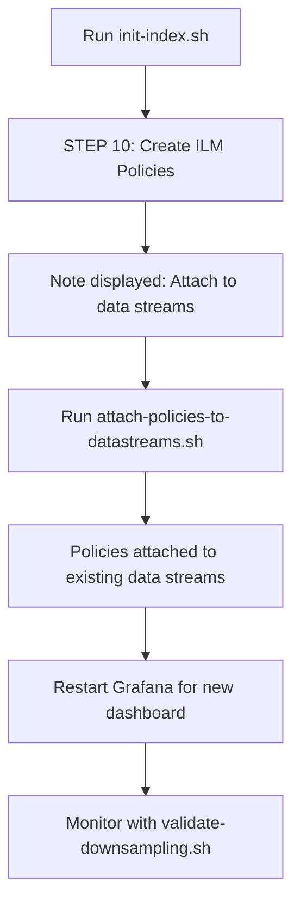

# Downsampling Integration Summary

## Overview

The downsampling ILM policies have been fully integrated into the Elasticsearch initialization workflow via `init-index.sh`.

## Integration Points

### 1. init-index.sh (STEP 10)

The main initialization script now automatically creates all downsampling ILM policies:

**Location**: `/home/gxbrooks/repos/elastic-on-spark/observability/elasticsearch/bin/init-index.sh`

**What it does**:
- Creates 4 downsampling ILM policies:
  - `system-metrics-downsampled`
  - `docker-metrics-downsampled`
  - `spark-gc-downsampled`
  - `spark-logs-metrics-downsampled`
- Outputs policy creation results to `elasticsearch/outputs/`
- Displays helpful note about attaching policies to data streams

**Usage**:
```bash
cd /home/gxbrooks/repos/elastic-on-spark/observability/elasticsearch/bin
./init-index.sh
```

### 2. Configuration Files

All ILM policy JSON files are stored in the source tree:

```
elasticsearch/
└── system-metrics/
    ├── system-metrics.ilm.json           # System metrics (cpu, memory, network, disk, load)
    ├── docker-metrics.ilm.json           # Docker container metrics
    ├── spark-gc.ilm.json                 # Spark GC events
    └── spark-logs-metrics.ilm.json       # Spark log count metrics
```

Each file defines:
- **Hot tier** (0-2d): Original 30-second data
- **Warm tier** (2-4d): 5-minute downsampling
- **Cold tier** (4-8d): 15-minute downsampling
- **Frozen tier** (8-12d): 60-minute downsampling
- **Delete** (>12d): Data removal

### 3. Helper Scripts

Three scripts are available for policy management:

#### a. apply-ilm-policies.sh
Manually applies ILM policies (useful for updates or standalone deployment).

**Location**: `elasticsearch/system-metrics/apply-ilm-policies.sh`

**Usage**:
```bash
cd /home/gxbrooks/repos/elastic-on-spark/observability/elasticsearch/system-metrics
./apply-ilm-policies.sh
```

#### b. attach-policies-to-datastreams.sh (NEW)
Attaches downsampling policies to existing data streams.

**Location**: `elasticsearch/system-metrics/attach-policies-to-datastreams.sh`

**Usage**:
```bash
cd /home/gxbrooks/repos/elastic-on-spark/observability/elasticsearch/system-metrics
./attach-policies-to-datastreams.sh
```

**What it does**:
- Checks if each data stream exists
- Attaches appropriate downsampling policy
- Handles gracefully if data streams don't exist yet
- Provides verification commands

#### c. validate-downsampling.sh
Validates downsampling configuration and monitors execution.

**Location**: `elasticsearch/system-metrics/validate-downsampling.sh`

**Usage**:
```bash
cd /home/gxbrooks/repos/elastic-on-spark/observability/elasticsearch/system-metrics
./validate-downsampling.sh
```

**What it checks**:
- ILM service status
- Policy existence and downsampling configuration
- Data stream health and policy attachment
- Downsampled index creation
- ILM execution phase and errors

## Workflow

### Fresh Installation



### Commands

```bash
# 1. Initialize everything (includes ILM policies)
cd /home/gxbrooks/repos/elastic-on-spark/observability/elasticsearch/bin
./init-index.sh

# 2. Attach policies to data streams
cd ../system-metrics
./attach-policies-to-datastreams.sh

# 3. Restart Grafana
cd /home/gxbrooks/repos/elastic-on-spark/observability
docker-compose restart grafana

# 4. Validate (optional)
cd elasticsearch/system-metrics
./validate-downsampling.sh
```

### Existing Installation

For systems where Elasticsearch is already running:

```bash
# 1. Apply ILM policies
cd /home/gxbrooks/repos/elastic-on-spark/observability/elasticsearch/system-metrics
./apply-ilm-policies.sh

# 2. Attach to data streams
./attach-policies-to-datastreams.sh

# 3. Restart Grafana
cd /home/gxbrooks/repos/elastic-on-spark/observability
docker-compose restart grafana

# 4. Validate
cd elasticsearch/system-metrics
./validate-downsampling.sh
```

## File Structure

```
elastic-on-spark/
├── variables.yaml                                    # Retention policy config (lines 34-53)
└── observability/
    ├── DOWNSAMPLING_IMPLEMENTATION.md                # Complete implementation docs
    ├── QUICK_START_DOWNSAMPLING.md                   # Quick start guide
    ├── elasticsearch/
    │   ├── bin/
    │   │   └── init-index.sh                         # MODIFIED: Added STEP 10
    │   └── system-metrics/                           # NEW DIRECTORY
    │       ├── README.md                             # ILM policies documentation
    │       ├── INTEGRATION_SUMMARY.md                # This file
    │       ├── system-metrics.ilm.json               # System metrics policy
    │       ├── docker-metrics.ilm.json               # Docker metrics policy
    │       ├── spark-gc.ilm.json                     # GC metrics policy
    │       ├── spark-logs-metrics.ilm.json           # Log metrics policy
    │       ├── apply-ilm-policies.sh                 # Manual policy application
    │       ├── attach-policies-to-datastreams.sh     # NEW: Attach policies
    │       └── validate-downsampling.sh              # Validation script
    └── grafana/
        ├── provisioning/
        │   └── dashboards/
        │       └── spark-system-metrics-aggregated.json  # NEW DASHBOARD
        └── dashboards/
            └── spark-system-metrics-aggregated.md        # Dashboard docs
```

## Data Streams Affected

### Automatically Managed (by Elastic Agent)
These data streams are created by Elastic Agent. Policies must be attached after creation:

- `metrics-system.cpu-default`
- `metrics-system.memory-default`
- `metrics-system.network-default`
- `metrics-system.diskio-default`
- `metrics-system.load-default`
- `metrics-docker.cpu-default`
- `metrics-docker.memory-default`
- `metrics-docker.network-default`

### Created by Application
These are created by the Spark application or init-index.sh:

- `logs-spark_gc-default` (Spark GC logs)
- `metrics-spark-logs-default` (Spark log metrics transform)

## Benefits of Integration

### 1. Single Command Setup
- Fresh installations get downsampling automatically
- No manual policy creation needed
- Consistent configuration across environments

### 2. Source Control
- All policies version controlled
- Changes tracked in git
- Easy to review and audit

### 3. Automated Deployment
- Ansible playbooks can call init-index.sh
- CI/CD integration possible
- Repeatable deployments

### 4. Maintainability
- Policies defined in JSON files
- Easy to update retention periods
- Scripts handle complexity

### 5. Documentation
- Integration documented in code
- Helper text in script output
- README files for reference

## Configuration Variables

Defined in `/home/gxbrooks/repos/elastic-on-spark/variables.yaml`:

```yaml
ES_RETENTION_BASE:      2d   # Hot tier - original 30s data
ES_RETENTION_5MIN:      4d   # Warm tier - 5-minute downsampled
ES_RETENTION_15MIN:     8d   # Cold tier - 15-minute downsampled
ES_RETENTION_60MIN:     12d  # Frozen tier - 60-minute downsampled
```

**Note**: These are test values. For production, consider:
```yaml
ES_RETENTION_BASE:      7d      # 1 week of high-res data
ES_RETENTION_5MIN:      30d     # 1 month at 5m resolution
ES_RETENTION_15MIN:     90d     # 3 months at 15m resolution
ES_RETENTION_60MIN:     365d    # 1 year at hourly resolution
```

## Testing Timeline

| Day | Expected Action | Verification Command |
|-----|----------------|---------------------|
| 0 | Policies created | `esapi GET _ilm/policy/system-metrics-downsampled` |
| 0 | Policies attached | `esapi GET metrics-system.cpu-default/_ilm/explain` |
| 1 | Data accumulating | Check dashboard shows data |
| 2 | First rollover | `esapi GET _cat/indices/.ds-metrics-*` |
| 2 | 5m downsampling | `esapi GET _cat/indices/*downsample*` |
| 4 | 15m downsampling | `esapi GET _cat/indices/*downsample*` |
| 8 | 60m downsampling | `esapi GET _cat/indices/*downsample*` |
| 12 | Old data deleted | Verify oldest indices removed |

## Troubleshooting

### Policies not created during init-index.sh

**Issue**: STEP 10 fails or is skipped

**Solution**:
```bash
# Check init-index.sh output for errors
# Run manual application
cd /home/gxbrooks/repos/elastic-on-spark/observability/elasticsearch/system-metrics
./apply-ilm-policies.sh
```

### Data streams don't exist

**Issue**: attach-policies-to-datastreams.sh shows warnings

**Solution**: This is normal if Elastic Agent hasn't created the data streams yet.
- Wait for Elastic Agent to start collecting metrics
- Policies will be applied when data streams are created via index templates
- Or manually attach after data streams exist

### ILM not executing

**Issue**: Downsampling not occurring after expected time

**Solution**:
```bash
# Check ILM status
esapi GET _ilm/status

# Start if stopped
esapi POST _ilm/start

# Force poll
esapi POST _ilm/poll

# Check for errors
esapi GET metrics-system.cpu-default/_ilm/explain
```

## Next Steps

1. **Run init-index.sh** if setting up fresh installation
2. **Attach policies** using attach-policies-to-datastreams.sh
3. **Restart Grafana** to load new dashboard
4. **Validate** using validate-downsampling.sh
5. **Monitor** dashboard for data
6. **Wait 2 days** to see first downsampling
7. **Adjust retention** in variables.yaml for production

## References

- Main implementation doc: `/observability/DOWNSAMPLING_IMPLEMENTATION.md`
- Quick start: `/observability/QUICK_START_DOWNSAMPLING.md`
- ILM policies details: `/observability/elasticsearch/system-metrics/README.md`
- Dashboard guide: `/observability/grafana/dashboards/spark-system-metrics-aggregated.md`
- Init script: `/observability/elasticsearch/bin/init-index.sh`

## Version History

| Date | Version | Changes |
|------|---------|---------|
| 2025-11-12 | 1.0 | Initial implementation with standalone scripts |
| 2025-11-12 | 1.1 | Integrated into init-index.sh STEP 10 |

---

**Status**: ✅ Fully integrated and ready for deployment

