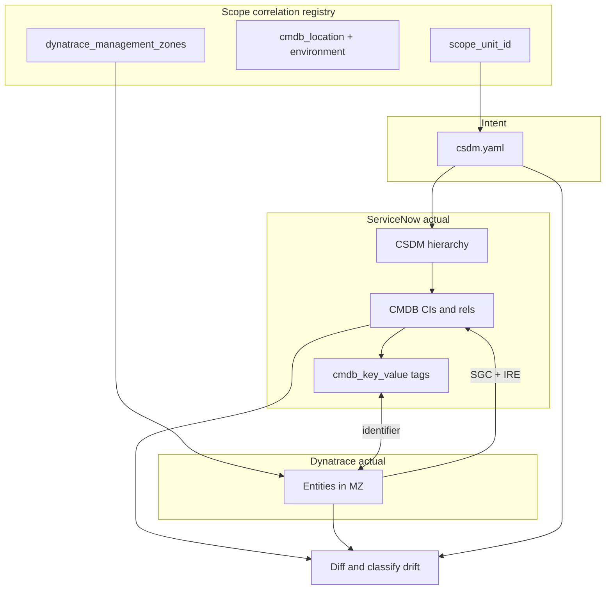

# Dynatrace and ServiceNow CMDB/CSDM Model Comparison Process

## Purpose

Enterprises maintain **two parallel models** of the same IT environment:

| System | Model |
|--------|--------|
| **ServiceNow** | CSDM hierarchy (Business Application → Business Service → Application Service) backed by CMDB CIs, relationships, tags, and Service Mapping |
| **Dynatrace** | Entity graph (hosts, process groups, services, Kubernetes objects) with partitioning by management zones, tags, and Smartscape relationships |

**Compare** answers three questions for a chosen scope:

1. **Inconsistencies** — Where do the models disagree on identity, placement, or attributes at defined correlation keys?
2. **Presence gaps** — What exists in ServiceNow but not Dynatrace (and vice versa)?
3. **Intra-model issues** — What is wrong *within* each model (missing CMDB objects, missing tag bindings, missing management zone assignment, hierarchy drift)?

The process is **project- and repository-independent**. It applies to on-prem, cloud, Docker, Kubernetes, and SaaS workloads. A lab row in the scope correlation registry (for example `brooks-lab-onprem`) is one scope unit among many an enterprise would define—not a hard-coded “spark-observability project” boundary.

### Default scope: full model (“All”)

By default, compare exports the **entire ServiceNow CMDB slice** and **entire Dynatrace tenant** relevant to the run:

- ServiceNow: all Linux servers and application services (unless `sn_compare_filter_by_cmdb_location=true`)
- Dynatrace: all entity types in the tenant export (unless `sn_compare_filter_by_dynatrace_mz=true`)

Management zone and CMDB location are captured as **attributes** on each row, not as implicit exclusions. Findings describe model gaps and inconsistencies—not “outside project scope.”

### Optional scope filters (enterprise pattern)

Modelers often need to **restrict** one or both sides to a matching boundary—for example, compare a Dynatrace management zone to the ServiceNow locations that comprise that zone. Scope is controlled by **independent flags per platform** (extensible over time):

| Flag | Platform | Effect when `true` |
|------|----------|-------------------|
| `sn_compare_filter_by_cmdb_location` | ServiceNow | Linux servers at the scope unit `cmdb_location` only |
| `sn_compare_filter_by_dynatrace_mz` | Dynatrace | Entities in the scope unit `dynatrace_management_zones` only |

Additional scope dimensions (business application, cloud account, tag selector, etc.) may be added as new flags. The scope correlation registry (`servicenow/regions/*/region.yaml`) defines how each scope unit maps SN placement to Dynatrace partitioning when filters are enabled.

**Goal:** Confirm that infrastructure and application boundaries align across ServiceNow and Dynatrace so events, problems, and topology imports bind to the correct CMDB CIs and application services.

---

## Audience

- **CSDM modelers** — maintain `csdm.yaml` and business hierarchy intent
- **CMDB / Discovery operators** — horizontal Discovery, KVA, Docker Pattern, SGC imports
- **Dynatrace operators** — management zones, auto-tags, OneAgent / Operator deployment
- **Integration engineers** — SGC, Event Management, IRE merge and correlation

---

## Core principles

### 1. Compare at correlation points, not object-for-object

ServiceNow and Dynatrace use different ontologies. A Dynatrace **PROCESS_GROUP** is not a CSDM **Application Service**. Consistency means **aligned scope, identity, and dependencies** at defined join keys—not identical object counts or names.

### 2. Separate “specified,” “CMDB actual,” and “Dynatrace actual”

| Layer | Source | Role in comparison |
|-------|--------|-------------------|
| **Specified** | Version-controlled `*.csdm.yaml` (+ region registry) | Expected CSDM hierarchy, identifiers, `depends_on`, platform, Service Mapping method |
| **ServiceNow actual** | CMDB after CSDM deploy, Discovery, KVA, SGC | What the instance holds today |
| **Dynatrace actual** | Entities API / Smartscape in the export scope | What observability sees today |

Drift is reported as **specified vs CMDB**, **CMDB vs Dynatrace**, or **specified vs Dynatrace** depending on the check.

### 3. Scope attributes are not interchangeable

| Concept | ServiceNow (CSDM) | Dynatrace |
|---------|-------------------|-----------|
| Geographic / site placement | `location` → `cmn_location` | Not equivalent to management zone |
| Environment (prod / nonprod) | `environment` attribute + labels | Tags, environment naming, alerting profiles |
| Observability partition | Tag-based SM rules, Dynamic CI Groups | **Management zone** |
| Cloud tenancy | `cloud_provider`, account/subscription/project refs (when modeled) | Cloud integration entities, tags |

**Do not map management zone name directly to CMDB location.** They answer different questions: *where is it in the enterprise?* vs *which observability boundary owns this entity?*

### 4. One comparison run = one **scope unit**

At enterprise scale, a single global diff is meaningless. Each comparison run targets one **scope unit** from a **scope correlation registry** (see below). Run the process per unit, then roll up results.

---

## Scope correlation registry (enterprise pattern)

An enterprise typically has **many** management zones differentiated by environment, business unit, geography, application portfolio, or cloud account. ServiceNow may have **many** `cmn_location` rows, clusters, and BAs across the same dimensions.

Maintain a **scope correlation registry** (YAML, CMDB table, or spreadsheet—format is secondary) that defines how comparison runs are bounded.

### Recommended registry fields

| Field | Description | Example |
|-------|-------------|---------|
| `scope_unit_id` | Stable key for this comparison boundary | `bu-analytics-prod-eu-west` |
| `cmdb_location` | ServiceNow location name(s) included | `frankfurt-dc-1` |
| `cmdb_environment` | CSDM `environment` value | `production` |
| `business_application` | Optional BA filter | `Data and Analytics Platform` |
| `dynatrace_management_zones` | One or more MZ names or IDs | `Analytics Production EU` |
| `dynatrace_tenant` | Tenant URL / environment id | `https://<env-id>.live.dynatrace.com` |
| `kubernetes_clusters` | Cluster names (SN + DT) | SN: `analytics-eu-1`, DT: `analytics-eu-k8s` |
| `docker_hosts` | Host CMDB names or groups | `obs-host-01`, `obs-host-02` |
| `cloud_accounts` | AWS account / Azure sub / GCP project | `123456789012` |
| `csdm_spec_files` | Intent files for this unit | `analytics/servicenow/csdm.yaml` |
| `sgc_connection` | SGC connection alias (if used) | `SGO-Dynatrace-Analytics-EU` |

### Many management zones — how to generalize

Yes, the approach **must** generalize to multiple management zones. Treat each registry row as an independent comparison boundary:

```
Enterprise
├── Scope unit A  →  MZ "Retail Prod US"     ↔  location chicago-dc, env production
├── Scope unit B  →  MZ "Retail NonProd US"  ↔  location chicago-dc, env staging
├── Scope unit C  →  MZ "Analytics EU"       ↔  location frankfurt-dc-1, env production
└── Scope unit D  →  MZ "Shared Observability" ↔  multiple locations (edge case)
```

**Rules of thumb:**

1. **Prefer one primary MZ per scope unit** for comparison exports. If Dynatrace uses overlapping MZs (entity in both “All Production” and “App X Prod”), pick the **most specific** MZ for the diff and document the choice in the registry.
2. **One scope unit may reference multiple MZs** when a ServiceNow location hosts workloads observed under different Dynatrace partitions (e.g. BU-specific MZs on shared infrastructure). The comparison merges DT exports from those MZs before joining to CMDB.
3. **One MZ may map to multiple CMDB locations** in distributed or cloud-native topologies (e.g. MZ scoped by tag `Application:payments` spans regions). Split comparison by **application** or **cluster** rather than by location alone.
4. **SGC connections** are often configured **per management zone** (or per connection row with `management_zone_id`). Align each SGC connection to exactly one registry row.
5. **Roll-up reporting** aggregates pass/fail counts by business unit, environment, and geography using registry metadata—not by flattening all MZs into one list.

### Example (illustrative only — Optimiz / brooks-lab)

| scope_unit_id | cmdb_location | environment | dynatrace_management_zones | kubernetes_clusters |
|---------------|---------------|-------------|----------------------------|---------------------|
| `optimiz-lab-onprem` | `brooks-lab` | `on-prem` | `Spark Observability` | SN: `brooks-lab`, DT: `spark-observability-k8s` |

This row is one scope unit among many an enterprise would define; it is not the default shape for all deployments.

---

## Platform-specific comparison layers

Run all applicable layers for each scope unit. Not every deployment uses every platform.

### On-premise hosts

| Check | ServiceNow | Dynatrace | Pass criteria |
|-------|------------|-----------|---------------|
| Host inventory | `cmdb_ci_linux_server` (or `cmdb_ci_computer`) filtered by location / Dynamic CI Group | `HOST` entities in registry MZ(s) | Same normalized host set; one CMDB CI per host |
| Host identity | `name`, `host_name`, serial, IP | `displayName`, `detectedName`, entity id | IRE can merge; no duplicate CIs per normalized name |
| SGC overlay | CIs with `discovery_source` containing SGO-Dynatrace | Same hosts in DT | SGC-imported CIs merge to Discovery-authoritative host or are explicitly linked |

### Docker (Compose / standalone engine)

| Check | ServiceNow | Dynatrace | Pass criteria |
|-------|------------|-----------|---------------|
| Container CIs | `cmdb_ci_docker_container` (+ Docker Pattern relationships) | Process groups / containers on host | Containers for scoped services exist in both |
| Tag-based SM | `cmdb_key_value`: `servicenow.io/application-service-identifier` | DT tags on process/host (if mirrored) or naming convention map | Identifier matches `csdm.yaml` |
| Vertical SM | Entry points, `cmdb_tcp`, **Runs on** | Host listeners in DT | Enrichment present when `service_mapping: vertical` |

### Kubernetes

| Check | ServiceNow | Dynatrace | Pass criteria |
|-------|------------|-----------|---------------|
| Cluster | KVA / Discovery cluster CI | `KUBERNETES_CLUSTER` entity | Cluster name mapping documented in registry |
| Workloads | Pod / deployment CIs via KVA labels | K8s entities in MZ | Labeled workloads appear in CMDB |
| Tag-based SM | K8s labels → `cmdb_key_value` | Optional mirrored tags | `servicenow.io/application-service-identifier` binds map |
| CSDM app services | `cmdb_ci_service_discovered`, `platform: kubernetes` | Not 1:1; compare via tags / process groups | Each declared app service has bound workload CIs |

### Cloud (AWS / Azure / GCP)

| Check | ServiceNow | Dynatrace | Pass criteria |
|-------|------------|-----------|---------------|
| Tenancy | Cloud account / subscription / project CI (when modeled) | Cloud integration entities | Account id in registry matches both sides |
| Region / AZ | Location or cloud region attributes | Cloud region on entity | Documented mapping |
| Managed services | PaaS CIs (RDS, AKS, etc.) | DT cloud service entities | Scoped to same account + region filters |
| Partitioning | Location + environment + optional BU | MZ + cloud tags | Registry row ties them; not string equality |

### SaaS and external services

| Check | ServiceNow | Dynatrace | Pass criteria |
|-------|------------|-----------|---------------|
| Application service | `platform: saas`, `service_mapping: manual` | External service / synthetic checks if monitored | CSDM record exists; DT monitoring documented |
| Dependencies | `depends_on` to other app services | Smartscape / service flow (optional) | Consumer dependencies reflected in CMDB |

---

## Correlation keys (join columns)

Use stable keys declared in `csdm.yaml` and the scope registry—not display names alone.

| Purpose | ServiceNow | Dynatrace | Notes |
|---------|------------|-----------|-------|
| Application service identity | `identifier` + `cmdb_key_value` key `servicenow.io/application-service-identifier` | Tag or mapped process group / service name | Primary key for tag-based SM |
| Business service | `servicenow.io/business-service-identifier` | Optional DT tag | Secondary filter |
| Business application | `servicenow.io/application-identifier` | Optional DT tag | Secondary filter |
| Environment | `environment` + `servicenow.io/environment` | Auto-tag / custom tag | Align values in registry |
| Location | `location` + `servicenow.io/location` | **Not** management zone | Geographic CSDM placement |
| Host | CMDB `name` / `host_name` (normalized) | HOST `displayName` / `detectedName` | Watch short name vs FQDN |
| K8s cluster | Cluster CI name | K8s cluster display name | Document SN ↔ DT name pairs in registry |
| Cloud resource | Account + region + resource id | Cloud entity id | Required for cloud scope units |

**Recommendation:** Where possible, apply the same `servicenow.io/*` labels on Kubernetes manifests, Docker Compose services, and (optionally) Dynatrace custom tags so both platforms share machine-readable keys without a manual mapping table.

---

## Comparison process (per scope unit)

### Step 0 — Select scope unit

Choose one row from the scope correlation registry. Record `scope_unit_id`, tenant, management zone(s), CMDB location(s), and linked `csdm.yaml` files.

### Step 1 — Build the intent inventory

From `csdm.yaml` (and registry defaults):

- Business applications, business services, application services
- `identifier`, `platform`, `service_mapping`, `discover`, `depends_on`
- Expected hosts, clusters, and cloud accounts (from `expand`, `depends_on`, or registry)

This is the **expected model** for the scope unit.

### Step 2 — Export ServiceNow actual state

Sources:

- CSDM deploy / diagnose automation (if available)
- Table API / CMDB Workspace lists filtered by location, BA, and class
- `cmdb_rel_ci` for **Contains** and **Depends on::Used by**
- `cmdb_key_value` for tag-based Service Mapping labels
- `discovery_source` for Discovery vs SGO-Dynatrace vs KVA

Export to CSV or JSON keyed by `identifier` and host name.

### Step 3 — Export Dynatrace actual state

For each management zone listed in the registry row:

```http
GET /api/v2/entities?entitySelector=type(HOST),mzId(<id>)
GET /api/v2/entities?entitySelector=type(KUBERNETES_CLUSTER),mzId(<id>)
GET /api/v2/entities?entitySelector=type(PROCESS_GROUP),mzId(<id>)
GET /api/v2/entities?entitySelector=type(SERVICE),mzId(<id>)
```

Add cloud entity types when the scope unit includes cloud accounts. Filter further with tags that match registry metadata (environment, project, owner).

Export to CSV or JSON. Resolve management zone **name → numeric id** via `GET /config/v1/managementZones` when scripting.

### Step 4 — Normalize and join

1. Normalize host names (lowercase; document FQDN vs short name policy).
2. Join host sets: CMDB ↔ Dynatrace.
3. Join application services: CMDB `identifier` ↔ workload tags ↔ DT entities (direct tag or mapping table).
4. Compare `depends_on` in intent vs CMDB relationships.
5. Optionally compare CMDB relationships to DT Smartscape (directional sanity check only).

### Step 5 — Classify drift

| Classification | Meaning | Typical action |
|----------------|---------|----------------|
| **Missing in CMDB** | In DT (or intent) but no CMDB CI | Run Discovery / KVA / SGC; fix IRE |
| **Missing in Dynatrace** | In CMDB/intent but not in scoped MZ | OneAgent / Operator / cloud integration; fix MZ rules |
| **Duplicate in CMDB** | Multiple CIs for same host identity | IRE merge; dedupe |
| **Tag mismatch** | App service exists but labels don’t bind SM | Apply runtime labels; fix `cmdb_key_value` ACL |
| **Hierarchy drift** | BA/BS/AS parentage differs from `csdm.yaml` | Re-run CSDM deploy |
| **Scope mismatch** | Entity in wrong MZ or wrong location | Update registry, MZ rules, or CSDM `location` |
| **Dependency drift** | `depends_on` not reflected in CMDB | Second-pass linker; missing target CIs |

### Step 6 — Reconcile and re-run

| Drift type | Reconciliation path |
|------------|---------------------|
| CSDM hierarchy | CSDM deploy processor (`csdm.yaml`, `csdm_op: insert`) |
| Retire obsolete CIs | `csdm_op: delete` or delete-only spec |
| Host / container enrichment | Horizontal Discovery, Docker Pattern, KVA |
| Dynatrace → CMDB topology | SGC scheduled import (per connection / MZ) |
| Host identity | IRE identification rules; align hostname forms |
| Tag-based maps | Runtime labels + Service Mapping tag rules on instance |
| Vertical SM stuck | Entry points, MID, enrichment (platform-specific) |

Re-run Steps 2–5 until the scope unit meets acceptance criteria or exceptions are documented.

### Step 7 — Roll up (enterprise)

Aggregate results by `environment`, business unit, geography, and platform. Track trend over time (scheduled comparison). Do not block production on a single optional SaaS row; prioritize host identity and tier-1 application services.

---

## Acceptance criteria (per scope unit)

| Level | Consistent when… |
|-------|------------------|
| **Scope** | All comparison inputs match the registry row (location, environment, MZ, tenant) |
| **Infrastructure** | Every in-scope Dynatrace HOST maps to exactly one authoritative CMDB host CI |
| **CSDM structure** | BA / BS / application service tree matches `csdm.yaml` |
| **Tag-based services** | Each `service_mapping: tags` application service has at least one workload CI with the expected `servicenow.io/application-service-identifier` |
| **Dependencies** | Declared `depends_on` links exist in CMDB (or are documented deferrals) |
| **Observability binding** | Sample problems/events correlate to the expected CMDB CI (end-to-end spot check) |

**Not required for “consistent”:** identical display names, identical graph topology depth, or management zone name equal to location name.

---

## Data collection methods

### Automated (recommended where available)

- ServiceNow: CSDM diagnose playbook, SGC diagnose, Discovery diagnose
- Dynatrace: Entities API scoped by `mzId` and tags
- Future: dedicated **compare models** automation emitting a single diff report per scope unit

### Manual

- CMDB Workspace filtered lists
- Dynatrace Hub → Entities (management zone filter)
- Spreadsheet join on correlation keys

### Semi-automated

- Export both sides to JSON; small script diff on `identifier` + normalized hostname
- Store exports in CI artifacts for audit trail

---

## Multi-platform deployment patterns

| Deployment pattern | Primary SN discovery | Primary DT instrumentation | Comparison emphasis |
|--------------------|------------------------|----------------------------|-------------------|
| On-prem VMs | Discovery / agent | OneAgent | Host parity, IRE merge |
| On-prem Docker | Docker Pattern + label sync | OneAgent on host | Container tags + vertical/tag SM |
| On-prem / private K8s | KVA | Dynatrace Operator / OneAgent | Cluster name map, pod labels |
| Public cloud K8s (EKS/AKS/GKE) | KVA + cloud CI | Operator + cloud integration | Account/region + cluster registry row |
| Hybrid | Multiple registry rows | Multiple MZs | Never single global diff |
| SaaS-only edges | CSDM manual | Synthetics / external services | Intent vs CMDB only |

---

## Enterprise considerations

### Many tenants, many zones

- **Dynatrace**: SaaS may use one tenant with many MZs, or multiple tenants per business unit or region. The registry must record **tenant + MZ**, not MZ alone.
- **ServiceNow**: One instance or federated instances; comparison is always against the CMDB instance that holds the CSDM model for that scope unit.

### Shared infrastructure

Hosts or clusters shared across business units often appear in **multiple management zones** via tag rules. Comparison scope units should be **application- or BU-scoped** when infrastructure is shared, using tags or Dynamic CI Groups rather than location alone.

### Environment promotion

Maintain separate registry rows for **production**, **staging**, and **development**. Compare staging to staging—not staging hosts against production MZ.

### Governance

- **CSDM modeler** owns `csdm.yaml` and registry metadata for application scope
- **Observability operator** owns MZ definitions and DT tags
- **CMDB operator** owns Discovery schedules and IRE rules
- **Integration operator** owns SGC connections (one per MZ or documented many-to-one)

Change any of the above → re-run comparison for affected scope units.

---

## Example workflow diagram



---

## Related artifacts in this repository

| Artifact | Role |
|----------|------|
| `servicenow/docs/CSDM_Specifications.md` | `{stack}.csdm.yaml` format, platforms, tags, `csdm_op` |
| `servicenow/docs/Tag_Based_Service_Mapping.md` | Tag-based SM and `servicenow.io/*` keys |
| `servicenow/comparator/` | **Automated compare** (Python) — export + annotated JSON report |
| `servicenow/comparator/dynatrace-correlation.yaml` | Expected DT partitioning for prescriptive diagnostics |
| `servicenow/regions/*/region.yaml` | Scope correlation registry (discovered by compare) |
| `observability/dynatrace/tenants/*/docs/Partitioning_and_Tagging.md` | Example MZ and auto-tag pattern (tenant-specific) |

---

## Automated compare (`servicenow/comparator`)

The Python package **`servicenow/comparator`** implements this process for registered **scope units** (see [comparator/README.md](../comparator/README.md)).

```bash
cd spark-observability
PYTHONPATH=. python -m servicenow.comparator

# Single scope unit
PYTHONPATH=. python -m servicenow.comparator --scope-unit-id brooks-lab-onprem
```

**What it does (per scope unit):**

1. Loads **CSDM specifications** from `servicenow/regions/{region}/*.csdm.yaml` (via region discovery).
2. Exports **ServiceNow** Linux servers, application services, intent-correlated status, and `cmdb_key_value` tag rows.
3. Exports **Dynatrace** entities (`HOST`, `PROCESS_GROUP`, `SERVICE`, `KUBERNETES_CLUSTER`, `KUBERNETES_NODE`) for the tenant by default, with management zone on each row.
4. Writes **`tmp/compare/<timestamp>/DT_SN_Model_Comparison.json`** (raw export) and **`DT_SN_Model_Comparison_Report.json`** (annotated findings with deep links).

**Report output:** `DT_SN_Model_Comparison_Report.json` (v1.2) is a **platform-neutral** comparison of the full CMDB and Dynatrace tenant export against CSDM intent. The report root carries **`scope_applied`** (default: all/all) and **`csdm_intent_sources`** (which `*.csdm.yaml` files were loaded). Region registry ids (`scope_unit_id`, `region_id`, `cmdb_location`) appear only under **`csdm_intent_sources[].registry`** — they describe where intent came from, not an implicit export boundary unless scope filters are enabled.

**Dynatrace correlation spec:** `compare/dynatrace-correlation.yaml` declares expected management zone, host group, Kubernetes cluster map, and reference hosts for partitioning diagnostics. It does not limit export scope unless `sn_compare_filter_by_dynatrace_mz=true`.

**Default scope is the full model on both platforms.** Scope-unit fields (`cmdb_location`, `dynatrace_management_zones`) are **correlation registry metadata** for diagnostics and optional filters:

```bash
# Limit ServiceNow export to one CMDB location
ansible-playbook ... -e sn_compare_filter_by_cmdb_location=true

# Limit Dynatrace export to scope-unit management zones
ansible-playbook ... -e sn_compare_filter_by_dynatrace_mz=true
```

**Outputs** land under **`tmp/compare/`** at the repository root (gitignored). Override the base path with `-e sn_compare_output_base=/path/to/dir`.

**Registry:** Add `servicenow/regions/{region-id}/region.yaml` for additional environments. Override discovery with `-e sn_compare_scope_units='[...]'` when needed.

**Diff classification** (`matched`, `servicenow_only`, `dynatrace_only`, `missing_in_cmdb`, `missing_tag_binding`, `ok_canonical_tag`, `ok_alternate_tag_only`) is computed by `compare/files/generate_compare_report.py`.

**Tag binding notes:** Compare queries `cmdb_key_value` for the canonical key `servicenow.io/application-service-identifier` plus alternate keys `app.kubernetes.io/name` and `app`. When canonical rows are absent but alternate rows match an intent `identifier`, the report marks **`alternate_tag_only`** — run `discovery/docker/discover.yml` or fix table ACLs per `servicenow/docs/install.md` §6.3.

This automation does **not** replace `csdm/diagnose.yml` or `sgc/diagnose.yml`; run those for deep Service Mapping, SGC, and IRE diagnostics. Compare focuses on **cross-platform inventory, tag alignment, and annotated drift** at correlation keys.

---

## Document history

| Date | Change |
|------|--------|
| 2026-06-21 | Initial generic process; multi–management-zone registry pattern; platform layers for Docker, K8s, cloud, on-prem |
| 2026-06-21 | Added `compare.yml` automation; moved document to `playbooks/servicenow/docs/` |
| 2026-06-24 | Compare default scope loosened to full SN/DT inventory; MZ and location captured as attributes; optional filters for repair |
| 2026-06-25 | JSON compare report replaces Excel; entity deep links; project-independent findings; scope_applied metadata |
| 2026-06-29 | Compare moved to Python `servicenow/comparator/`; report v1.3 discoverability taxonomy |
