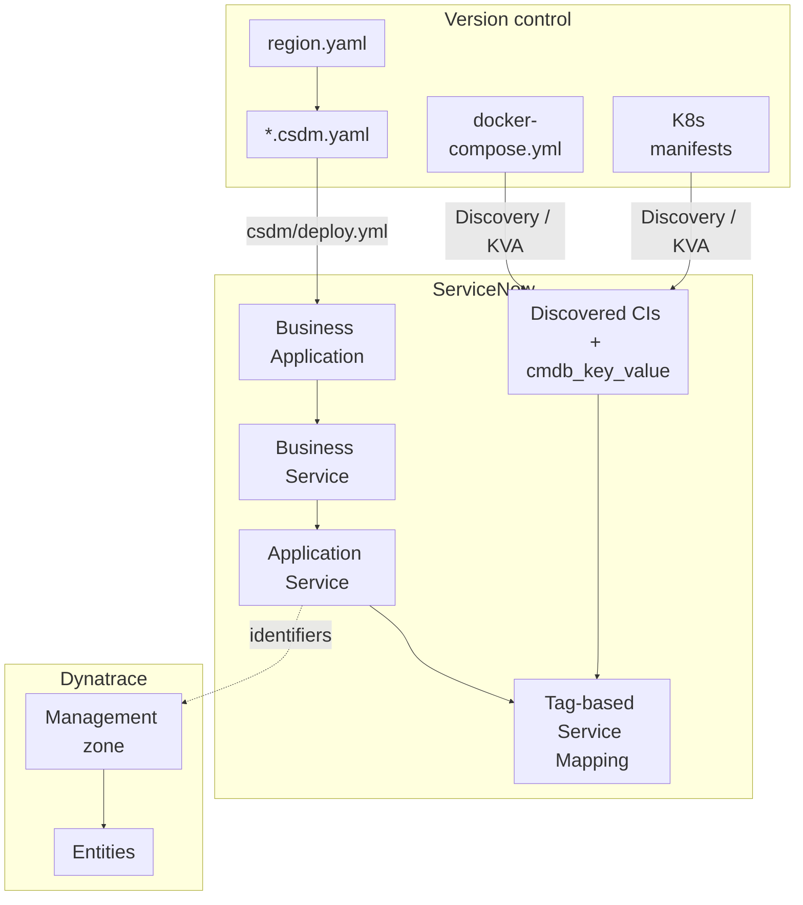

# Dynatrace and ServiceNow Specification Guide

## Purpose

This guide is the **primary reference for application modelers** — senior developers, application architects, and enterprise architects — who define how workloads appear in **ServiceNow CSDM** and **Dynatrace**. It explains what to declare in version-controlled specification files, what runtime labels to apply on workloads, and how the two platforms correlate at deploy and compare time.

Operational install steps (users, MID Server, ACLs, playbooks) remain in [install.md](install.md). Normative YAML schema details remain in [CSDM_Specifications.md](CSDM_Specifications.md). Drift detection workflow is in [DT_SN_Comparison_Process.md](DT_SN_Comparison_Process.md). For why Ansible sometimes reads runtime instead of relying on ServiceNow Discovery alone, see [SN_Tag_Gaps.md](SN_Tag_Gaps.md).

---

## How it fits together

Most enterprises maintain three layers that must stay aligned over time.

The **business model** lives in ServiceNow as CSDM objects — Business Applications, Business Services, and Application Services — and answers portfolio and service-management questions: who owns a capability, how it fits the product map, and which team receives an incident. The **runtime inventory** is what Discovery and the Kubernetes Visibility Agent actually find: pods, containers, hosts, and the label rows attached to those configuration items in **`cmdb_key_value`**. The **observability partition** in Dynatrace holds metrics, logs, traces, and problems, scoped by management zones and tags so alerts do not bleed across environments or products.

Discovery and KVA populate the runtime inventory from deployed workloads. CSDM deploy materializes the business model that would otherwise be entered manually in the ServiceNow UI. **Tags** on running services — especially **`servicenow.io/application-service-identifier`** — are copied into **`cmdb_key_value`** and become the join key that binds discovered CIs to Application Services for tag-based Service Mapping. Dynatrace uses the same identifiers and boundaries so Event Management, SGC, and topology import land on the correct CMDB objects.



A practical modeling order is: declare the ServiceNow CSDM model, author runtime labels on workloads, run native discovery, align Dynatrace partitioning, then use **compare** to detect drift between specification, CMDB, and Dynatrace.

---

## Audience and outcomes

After reading this guide you should be able to explain why each class of model entity exists, declare a CSDM hierarchy in `*.csdm.yaml`, author runtime labels in container or Kubernetes specifications as the single source of truth for deployed tags, choose platform and Service Mapping method, and hand off to operators for deploy, discovery, and compare.

---

## Model entities

### CSDM hierarchy

CSDM specifications declare the Business Application → Business Service → Application Service hierarchy. This model ties discovered, operational configuration items to portfolio and service-management context so observability signals — alerts, errors, SLO breaches, topology changes — can drive Incident, Event Management, Change, and portfolio processes.

| Level | CMDB class | Role |
|-------|------------|------|
| **Business Application** | `cmdb_ci_business_app` | Portfolio or product boundary |
| **Business Service** | `cmdb_ci_service` | Logical capability the organization recognizes |
| **Application Service** | `cmdb_ci_service_discovered` | Deployable unit that Service Mapping populates and binds to discovered CIs |

Each Application Service carries a stable **`identifier`** (slug: `[a-z0-9-]+`, max 63 characters). For tag-based Service Mapping, this **`identifier`** must equal **`servicenow.io/application-service-identifier`** on the running workload.

**Business Application and Business Service relationships are declared only in CSDM** (or the ServiceNow UI) through **`parent_business_application`** and **`parent_business_service`**. Do not repeat those relationships as container labels — they are not join keys and would duplicate authoritative CMDB hierarchy.

CSDM files also carry **`depends_on`**, ownership, location, **`platform`**, and **`service_mapping`** method on each entity explicitly. They do **not** carry Docker Compose service names, Kubernetes recommended labels, or runtime **`servicenow.io/*`** values.

### Region registry

Each management region has a **`region.yaml`** under `servicenow/regions/<region_id>/`. The registry records CMDB location, Dynatrace tenant and management zone references, the list of CSDM spec files for that region, and compare scope.

### Runtime workload specifications

Runtime workload specifications describe services as they are deployed: Docker Compose files, Kubernetes manifests, Helm charts, or DynaKube configuration. They define images, ports, volumes, and — for Service Mapping — **labels** that Discovery stores in the CMDB.

The container or Kubernetes specification is the **authoritative source** for every **`servicenow.io/*`** label on a running workload. See [Single source of truth for runtime tags](#single-source-of-truth-for-runtime-tags).

---

## Single source of truth for runtime tags

Every tag value on a deployed workload must have **one** authoritative definition. For Docker and Kubernetes, that authority is the **container specification** — not `*.csdm.yaml`.

| Concern | Where it is specified |
|---------|------------------------|
| **`servicenow.io/*` on containers and pods** | `docker-compose.yml`, Kubernetes manifests or templates, DynaKube pod labels |
| **`com.docker.compose.*`, `app.kubernetes.io/*`** | Same container specifications only |
| **Application Service `identifier`** | `*.csdm.yaml` — must match **`servicenow.io/application-service-identifier`** on the workload |
| **BA → BS → AS hierarchy, `depends_on`, ownership** | `*.csdm.yaml` (or ServiceNow UI) only |
| **CMDB `location` on CSDM records** | Explicit **`location`** on each Application Service in CSDM — mirrored on workloads as **`servicenow.io/location`** |

Do not duplicate Compose service names or Kubernetes label selectors in CSDM. CSDM declares the Application Service and its relationships; the container spec carries everything Discovery must read from the runtime.

Host agents without a container or pod label surface may use interim host-level CMDB sync until a runtime label path exists — see [SN_Tag_Gaps.md](SN_Tag_Gaps.md).

---

## Region layout

Version-controlled specifications for a management region live under `servicenow/regions/<region_id>/`:

| File | Role |
|------|------|
| **`region.yaml`** | Region id, CMDB location, Dynatrace references, list of CSDM spec files, compare scope |
| **`*.csdm.yaml`** | CSDM hierarchy and application services for one stack or domain |
| **`dynatrace-correlation.yaml`** | Optional compare-time join keys |

Register each new `*.csdm.yaml` in **`region.yaml`** → **`csdm_specs`**.

---

## CSDM specifications

CSDM files declare business hierarchy, application services, relationships, and Service Mapping method. **Every entity must declare its own attributes explicitly** — ownership, criticality, environment, and location are not inherited from file-level defaults. Compare validates that each entity in a specification file declares required attributes before drift analysis runs.

### Business application

```yaml
business_applications:
  - name: Data and Analytic Services
    identifier: data-and-analytic-services
    short_description: Data processing and analytics platform services
    operational_status: "1"
    active: "true"
    business_owner: example-owner
    it_application_owner: example-owner
```

### Business service

```yaml
business_services:
  - name: Apache Spark
    identifier: apache-spark
    short_description: Distributed data processing cluster
    operational_status: "1"
    parent_business_application: Data and Analytic Services
    owned_by: example-owner
    business_criticality: "4 - not critical"
```

### Application service — Docker platform

```yaml
application_services:
  - name: Elasticsearch
    identifier: elasticsearch
    short_description: Elasticsearch — HTTPS API
    operational_status: "1"
    parent_business_service: Elasticsearch
    platform: docker
    service_mapping: tags
    discover: false
    service_tier: data
    environment: on-prem
    location: my-region
    owned_by: example-owner
    business_criticality: "4 - not critical"
    depends_on:
      - OpenTelemetry Collector
      - Logstash
      - Elasticsearch
```

The **`identifier`** must appear on the running container as **`servicenow.io/application-service-identifier: elasticsearch`** in the Compose file.

### Application service — Kubernetes platform

```yaml
application_services:
  - name: Spark Master
    identifier: spark-master
    short_description: Spark master StatefulSet
    operational_status: "1"
    parent_business_service: Apache Spark
    platform: kubernetes
    service_mapping: tags
    discover: false
    service_tier: app
    environment: on-prem
    location: my-region
    cluster: my-cluster
    namespace: spark
    owned_by: example-owner
    business_criticality: "4 - not critical"
    depends_on:
      - OpenTelemetry Collector
      - Logstash
      - Elasticsearch
```

Do **not** declare Application Service → `cmdb_ci_linux_server` `depends_on` edges. Host placement is reached through discovered workload CIs (for example pod **Runs on** host).

Pod templates must carry **`servicenow.io/application-service-identifier: spark-master`**. When one pod template serves multiple Application Services (for example Dynatrace OneAgent per node), set the identifier explicitly per pod — not by inferring from pod name prefixes.

### Application service — host platform

```yaml
application_services:
  - name: "Elastic Agent ({host})"
    identifier: "elastic-agent-{host_lower}"
    short_description: "Elastic Agent on {host}"
    operational_status: "1"
    parent_business_service: Elastic Agent
    platform: host
    service_mapping: tags
    discover: false
    service_tier: ingest
    environment: on-prem
    location: my-region
    owned_by: example-owner
    business_criticality: "4 - not critical"
    expand:
      inventory_group: k8s_nodes
```

### Application service — SaaS or manual mapping

```yaml
application_services:
  - name: Dynatrace Tenant
    identifier: dynatrace-tenant
    platform: saas
    service_mapping: manual
    discover: false
    owned_by: example-owner
    business_criticality: "4 - not critical"
```

No runtime tags; map manually or through SGC import.

---

## Container and Kubernetes specifications

Container and Kubernetes specifications describe **what is deployed**. For tag-based Service Mapping, each service or pod template must include **`servicenow.io/*`** labels that Discovery copies into **`cmdb_key_value`**.

After you change labels, redeploy the workload so running objects match the specification, then allow Discovery or KVA to refresh the CMDB. **`discovery/k8s/sync_pod_labels.yml`** copies pod labels from the cluster into **`cmdb_key_value`** when KVA has not yet ingested them.

### Required ServiceNow labels

| Label key | Required? | Notes |
|-----------|-----------|-------|
| `servicenow.io/application-service-identifier` | **Yes** | Must match CSDM Application Service **`identifier`** |
| `servicenow.io/environment` | Recommended | Should match explicit **`environment`** on the Application Service in CSDM |
| `servicenow.io/location` | Recommended | Should match explicit **`location`** on the Application Service in CSDM |
| `servicenow.io/service-tier`, `cluster`, `namespace` | Optional | Scope and reporting |

Do **not** use **`servicenow.io/application-identifier`** or **`servicenow.io/business-service-identifier`**. BA and BS relationships belong only in CSDM.

### Docker Compose example

```yaml
services:
  elasticsearch:
    image: elasticsearch:8.15.0
    labels:
      com.docker.compose.project: observability
      com.docker.compose.service: elasticsearch
      servicenow.io/application-service-identifier: elasticsearch
      servicenow.io/environment: on-prem
      servicenow.io/location: my-region
      servicenow.io/service-tier: data
```

### Kubernetes pod template example

```yaml
metadata:
  labels:
    app.kubernetes.io/name: spark-master
    app.kubernetes.io/component: master
    servicenow.io/application-service-identifier: spark-master
    servicenow.io/environment: on-prem
    servicenow.io/location: my-region
    servicenow.io/service-tier: app
    servicenow.io/cluster: my-cluster
    servicenow.io/namespace: spark
```

### Per-node Kubernetes workloads (Dynatrace OneAgent)

Dynatrace OneAgent is the one workload that needs a **post-deploy labeling step** in addition to normal pod template labels. DynaKube creates a single DaemonSet for all nodes; the DynaKube CR can set **shared** labels (`servicenow.io/environment`, `servicenow.io/location`, etc.) on every OneAgent pod, but each node maps to a **different** Application Service in CSDM (`dynatrace-oneagent-lab1`, `dynatrace-oneagent-lab2`, …). Kubernetes cannot vary `servicenow.io/application-service-identifier` per node from one static DaemonSet template without per-node manifests.

The labeling step is **not** a separate modeling path — it sets the same explicit join key every other workload carries in its spec:

1. **`apply_dynakube.yml`** applies shared labels from `dynakube.yaml.j2` and runs **`label_oneagent_servicenow.yml`** once OneAgent pods are ready.
2. **`discovery/k8s/label_oneagent_pods.yml`** re-applies per-node identifiers when pods are recreated (for example after a DynaKube rollout) without a full Dynatrace deploy.
3. **`discovery/k8s/sync_pod_labels.yml`** reads labels from the cluster into `cmdb_key_value` — the same bridge used for Spark and other pods.

There is no name-prefix inference: each pod receives an explicit `servicenow.io/application-service-identifier` for its node.

---

## Compare outputs

Running **`compare.yml`** writes a timestamped directory under **`tmp/compare/`** (gitignored):

| File | Purpose |
|------|---------|
| **`DT_SN_Model_Comparison.json`** | Raw export: full ServiceNow CMDB slice and Dynatrace tenant entities collected for the run, plus CSDM intent parsed from `*.csdm.yaml`. Default scope is **all** CMDB / **all** tenant — not limited to a single lab location. |
| **`DT_SN_Model_Comparison_Report.json`** | Annotated report: findings (severity, category, resolution steps), inventory sections, and deep links to ServiceNow and Dynatrace entities. |

**Report structure (v1.2):**

- **`scope_applied`** — what was actually filtered during the run (`servicenow.mode`, `dynatrace.mode`, optional location or management zone). Default: `all` on both platforms.
- **`csdm_intent_sources`** — which CSDM specification files were loaded for comparison. Each entry has a **`registry`** block (scope unit id, region id, location — metadata about where intent came from) and an **`intent`** block (parsed application services). Registry fields are **not** the compare boundary unless you enable scope filters.
- **`findings`** — flat list of drift and alignment issues (`servicenow_tags`, `cross_platform_alignment`, `dynatrace_setup`, etc.).
- **`inventory`** — host alignment, application service diff, tag bindings, Dynatrace entity summaries.

Optional filters (enterprise repair scope):

```bash
ansible-playbook ... -e sn_compare_filter_by_cmdb_location=true
ansible-playbook ... -e sn_compare_filter_by_dynatrace_mz=true
```

See [DT_SN_Comparison_Process.md](DT_SN_Comparison_Process.md) for the full workflow.

### Presentation

**[DT_SN_Concepts.odp](DT_SN_Concepts.odp)** — high-level slides for model enrichment and cross-correlation (regenerate with `servicenow/docs/tools/build_dt_sn_concepts_odp.py`).

---

## How tags reach the CMDB

| Platform | Workload | CMDB CI | Typical ingestion |
|----------|----------|---------|-------------------|
| Docker | Compose service | `cmdb_ci_docker_container` | Docker Pattern |
| Kubernetes | Pod | `cmdb_ci_kubernetes_pod` | KVA Informer; **`sync_pod_labels.yml`** bridges gaps |
| Host | systemd agent | `cmdb_ci_linux_server` | Interim CSDM sync when no workload labels |

Tag-based Service Mapping matches **`servicenow.io/application-service-identifier`** only.

---

## Dynatrace alignment

Define ServiceNow boundaries first, then configure Dynatrace to match. Use **`compare.yml`** to verify alignment — [DT_SN_Comparison_Process.md](DT_SN_Comparison_Process.md).

### `DT_*` variables in `vars/variables.yaml`

Ansible still defines **`DT_TENANT_URL`**, **`DT_API_URL`**, tokens, and partitioning keys such as **`DT_MANAGEMENT_ZONE`** for Dynatrace deploy playbooks. The same values also appear in **`region.yaml`** and **`dynatrace-correlation.yaml`**; compare loads correlation from the region first and uses **`DT_*`** only as fallback.

---

## Modeler workflow

1. Author or update **`*.csdm.yaml`** — hierarchy, explicit attributes on each entity, **identifiers**, platform, **`depends_on`**, Service Mapping method.
2. Register the spec in **`region.yaml`**.
3. Add **`servicenow.io/*`** and platform labels to container or Kubernetes specifications.
4. Deploy workloads so Discovery and KVA see current labels.
5. Run **`csdm/deploy.yml`** to create or update Application Services in the CMDB.
6. Run native discovery; run **`discovery/k8s/sync_pod_labels.yml`** when needed.
7. Configure tag-based Service Mapping — [Tag_Based_Service_Mapping.md](Tag_Based_Service_Mapping.md).
8. Run **`compare.yml`** and review **`DT_SN_Model_Comparison_Report.json`** for drift.

---

## Related documents

| Document | Role |
|----------|------|
| [SN_Tag_Gaps.md](SN_Tag_Gaps.md) | Native ServiceNow tag ingestion vs Ansible workarounds |
| [CSDM_Specifications.md](CSDM_Specifications.md) | Normative YAML schema and deploy processor rules |
| [Tag_Based_Service_Mapping.md](Tag_Based_Service_Mapping.md) | ServiceNow UI: tag categories and application service filters |
| [install.md](install.md) | Instance prerequisites, ACLs, phased install |
| [DT_SN_Comparison_Process.md](DT_SN_Comparison_Process.md) | Compare workflow and finding categories |
