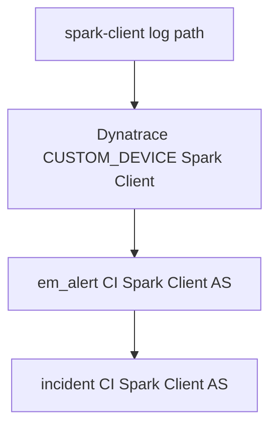
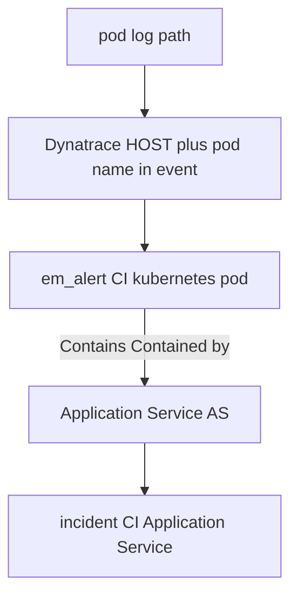
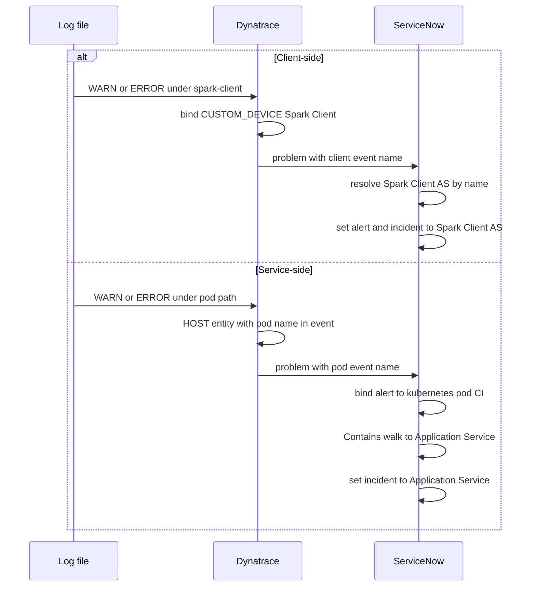

# CMDB Mapping: Client-side vs Service-side Log-to-Incident

How Dynatrace and ServiceNow (CSDM / CMDB) configurations differ for **Spark Client-side** vs **Spark Service-side** log alerts, and how those differences produce the correct **`incident.cmdb_ci`**.

Canonical process narrative, diagrams, and step-by-step automation live in [Log_to_Incident.adoc](Log_to_Incident.adoc). This note focuses on the **CI mapping contract** across both platforms.

---

## Two patterns, one pipeline

| | **Client-side** | **Service-side** |
|--|-----------------|------------------|
| **Who emits the log** | PySpark client-mode driver on a host | Spark workload in Kubernetes (master, worker, history, …) |
| **Log path contract** | `/mnt/spark/logs/spark-client/<instance>/spark-app*.log` | `/mnt/spark/logs/<pod-name>/spark-app*.log` (or `/opt/spark/logs/…`) |
| **Dynatrace problem entity** | Logical **CUSTOM_DEVICE** “Spark Client” | Typically **HOST** (OneAgent file tail); pod entity lookup is **disabled** |
| **ServiceNow alert CI** | Application Service **Spark Client** | **Kubernetes pod** CI |
| **ServiceNow incident CI** | Same Application Service **Spark Client** | Parent **Application Service** via **Contains::Contained by** |
| **CMDB bridge used for incident** | Text → AS **by name** (no Contains) | Alert pod → **Contains** → AS |

Shared path: OpenPipeline Davis `ERROR_EVENT` → Dynatrace Problem → ServiceNow Event Management (`em_event` / `em_alert`) → business rules → `incident`.

---

## End-to-end mapping

### Client-side



### Service-side



---

## Dynatrace configuration differences

Both patterns use the Spark OpenPipeline log-alerts pipeline
(`observability/dynatrace/tenants/pdt20158/integrations/spark-openpipeline-log-alerts-pipeline.json.j2`)
and the custom log source that tails `/mnt/spark/logs/…`. They diverge in **processing**, **Davis matcher**, and **impacted entity**.

### Client-side (Dynatrace)

| Concern | Configuration |
|---------|----------------|
| **Path match** | `k8s.log.path` / `log.source` under `/mnt/spark/logs/spark-client/*` |
| **Parse** | DQL extracts `spark.client.instance` from the path |
| **Tag** | `spark.client.as_identifier = spark-client` |
| **Entity bind** | Static `dt.source_entity = CUSTOM_DEVICE-BF87A767187C320F` (“Spark Client”). `fieldsAdd` is **static-only**; `lookupEntity(...)` expressions are **not** evaluated. |
| **Davis processor** | `spark-client-warn-error-davis` |
| **`event.name`** | `Application log {loglevel} on spark-client-{spark.client.instance}` |
| **Management zone** | CUSTOM_DEVICE “Spark Client” is included in **Spark Observability** so SGO can forward the problem |
| **Optional host process tag** | `DT_TAGS=servicenow.io/application-service-identifier=spark-client` on the driver (process enrichment only; **not** required for log-path incidents) |

**Why CUSTOM_DEVICE:** Client drivers are not Kubernetes pods. Binding Davis events to a stable logical device (instead of the OneAgent **HOST**) keeps client problems from bundling with Service-side HOST problems on the same node.

### Service-side (Dynatrace)

| Concern | Configuration |
|---------|----------------|
| **Path match** | `/mnt/spark/logs/*` or `/opt/spark/logs/*`, **excluding** `spark-client` and legacy `*-chapter` dirs |
| **Parse** | DQL extracts `k8s.pod_name` from the path (e.g. `spark-master-0`) |
| **Entity bind** | Processor `resolve-k8s-pod-entity` (`lookupEntity(CLOUD_APPLICATION_INSTANCE, …)`) is **disabled**. Pod Smartscape entities sit outside the Spark Observability MZ and would block SGO webhook delivery. |
| **Davis processor** | `k8s-warn-error-davis` |
| **`event.name`** | `Application log {loglevel} on {k8s.pod_name}` |
| **Typical impacted entity** | **HOST** (file-tailed log on the node). Pod identity for CMDB is recovered later in ServiceNow from the path / `event.name`. |

**Design split:** Dynatrace carries the **pod name in the event title/description**; ServiceNow owns **pod CI binding** (`K8sLogPodCiBind`). Dynatrace does **not** need to be the system of record for the CMDB pod sys_id.

### Side-by-side (Dynatrace)

| | Client-side | Service-side |
|--|-------------|--------------|
| OpenPipeline branch | Client extract + tag + CUSTOM_DEVICE `dt.source_entity` | Pod name extract; pod `lookupEntity` **off** |
| Davis `event.name` | `… on spark-client-<instance>` | `… on <pod-name>` |
| Problem impacted entity | CUSTOM_DEVICE Spark Client | HOST (usually) |
| SN connector often seen | Classic **Dynatrace** and/or **SGO-Dynatrace** | Prefer **SGO-Dynatrace** for pod rebind path |

---

## ServiceNow / CSDM / CMDB differences

### Shared CSDM spine

```
Business Application: Data and Analytic Services
  └── Business Service: Apache Spark
        ├── Application Service: Spark Client      (client-side)
        ├── Application Service: Spark Master      (service-side)
        ├── Application Service: Spark History Server
        └── Application Service: Spark Worker (LabN)
```

Source: `servicenow/regions/brooks-lab/spark.csdm.yaml`.

### Client-side (CMDB)

| Object | Class | Role |
|--------|-------|------|
| **Spark Client** | `cmdb_ci_service_discovered` | **Alert CI** and **incident CI** |
| CSDM | `identifier: spark-client`, `platform: host`, `service_mapping: manual`, `discover: false` | Logical AS; no required workload children |
| Contains edges | **None required** | Incident bind does **not** walk Contains |
| Depends on | Spark Master, lab3 NFS | Topology only — **not** used for incident CI |
| Host / process | Optional `cmdb_ci_linux_server` / `cmdb_ci_appl` | May appear from classic connector; **overridden** by path-based AS bind |

**Bind algorithm (`ResolveApplicationService`):**

1. Detect client text: `/logs/spark-client/` **or** `Application log` + `spark-client-`.
2. Look up Application Service by **`name = Spark Client`** (authoritative on optimizincdemo1; `identifier` is often empty).
3. Set `em_alert.cmdb_ci` and `incident.cmdb_ci` to that AS.

`K8sLogPodCiBind` **skips** path segment `spark-client` so the driver directory is never treated as a pod name.

### Service-side (CMDB)

| Object | Class | Role |
|--------|-------|------|
| **Pod** (e.g. `spark-master-0`) | `cmdb_ci_kubernetes_pod` | **`em_alert.cmdb_ci`** (preferred) |
| **Application Service** (e.g. Spark Master) | `cmdb_ci_service_discovered` | **`incident.cmdb_ci`** |
| Pod label / KVA | `servicenow.io/application-service-identifier=<identifier>` | Correlates pod ↔ CSDM `identifier` for tag-based SM |
| **Contains::Contained by** | `cmdb_rel_ci` parent AS → child pod | **Required** for incident AS resolution |
| Depends on / Instantiates / namespace | Other `cmdb_rel_ci` edges | Discovery / topology — **not** used for incident bind |

CSDM for Kubernetes ASes: `platform: kubernetes`, `service_mapping: tags`, `discover: false`, with matching pod labels (e.g. `spark-master` on the master StatefulSet pods).

**Bind algorithm:**

1. `K8sLogPodCiBind` sets alert CI to the pod whose **`name`** matches the log path segment / Davis title.
2. `ResolveApplicationService.resolveFromInfrastructureCi(pod)` queries `cmdb_rel_ci` where `child` = pod, `type` = **Contains::Contained by**, `parent.sys_class_name` = `cmdb_ci_service_discovered`.
3. Create-incident BR sets **`incident.cmdb_ci`** to that parent AS and **leaves** service-side **`em_alert.cmdb_ci`** on the pod.

If Contains is missing, incident AS resolution fails even when the alert is correctly on the pod. Backfill: `ansible/playbooks/servicenow/incident/ensure_as_contains_from_kva.yml` (materializes Contains from KVA when tag SM has not).

### Side-by-side (CMDB)

| | Client-side | Service-side |
|--|-------------|--------------|
| Alert CI class | Application Service | Kubernetes pod |
| Incident CI class | Application Service (same) | Application Service (parent of pod) |
| Relationship required for incident | None | **Contains::Contained by** AS → pod |
| Lookup key | AS **name** “Spark Client” | Pod **name** → Contains → AS |
| KVA / pod label | Not used for bind | Used to materialize Contains (precondition) |

---

## How Dynatrace and ServiceNow work together



### Contract summary

1. **Dynatrace** decides *which problem entity and event title* the log produces (CUSTOM_DEVICE + `spark-client-…` vs HOST + `<pod-name>`).
2. **ServiceNow CMDB** holds the *authoritative Application Service* and (for Service-side) the *pod* and *Contains* edge.
3. **ServiceNow scripts** map alert text / pod CI → **`incident.cmdb_ci`**:
   - Client: path / event name → AS by name.
   - Service: path → pod CI → Contains → AS.

Neither platform alone completes the story: Dynatrace without CMDB Contains (or client path rules) cannot set the CSDM Application Service on the incident; CMDB without Davis `event.name` / path context cannot tell client from service or which pod fired.

---

## Automation touchpoints (ServiceNow)

| Component | Client-side | Service-side |
|-----------|-------------|--------------|
| `ResolveApplicationService.applySparkClientAlertBinding` | Sets event/alert CI to Spark Client AS | Skipped when text is not client |
| `ResolveApplicationService.resolveFromSparkClientLogPath` | Incident AS | — |
| `ResolveApplicationService.resolveFromInfrastructureCi` | — | Incident AS via Contains |
| `K8sLogPodCiBind` | Skips `spark-client` segment | Binds alert to pod CI |
| `em-alert-create-k8s-log-incident` | Client first; may align alert CI to AS | Keeps alert on pod; incident gets AS |

Business rules accept `source=SGO-Dynatrace` **or** `source=Dynatrace` so classic connector client problems still bind.

---

## Quick reference — validated shapes

| Pattern | Alert CI | Incident CI |
|---------|----------|-------------|
| Client | Spark Client (`cmdb_ci_service_discovered`) | Spark Client |
| Service | `spark-master-0` (`cmdb_ci_kubernetes_pod`) | Spark Master (`cmdb_ci_service_discovered`) |

---

## Related docs

- [Log_to_Incident.adoc](Log_to_Incident.adoc) — Steps 0–5, Graphviz figures, automation spec
- [README.md](README.md) — render / export for the AsciiDoc
- `servicenow/regions/brooks-lab/spark.csdm.yaml` — Application Service declarations
- `observability/dynatrace/tenants/pdt20158/integrations/spark-openpipeline-log-alerts-pipeline.json.j2` — OpenPipeline / Davis
- `observability/dynatrace/tenants/pdt20158/docs/DT_Problems_to_SN_Event.md` — Problem → SN event path
- `ansible/playbooks/servicenow/incident/` — Script Includes, BRs, Contains backfill playbook
