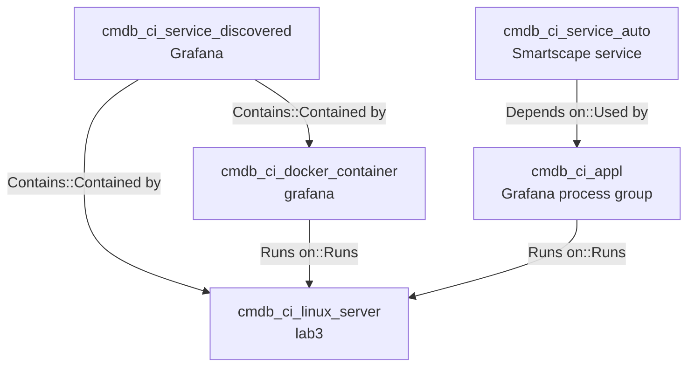

# Docker Application Service — CMDB model (Grafana)

CMDB / CSDM **`cmdb_rel_ci`** relationships from the **Application Service** downward for a tag-based Docker workload on Lab3. Example: **Grafana** (`identifier: grafana`).

## Service map

## cmdb_rel_ci relationships

| Parent | Type | Child |
|--------|------|-------|
| `cmdb_ci_service_discovered` | Contains::Contained by | `cmdb_ci_docker_container` |
| `cmdb_ci_service_discovered` | Contains::Contained by | `cmdb_ci_linux_server` |
| `cmdb_ci_docker_container` | Runs on::Runs | `cmdb_ci_linux_server` |
| `cmdb_ci_appl` (process group) | Runs on::Runs | `cmdb_ci_linux_server` |
| `cmdb_ci_service_auto` | Depends on::Used by | `cmdb_ci_appl` (process group) |

---

## Correlation attributes by CI class

What each CMDB object exposes for joining to other CIs or to Dynatrace **`entityId`** values. Application Services are **not** Dynatrace entities; join is always indirect.

### `cmdb_ci_service_discovered` (Application Service — Grafana)

| Kind | Name | Use |
| ---- | ---- | --- |
| Field | **`identifier`** | Must match `servicenow.io/application-service-identifier` on workload CIs (`grafana`) |
| Field | `name`, `environment`, `location` | Scope tag-based SM with container/pod tags |
| SM config | **`tag_list`** | Population filter (not stored as `cmdb_key_value` on the AS row) |
| Relationship | **Contains::Contained by** → container, host (traversal) | **Pattern A** — parent of workload CI |
| Relationship | **Depends on::Used by** → other AS, servers | Declared CSDM deps only |
| Dynatrace | — | No `sys_object_source`; problems do not bind here directly |

### `cmdb_ci_docker_container` (Grafana container)

| Kind | Name | Use |
| ---- | ---- | --- |
| Field | `name`, `container_id`, **`host`** | Locate container on `cmdb_ci_linux_server` |
| Tags | **`cmdb_key_value`**: `servicenow.io/application-service-identifier` | **Pattern B** → AS `identifier` |
| Tags | **`cmdb_key_value`**: `com.docker.compose.service`, `com.docker.compose.project` | Compose identity; bridge PG ↔ container on same host |
| Tags | **`cmdb_key_value`**: `servicenow.io/environment`, `servicenow.io/location` | SM scope |
| Relationship | **Runs on::Runs** → host | Infrastructure placement |
| Relationship | child of AS **Contains** | **Pattern A** when alert CI = this row |
| Dynatrace | **`sys_object_source`** (`SGO-Dynatrace`, `CONTAINER_*` / container entity id) | **`em_event.cmdb_ci`** when Davis picks container entity and IRE merged |
| Source | `discovery/docker/discover.yml` | Creates CI + `cmdb_key_value` from `docker inspect` |

### `cmdb_ci_appl` (process group — SGC)

| Kind | Name | Use |
| ---- | ---- | --- |
| Field | `name` (often process / image derived) | Weak name match to compose service; do not rely on alone |
| Field | **`host`** / **Runs on::Runs** → `cmdb_ci_linux_server` | Bridge to containers on same host |
| Tags | **`cmdb_key_value`** from **SGC import of Dynatrace entity tags** | **Pattern B on PG** — only after **`DT_TAGS`** (or DT auto-tags) on the process |
| Tags | Today without `DT_TAGS` | Typically **empty** for servicenow.io keys |
| Relationship | **Runs on::Runs** → host | Co-locate with container |
| Relationship | **Depends on::Used by** ← Smartscape service | DT monitoring topology only |
| Dynatrace | **`sys_object_source`** (`PROCESS_GROUP-…`) | **Most common `em_alert.cmdb_ci`** for log/APM problems |
| Source | SGC scheduled import (`discovery_source` includes `SGO-Dynatrace`) | Does **not** copy Docker Compose labels by itself |

### `cmdb_ci_service_auto` (Smartscape service — SGC)

| Kind | Name | Use |
| ---- | ---- | --- |
| Field | `name` | DT service display name |
| Relationship | **Depends on::Used by** → process group(s) | Call-path topology |
| Tags | Optional **`cmdb_key_value`** if DT tags on SERVICE entity | Same Pattern B as PG if tags present |
| Dynatrace | **`sys_object_source`** (`SERVICE-…`) | Problems on **service-level** detectors (HTTP service metrics, some APM) |
| AS join | Indirect | PG or container bridge, or tag on SERVICE if configured |

### `cmdb_ci_linux_server` (lab3)

| Kind | Name | Use |
| ---- | ---- | --- |
| Field | **`name`**, FQDN | Merge with DT **HOST** via IRE / hostname |
| Relationship | parent of **Contains** from AS (traversal) | Host-level alerts rarely map to Grafana AS without tags on host |
| Dynatrace | **`sys_object_source`** (`HOST-…`) | **Host CPU** and some **log** problems |
| Tags | Optional host-agent specs | `elastic-agent-*` AS use host `cmdb_key_value` |

### Supporting tables (not CIs in the map)

| Table | Join role |
| ----- | --------- |
| **`sys_object_source`** | Dynatrace **`entityId`** → `target_sys_id` / CMDB table — binds **`em_event`** / **`em_alert`** |
| **`cmdb_key_value`** | Tag key/value on a CI — **Pattern B**, tag-based SM input |
| **`cmdb_rel_ci`** | **Contains**, **Runs on**, **Depends on** — **Pattern A** |

---

## Dynatrace: which entity types appear on a problem?

Davis picks **impacted entities** for the problem and webhook **`ImpactedEntities`**. ServiceNow binds **`em_event.cmdb_ci`** via **`sys_object_source`** for that **`entityId`**. This is **not** the CSDM Application Service.

| Signal type | Typical Dynatrace entity | Brooks-lab / Docker notes |
| ----------- | ------------------------ | ------------------------- |
| **Log lines** (log events, DQL) | **HOST**, **PROCESS_GROUP**, or log-source process; K8s: **K8s pod/container** entities | Spark ERROR matcher often surfaces **host** or **process** tied to `log.source.path`. Containerized app logs may attach to **PROCESS_GROUP** for the process writing the log. |
| **Application exceptions** (APM, coded errors) | **PROCESS_GROUP**, often **SERVICE** (server-side call) | PurePath / service flow ties to PG and Smartscape **SERVICE**. |
| **HTTP / web requests** (server-side APM) | **SERVICE** (Smartscape), underlying **PROCESS_GROUP** | User-facing “service” in DT is **SERVICE**, not CSDM Application Service. |
| **HTTP synthetic monitors** | **SYNTHETIC_TEST** / **HTTP_CHECK**; may relate to **SERVICE** | Synthetic problems may not map to brooks-lab CMDB unless SGC imports those entity types. |
| **Infrastructure metrics** (host CPU, memory) | **HOST** | Chapter CPU path: **`HOST-…`** only in impacted list. |
| **Process / JVM metrics** | **PROCESS_GROUP**, **PROCESS_GROUP_INSTANCE** | Common for process-scoped thresholds. |
| **Custom alerts on a service** | **SERVICE** or **PROCESS_GROUP** | Depends on detector scope. |

**Takeaway:** Log and exception problems on Docker workloads most often bind ServiceNow to **`cmdb_ci_appl` (process group)** or **`cmdb_ci_linux_server` (host)** — not to **`cmdb_ci_docker_container`**, unless Dynatrace exposes a container entity and SGC/IRE created **`sys_object_source`** for it. Plan incident automation for **process group first**, container and host second.

---

## Paths to Application Service

Summary table — **when** each row applies (alert already has infrastructure **`cmdb_ci`** from Dynatrace or another source):

| Alert `cmdb_ci` class | Path | When this row applies |
| --------------------- | ---- | --------------------- |
| `cmdb_ci_docker_container` | **Pattern A** | Alert/event bound to container CI; SM **Contains** already exists |
| `cmdb_ci_docker_container` | **Pattern B** | Same as above, but **Contains** missing or unverified |
| `cmdb_ci_appl` (process group) | **Pattern B (PG tags)** | Alert on PG; **`DT_TAGS` + SGC** put `servicenow.io/application-service-identifier` on PG CI |
| `cmdb_ci_appl` (process group) | **Bridge → container** | Alert on PG; **no** PG tags; container has `cmdb_key_value` on same host |
| `cmdb_ci_linux_server` | **Bridge / host tags** | Host-only problem (e.g. CPU); optional host `cmdb_key_value` or manual mapping |

### Pattern A — Contains traversal (container alert)

**Context:** `em_alert.cmdb_ci` points at **`cmdb_ci_docker_container`** (Grafana). Uncommon for log problems today; possible if `sys_object_source` maps a container **`entityId`**.

**How does the alert get `cmdb_ci_docker_container`?**

1. Dynatrace problem includes **`entityId`** for a container-related entity (or merged CI).
2. Webhook POST → SGO listener creates **`em_event`**.
3. Listener looks up **`sys_object_source`**: `name=SGO-Dynatrace`, `id=<entityId>` → **`target_sys_id`** = container sys_id.
4. **`em_event.cmdb_ci`** = container CI.
5. EM rule creates **`em_alert`**; copies **`cmdb_ci`** from event.

**Prerequisites (before the problem):**

| Step | Object | Result |
| ---- | ------ | ------ |
| 1 | `discovery/docker/discover.yml` | Container CI + **`cmdb_key_value`** tags |
| 2 | `csdm/deploy.yml` | Application Service + **`tag_list`** |
| 3 | Tag-based SM job / Update map | **`cmdb_rel_ci` Contains** (AS parent → container child) |
| 4 | SGC import | **`sys_object_source`** for container **`entityId`** (if DT sends it) |

**Incident step:**

1. Start: **`em_alert.cmdb_ci`** = container sys_id.
2. Query **`cmdb_rel_ci`**: `child` = container, `type` = **Contains::Contained by**.
3. **`parent`** = **`cmdb_ci_service_discovered`** (Grafana).
4. Set **`incident.cmdb_ci`** = parent sys_id.

**CIs / tags / relationships used:** `em_alert` → **`cmdb_rel_ci` Contains** → AS. Tags not required on the event payload.

---

### Pattern B — Tag lookup (container alert)

**Context:** Same container **`cmdb_ci`** on alert, but **Contains** edge missing (SM not run, ACL blocked tags, service still in Requirements).

**How does the alert get `cmdb_ci_docker_container`?** Same as Pattern A (**`sys_object_source`** from Dynatrace **`entityId`**).

**Incident steps:**

1. Start: **`em_alert.cmdb_ci`** = container sys_id.
2. Query **`cmdb_key_value`**: `configuration_item` = container, `key` = **`servicenow.io/application-service-identifier`** → `value` = **`grafana`**.
3. Query **`cmdb_ci_service_discovered`**: **`identifier`** = **`grafana`**.
4. Set **`incident.cmdb_ci`** = Application Service sys_id.

**CIs / tags / relationships:** `cmdb_key_value` on container (from **`docker/discover.yml`**), AS **`identifier`** field. No **`cmdb_rel_ci`** required.

---

### Pattern B — Tag lookup (process group alert, with DT_TAGS + SGC)

**Context:** **`em_alert.cmdb_ci`** = **`cmdb_ci_appl`** (Grafana process group) — **typical** for log/APM problems.

**What “after DT_TAGS + SGC” means:**

| Step | Where | What happens |
| ---- | ----- | ------------ |
| 1 Compose | `docker-compose.yml` | `environment: DT_TAGS=servicenow.io/application-service-identifier=grafana` on the Grafana service |
| 2 OneAgent | Process startup | Tags attached to Dynatrace **PROCESS_GROUP** entity in Smartscape |
| 3 SGC import | Scheduled topology job | Creates/updates process group **`cmdb_ci_appl`** + **`sys_object_source`** |
| 4 SGC import | Same job | Copies Dynatrace entity tags into **`cmdb_key_value`** on that CI (`key` / `value` rows) |
| 5 Problem | Davis | **`ImpactedEntities`** includes **`PROCESS_GROUP-…`** |
| 6 Webhook | `em_event` | **`sys_object_source`** → **`cmdb_ci`** = process group CI |
| 7 Alert | `em_alert` | Same process group **`cmdb_ci`** |

**Incident steps (after step 4 above):**

1. Start: **`em_alert.cmdb_ci`** = process group sys_id.
2. Query **`cmdb_key_value`** on **that CI**: `key` = **`servicenow.io/application-service-identifier`** → **`grafana`**.
3. Query **`cmdb_ci_service_discovered`**: **`identifier`** = **`grafana`**.
4. Set **`incident.cmdb_ci`** = Application Service sys_id.

**Without DT_TAGS:** step 2 returns **no row** on the process group — use **Bridge** below.

---

### Bridge — process group alert → container → Application Service

**Context:** Alert on **process group**, PG has **no** servicenow.io tags, container **does** (current brooks-lab default).

**Steps:**

1. **`em_alert.cmdb_ci`** = process group sys_id.
2. **`cmdb_rel_ci`**: PG **Runs on::Runs** → **`cmdb_ci_linux_server`** (lab3).
3. Find **`cmdb_ci_docker_container`** where **`host`** = lab3 and **`cmdb_key_value`** has `servicenow.io/application-service-identifier=grafana` (or `com.docker.compose.service=grafana`).
4. **Pattern A** or **Pattern B** from that container → Application Service.

**CIs / tags / relationships:** PG → **Runs on** → host; container **`cmdb_key_value`**; AS **Contains** or **`identifier`**.

---

## Related records (not map nodes)

| Table | On / for | Purpose |
| ----- | -------- | ------- |
| `cmdb_key_value` | container | Compose + servicenow.io tags from **`docker/discover.yml`** |
| `cmdb_key_value` | process group | Dynatrace entity tags from **SGC** (needs **`DT_TAGS`**) |
| `sys_object_source` | host, PG, container | **`entityId`** → CI for events/alerts |
| `cmn_location` | host, container | `brooks-lab` |

## Excluded

- Business Application / Business Service above the Application Service
- Depends on edges to other application services
- Dynatrace problem objects (not CMDB CIs)
