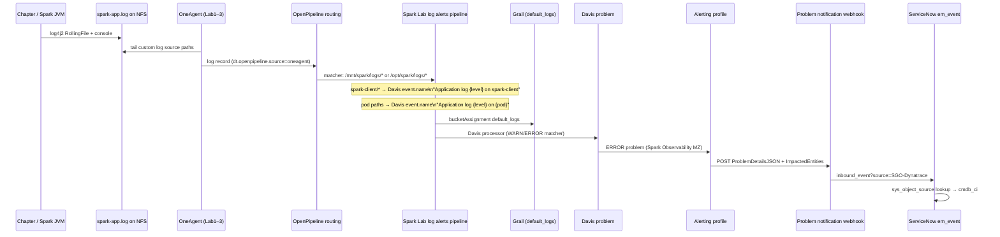

# Spark logs — emission → Dynatrace → ServiceNow (brooks-lab as-is)

End-to-end path for **Spark WARN/ERROR log lines** from chapter runs and K8s workloads on tenant **pdt20158**, through Dynatrace Grail and Davis, into ServiceNow Event Management as **`em_event`** rows with **`source=SGO-Dynatrace`**.

**Automation:** `ansible/playbooks/servicenow/sgc/sources/dynatrace/events/deploy.yml`  
**Reference:** `observability/dynatrace/tenants/pdt20158/docs/DT_Problems_to_SN_Event.md`

---

## End-to-end flow



**Parallel path (not covered step-by-step here):** the same `spark-app.log` files are also tailed by **Elastic Agent** on Lab3 → Logstash → **Elasticsearch/Kibana**. That path does not create ServiceNow events.

---

## Step 1 — Spark emits log lines

### What happens

Spark JVMs (PySpark chapter **driver** on Lab3, **executors** in K8s pods, **master/worker** components) write log4j lines. Chapter runs use **client mode**: the driver on the host connects to `spark://Lab3.lan:31686` and executors run in the cluster.

| Writer | Config | Output path |
|--------|--------|-------------|
| Chapter / client-mode driver | `run-chapters.sh` + `log4j2-client.properties` | `/mnt/spark/logs/spark-client/<hostname-pid>/spark-app.log` (one subdirectory per driver JVM) |
| K8s Spark pods | Pod log4j / symlink layout | `/mnt/spark/logs/<pod-dir>/spark-app.log` |
| Spark 4.x DiskLog (optional) | `/opt/spark/logs` when present | `/opt/spark/logs/spark-app.log` |
| Legacy (retired) | prior `run-chapters.sh` | `/mnt/spark/logs/<host>-chapter/` — dropped by OpenPipeline |

See [Problem to Incident — Spark client log path](Problem_to_Incident.adoc#step-5-spark-client-path) for client-mode incident correlation.

### Configurations

| File / setting | Role |
|----------------|------|
| `spark/conf/log4j2-client.properties` | `RollingFile` appender → `${SPARK_LOG_DIR}/spark-app.log`; pattern `%d %-5p %c{1}:%L - %m%n` |
| `spark/apps/data-analysis-book/run-chapters.sh` | Sets `SPARK_LOG_DIR=/mnt/spark/logs/spark-client/${hostname-pid}`; optional `SPARK_DRIVER_INSTANCE`; `DT_TAGS=servicenow.io/application-service-identifier=spark-client`; adds `-Dlog4j2.configurationFile=…/log4j2-client.properties` |
| `docs/Log_Architecture.md` | NFS layout under `/mnt/spark/logs` on Lab1–Lab3 |
| K8s / Spark deploy | Executor and master logs under per-pod directories on NFS |

### Example raw log lines (file on disk)

Client-mode driver (`/mnt/spark/logs/spark-client/lab3-par-a-557204/spark-app.log`):

```text
2026-07-06 07:18:44 WARN  WindowExec:244 - No Partition Defined for Window operation! Moving all data to a single partition…
2026-07-06 07:19:02 ERROR TaskSetManager:250 - Lost task 0.0 in stage 12.0 …
```

K8s master (pod path):

```text
2026-07-01 14:26:26 WARN  Master:250 - Got status update for unknown executor app-20260701142425-0039
```

### Attribute pairs at emission (implicit)

Log4j does not attach Dynatrace fields. The line carries only timestamp, level, logger, message:

| Attribute | Example value |
|-----------|---------------|
| timestamp (in line) | `2026-07-01 14:26:22` |
| level | `WARN` |
| logger | `WindowExec` |
| line | `244` |
| message | `No Partition Defined for Window operation! …` |
| file path (filesystem) | `/mnt/spark/logs/lab3-chapter/spark-app.log` |

---

## Step 2 — OneAgent ingests file logs into Dynatrace

### What happens

**OneAgent** on Lab hosts tails paths registered as a **custom log source**. Lines are sent through **OpenPipeline** (not the classic log-processing pipeline alone). Ingest is asynchronous (typically seconds to a few minutes after the line is written).

### Configurations

| Object | Schema / location | Name | Value |
|--------|-------------------|------|-------|
| Custom log source | `builtin:logmonitoring.custom-log-source-settings` | `Spark Lab - application log files` | Paths: `/mnt/spark/logs/*/spark-app.log`, `/mnt/spark/logs/*/spark-app-*.log`, `/opt/spark/logs/spark-app.log*` |
| Template | `observability/dynatrace/tenants/pdt20158/integrations/spark-log-custom-source.json.j2` | | |
| Ansible task | `apply_spark_log_custom_source.yml` | | Runs in `events/deploy.yml` |
| Management zone | `builtin:management-zones` | `Spark Observability` | Hosts/pods tagged for brooks-lab partition |
| Auto-tags (typical on ingested records) | Dynatrace tagging rules | | `Project:spark-observability`, `Environment:lab`, `OwnedBy:gbrooks` |

### Example Grail log record (after ingest)

Query: `fetch logs | filter matchesValue(content, "* WARN *") AND matchesValue(log.source, "/mnt/spark/logs/*")`

| Attribute | Example value | Notes |
|-----------|---------------|-------|
| `timestamp` | `2026-07-01T19:26:22.000000000Z` | UTC in Grail |
| `content` | `2026-07-01 14:26:22 WARN  WindowExec:244 - No Partition Defined…` | Full log line |
| `loglevel` | `WARN` | Parsed level |
| `status` | `WARN` | Normalized status |
| `log.source` | `/mnt/spark/logs/*/spark-app.log` | Path pattern (not always the literal file path) |
| `host.name` | `lab1` | Host running OneAgent / tail context |
| `dt.entity.host` | `HOST-F1B6A7154EBA24C8` | Smartscape host entity |
| `dt.source_entity` | `HOST-F1B6A7154EBA24C8` | **Default impacted entity for file-tailed logs** |
| `dt.smartscape_source.type` | `HOST` | |
| `dt.entity.kubernetes_cluster` | `KUBERNETES_CLUSTER-1BE3EFAB6083571E` | Present when host is a K8s node |
| `dt.entity.kubernetes_node` | `KUBERNETES_NODE-7127DBBDADDC24CD` | |
| `dt.openpipeline.source` | `oneagent` | |
| `dt.openpipeline.pipelines` | `['logs:pipeline_Metric_Pipeline_4530', …]` | After routing (see Step 3) |
| `Project` | `spark-observability` | Tag on record |
| `Environment` | `lab` | Tag on record |

**File-tailed chapter WARN lines typically do not include** `dt.entity.process_group` or `dt.entity.process_group_instance`. Container stdout logs (`log.source: Container Output`) can include process-group entities; that is a separate ingest path.

---

## Step 3 — OpenPipeline routing and storage

### What happens

On tenant **pdt20158**, logs are routed through **OpenPipeline**. A **Spark-specific route** (prepended before the catch-all **Metric Route**) sends Spark log paths into the **`Spark Lab - log alerts`** pipeline. The pipeline stores records in Grail bucket **`default_logs`** and runs a **Davis event processor** (Step 4).

Classic **`builtin:logmonitoring.log-events`** (`Spark Lab - ERROR and WARN log lines`) is deployed but **does not evaluate** records that bypass the classic pipeline — OpenPipeline Davis extraction is the **active** alert path.

### Configurations

| Object | Schema | Name / description |
|--------|--------|-------------------|
| Logs routing | `builtin:openpipeline.logs.routing` | Route **`Spark Lab log alerts (ERROR/WARN)`** — matcher: `matchesValue(log.source, "/mnt/spark/logs/*") OR matchesValue(log.source, "/opt/spark/logs/*")` → pipeline **`Spark Lab - log alerts`** |
| Logs routing (catch-all) | same | **`Metric Route`** — matcher: `true` → metric extraction pipeline (all other logs) |
| Log alerts pipeline | `builtin:openpipeline.logs.pipelines` | **`Spark Lab - log alerts`** (`customId: spark-lab-log-alerts`) |
| Template | `spark-openpipeline-log-alerts-pipeline.json.j2` | |
| Ansible task | `apply_spark_openpipeline_log_alerts.yml` | |

### Example routing decision (attribute pairs)

| Attribute | Value for chapter WARN line |
|-----------|----------------------------|
| `log.source` | `/mnt/spark/logs/*/spark-app.log` |
| Route matched | `Spark Lab log alerts (ERROR/WARN)` |
| Target pipeline | `Spark Lab - log alerts` |
| Storage bucket | `default_logs` |

---

## Step 4 — Davis event extraction (log → event)

### What happens

The **Davis processor** in the Spark log alerts pipeline matches **WARN** or **ERROR** lines under Spark log paths and emits a **Davis event**. That event becomes the ranked event inside a **problem** (Step 5). **`dt.source_entity`** on the event determines which Smartscape entity is “impacted” (today: **host** for file-tailed logs).

### Configurations (Davis processor)

| Property | Value |
|----------|-------|
| **Matcher (DQL subset)** | `(loglevel == "WARN" OR loglevel == "ERROR") AND (matchesValue(log.source, "/mnt/spark/logs/*") OR matchesValue(log.source, "/opt/spark/logs/*"))` |
| `event.type` | `ERROR_EVENT` |
| `event.name` | `Spark log alert` |
| `event.description` | `Spark application log line at ERROR or WARN level in brooks-lab ({log.source}).` |
| `dt.source_entity` | `{dt.source_entity}` (pass-through from log record) |
| `dt.davis.event_timeout` | `15m` |

Legacy (inactive for routed logs): `spark-error-log-event.json.j2` → `builtin:logmonitoring.log-events` summary **`Spark Lab - ERROR and WARN log lines`**.

### Example Davis event (Grail `fetch events`)

| Attribute | Example value |
|-----------|---------------|
| `timestamp` | `2026-07-01T19:33:32.808000000Z` |
| `event.name` | `Spark log alert` |
| `event.category` | `ERROR` |
| `display_id` | `P-260729` (problem id once correlated) |
| `dt.source_entity` | `HOST-A3921C1DA2349805` |
| `dt.source_entity.type` | `host` |
| `dt.entity.host` | `HOST-A3921C1DA2349805` |
| `dt.entity.host.name` | `Lab2` |
| `affected_entity_ids` | `['HOST-A3921C1DA2349805']` |
| `affected_entity_types` | `['dt.entity.host']` |
| `entity_tags` | `Environment:lab`, `Project:spark-observability`, `OwnedBy:gbrooks` |

---

## Step 5 — Davis problem and alerting profile

### What happens

The first matching Davis event opens a **problem** in management zone **Spark Observability**. The alerting profile forwards **ERROR** severity (and other configured severities) immediately to the ServiceNow webhook. **`davisMerge`** is not used on the log path — each qualifying log line can contribute to problem lifecycle within the `15m` event timeout window.

### Configurations

| Object | Schema | Name |
|--------|--------|------|
| Alerting profile | `builtin:alerting.profile` | **`Spark Observability - ServiceNow brooks-lab`** — MZ: Spark Observability; severities: AVAILABILITY, **ERRORS**, PERFORMANCE, RESOURCE_CONTENTION, CUSTOM_ALERT (0 min delay) |
| Problem notification | `builtin:problem.notifications` | **`ServiceNow brooks-lab - Spark Observability`** |
| Template | `spark-snow-alerting-profile.json.j2`, `sgc-problem-notification-payload.json.j2` | |

### Example problem (Dynatrace Problems UI)

| Field | Example value |
|-------|---------------|
| Problem id | `P-260729` |
| Title | `Spark log alert` (from `event.name`) |
| Severity | `ERROR` |
| Management zone | `Spark Observability` |
| Impacted entity | `Lab2` (host) |
| Impacted entity id | `HOST-A3921C1DA2349805` |

---

## Step 6 — Webhook POST to ServiceNow

### What happens

Dynatrace **Problem notification** POSTs JSON to the SGC inbound listener. **`source=SGO-Dynatrace`** is on the URL, not in the body. ServiceNow scoped app **`sn_dynatrace_integ`** parses **`ProblemDetailsJSON`** (v1 shape for SGC, not v2) and **`ImpactedEntities`** for CI binding.

### Configurations

| Setting | Value |
|---------|-------|
| **URL** | `https://optimizincdemo1.service-now.com/api/sn_em_connector/em/inbound_event?source=SGO-Dynatrace` |
| **Auth** | HTTP Basic (`SN_DT_WEBHOOK_USER` / `SN_DT_WEBHOOK_PASSWORD` in `vars/secrets.yaml`) |
| **Payload template** | `sgc-problem-notification-payload.json.j2` |
| **ConnectionId** | SGC connection alias sys_id (injected as `ConnectionId` in body) |
| **notifyClosedProblems** | `true` — RESOLVED posts update the same `message_key` |

### Example webhook body (illustrative keys)

Dynatrace substitutes placeholders at send time:

```json
{
  "ConnectionId": "<SGC-connection-sys-id>",
  "ProblemID": "-260729",
  "ProblemTitle": "Spark log alert",
  "ProblemSeverity": "ERROR",
  "ProblemImpact": "INFRASTRUCTURE",
  "State": "OPEN",
  "ImpactedEntity": "Lab2",
  "ImpactedEntities": [
    {
      "entityId": "HOST-A3921C1DA2349805",
      "name": "Lab2",
      "type": "HOST"
    }
  ],
  "ProblemDetailsJSON": {
    "id": "-260729",
    "rankedEvents": [
      {
        "entityId": "HOST-A3921C1DA2349805",
        "eventType": "ERROR",
        "severityLevel": "ERROR"
      }
    ]
  },
  "ProblemDetailsText": "Spark application log line at ERROR or WARN level in brooks-lab (/mnt/spark/logs/*/spark-app.log).",
  "ProblemURL": "https://pdt20158.apps.dynatrace.com/ui/problems/…",
  "Tags": "Project:spark-observability,Environment:lab,…",
  "PID": "<correlation-id>"
}
```

| Webhook field | Example | Used for |
|---------------|---------|----------|
| `ProblemID` | `-260729` | `em_event.message_key` (dedup OPEN/RESOLVED) |
| `ProblemTitle` | `Spark log alert` | `description` / `message` |
| `ProblemSeverity` | `ERROR` | `severity` (mapped to numeric, typically **2**) |
| `ImpactedEntity` | `Lab2` | `node` |
| `ImpactedEntities[].entityId` | `HOST-A3921C1DA2349805` | **`cmdb_ci` lookup** via `sys_object_source` |
| `ProblemDetailsJSON.rankedEvents[].entityId` | `HOST-A3921C1DA2349805` | Fallback CI binding parse path |
| `State` | `OPEN` / `RESOLVED` | Create vs close/update event |

---

## Step 7 — ServiceNow `em_event` and CI binding

### What happens

The **SGO-Dynatrace** Event Management listener creates or updates **`em_event`**. Field mappings in scoped app **`sa_event_field_mapping`** transform the webhook. **`cmdb_ci`** is resolved by looking up **`sys_object_source`** where `name = SGO-Dynatrace` and `id = <entityId>` from the problem.

### Configurations

| Setting | Value |
|---------|-------|
| Event source | `SGO-Dynatrace` (`sn_sgc_event_source` in `ansible/.../sgc/common/vars.yml`) |
| CMDB prerequisite | **SGO-Dynatrace Hosts** scheduled import active; host rows merged with Discovery **`cmdb_ci_linux_server`** |
| Object source | `sys_object_source.name = SGO-Dynatrace`, `id = HOST-…` → `target_sys_id` of Linux server CI |
| Optional (process binding) | **SGO-Dynatrace Process Groups** import — required only if `entityId` were `PROCESS_GROUP-…` |

### Example `em_event` row (after chapter run)

| `em_event` field | Example value |
|------------------|---------------|
| `source` | `SGO-Dynatrace` |
| `message_key` | `-260729` (from `ProblemID`) |
| `description` | `OPEN Problem P-260729 in environment pdt20158\nProblem detected at: 19:32 (UTC) …\n1 impacted infrastructure component\nHost Lab2` |
| `severity` | `2` (Major — ERROR-class problem) |
| `state` | `Processed` / `Ready` |
| `node` | `Lab2` |
| `resource` | Log source or sub-component when mapped (often log path or entity name) |
| `cmdb_ci` | sys_id of **`cmdb_ci_linux_server`** for Lab2 (via `sys_object_source`) |
| `cmdb_ci_type` | `cmdb_ci_linux_server` |
| `type` | `ERROR` (typical) |
| `additional_info` | JSON fragment with `ProblemURL`, `Tags`, `ImpactedEntities`, … |

Event rules may promote **`em_event` → `em_alert`**. Incident automation (if configured) walks **`cmdb_rel_ci` Contains** from the infrastructure CI to an Application Service — that is a **downstream** step, not part of the webhook payload.

---

## Configuration index (all objects that influence this path)

| Stage | Configuration | Deploy / doc reference |
|-------|---------------|------------------------|
| Emit | `spark/conf/log4j2-client.properties` | Spark image / repo conf |
| Emit | `spark/apps/data-analysis-book/run-chapters.sh` | Chapter runner |
| Ingest | `Spark Lab - application log files` custom log source | `apply_spark_log_custom_source.yml` |
| Route | OpenPipeline logs routing + **`Spark Lab - log alerts`** pipeline | `apply_spark_openpipeline_log_alerts.yml` |
| Detect | Davis processor matcher + event template | `spark-openpipeline-log-alerts-pipeline.json.j2` |
| Detect (legacy, bypassed) | `Spark Lab - ERROR and WARN log lines` log event | `spark-error-log-event.json.j2` |
| Problem | Management zone **Spark Observability** | `observability/dynatrace/deploy.yml` |
| Notify | Alerting profile **Spark Observability - ServiceNow brooks-lab** | `apply_dt_alerting_profile.yml` |
| Notify | Webhook **ServiceNow brooks-lab - Spark Observability** | `apply_dt_problem_notification.yml` |
| SN ingest | SGC inbound + field mappings | Store app `sn_dynatrace_integ` |
| SN CI | `sys_object_source` + SGC host import | `apply_sgc_topology_config.yml`, Guided Setup |

**Deploy everything:**

```bash
cd ansible
ansible-playbook -i inventory.yml \
  playbooks/servicenow/sgc/sources/dynatrace/events/deploy.yml \
  -e @../vars/secrets.yaml
```

**Generate test signal:**

```bash
cd spark/apps/data-analysis-book
./run-chapters.sh 06   # TaskSetManager WARN/ERROR likely
# or
./run-chapters.sh -a
```

**Verify:**

```bash
# ServiceNow events (last 2h)
ansible-playbook -i inventory.yml \
  playbooks/servicenow/sgc/sources/dynatrace/events/test.yml \
  -e @../vars/secrets.yaml
```

Dynatrace Logs (WARN/ERROR, last 2h): [Logs app — Spark paths](https://pdt20158.apps.dynatrace.com/ui/apps/dynatrace.logs/) with DQL:

```dql
fetch logs, from:now()-2h
| filter (loglevel == "WARN" OR loglevel == "ERROR")
  AND matchesValue(log.source, "/mnt/spark/logs/*")
| sort timestamp desc
| limit 100
```

ServiceNow: [em_event list — SGO-Dynatrace](https://optimizincdemo1.service-now.com/em_event_list.do?sysparm_query=source%3DSGO-Dynatrace%5EORDERBYDESCsys_created_on)

---

## Spark client-mode validation (brooks-lab)

### Approach

1. **Emit** — Run chapter drivers with distinct `SPARK_DRIVER_INSTANCE` values so parallel JVMs write to separate directories under `/mnt/spark/logs/spark-client/`.
2. **Ingest** — OneAgent custom log source paths `/mnt/spark/logs/spark-client/*/spark-app*.log` (restart OneAgent after deploy if paths were added recently).
3. **Detect** — OpenPipeline `spark-client-warn-error-davis` processor; Davis **`event.name`** = `Application log {loglevel} on spark-client`; timeout **15m**.
4. **Notify** — Problem webhook → `em_alert` with HOST CI; description includes full log path.
5. **Incident** — `em-alert-create-k8s-log-incident` BR: path `/logs/spark-client/` → Application Service **Spark Client** ([detail](Problem_to_Incident.adoc#step-5-spark-client-path)).

### Parallel chapter load (two drivers)

```bash
cd spark/apps/data-analysis-book
SPARK_DRIVER_INSTANCE="lab3-par-a-$$" ./run-chapters.sh 03 04 05 06 &
SPARK_DRIVER_INSTANCE="lab3-par-b-$$" ./run-chapters.sh 07 08 09 10 &
wait
```

Chapter **05** sets `spark.sparkContext.setLogLevel("WARN")` — useful for driver WARN lines in spark-client logs.

### Verify spark-client alerts and incidents

```bash
cd ansible
ansible-playbook -i inventory.yml playbooks/servicenow/incident/verify_spark_client_as.yml \
  -e @../vars/secrets.yaml
```

DQL filter for client paths only:

```dql
fetch logs, from:now()-2h
| filter (loglevel == "WARN" OR loglevel == "ERROR")
  AND matchesValue(log.source, "/mnt/spark/logs/spark-client/*")
| sort timestamp desc
| limit 50
```

---

## Known as-is limitations

1. **Host-level CI binding** — File-tailed `spark-app.log` records carry `dt.source_entity = HOST-…`, so alerts bind to **`cmdb_ci_linux_server`**, not process group, unless ingest path or OpenPipeline `dt.source_entity` override changes.
2. **Classic log events inactive** — Custom OpenPipeline routing bypasses `builtin:logmonitoring.log-events`; only the Davis processor in **`Spark Lab - log alerts`** fires.
3. **Chapter driver path vs K8s path** — Driver logs under `lab3-chapter/` share the same Dynatrace path pattern as pod logs but may lag OneAgent tailing if the directory was created after agent scan; allow 2–5 minutes after chapter completion before checking Grail.
4. **Elasticsearch duplicate** — Same files appear in Elasticsearch via Elastic Agent; SN events come **only** from the Dynatrace webhook path above.
